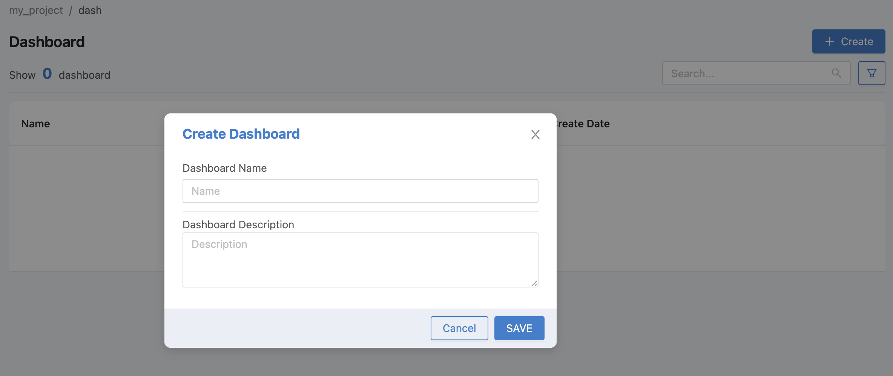
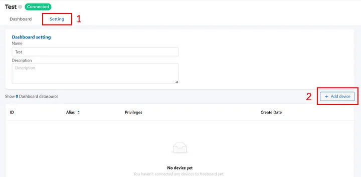
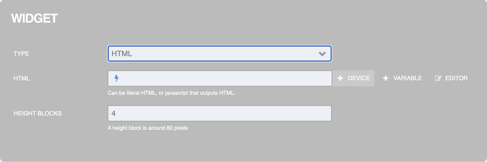
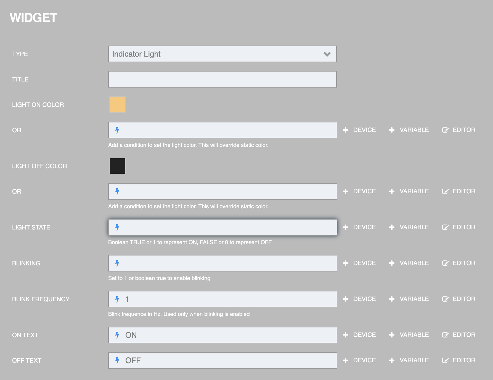
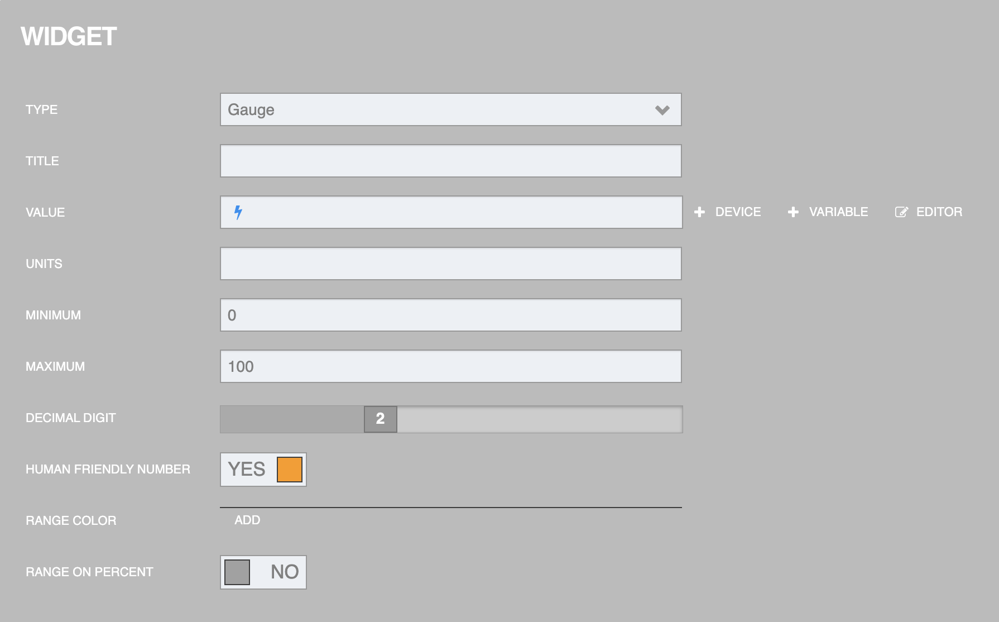
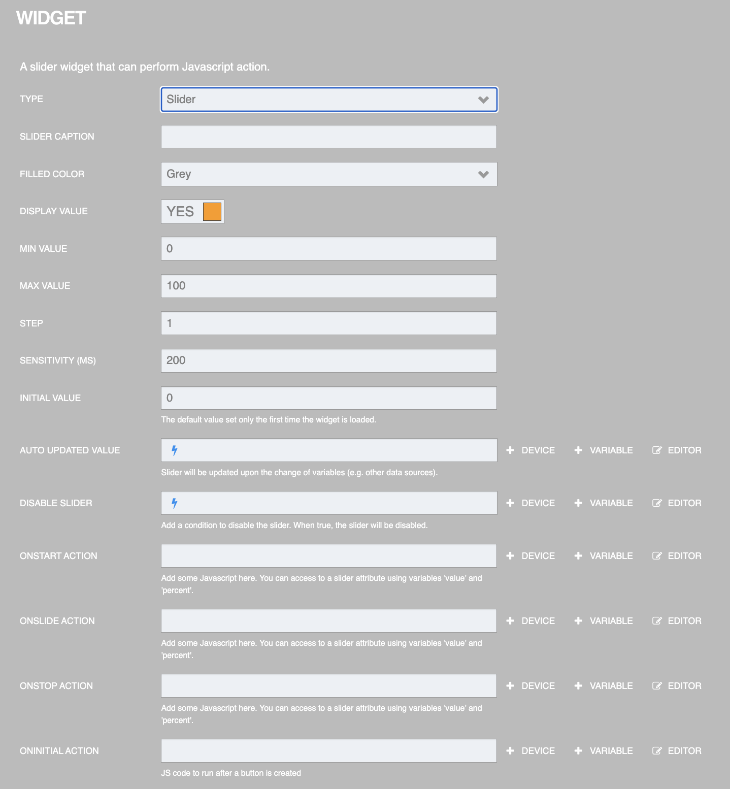

Dashboard
=================

Dashboard เป็นนำข้อมูลที่เก็บอยู่ใน Platform มาแสดงผลในรูปแบบต่างๆ เป็นเหมือนช่องทางให้ผู้ใช้สามารถติดตามหรือควบคุมการทำงานของ Device

การสร้าง Dashboard
-----------------

เริ่มสร้าง Dashboard โดยทำการเลือกเมนู Console ทางด้านซ้ายมือแล้วคลิกที่  Dashboard

.. image:: _static/dashboard.png

คลิกปุ่ม "Create" เพื่อสร้าง Dashboard

 
สามารถกรอกข้อมูลได้ 2 ส่วนคือ Dashboard Name และ Dashboard Description

- **Dashboard Name** คือ ชื่อ Dashboard ไม่สามารถมีช่องว่าง (White Space) อยู่ในชื่อได้

- **Dashboard Description** คือ คำอธิบายของ Dashboard

เมื่อทำการกรอกข้อมูลเสร็จเรียบร้อยแล้วให้ทำการกดปุ่ม "SAVE" ก็จะปรากฏรายการ Dashboard ใหม่ที่เพิ่งทำการสร้างขึ้นมา

ไปที่แถบ Setting จะปรากฏหน้าต่างของ Dashboard setting ทำการคลิกที่ "Add device" เพื่อเพิ่มอุปกรณ์ที่ได้ทำการสร้างไว้ในเมนู "Device"

ทำการใส่ข้อมูล/เลือกข้อมูล และทำการกด "SAVE"

- **Device** คือ เลือกอุปกรณ์ที่ได้ทำการสร้างไว้

- **Alias** คือ ชื่อของ Device ที่เป็นเจ้าของ Shadow (จะขึ้นเองเมื่อได้ทำการเลือก Device เรียบร้อยแล้ว)

- **Privileges** คือ การกำหนดสิทธิ์การเข้าถึงข้อมูลซึ่งจะมี

- **Subscribe Message** คือ การรับข้อมูลใน Topic ที่ต้องการ

- **Publish Message** คือ การส่งข้อมูลไปยัง Topic ที่ต้องการ

- **Shadow Read** คือ จำนวนการอ่าน Shadow โดยดูจากขนาดของ Shadow ที่ถูกอ่านออกมา แต่ละ Block มีขนาดไม่เกิน 1 kilobyte

- **Shadow Write** คือ จำนวนการเขียน Shadow โดยดูจากขนาดของ Shadow ที่ส่งไปเขียน แต่ละ Block มีขนาดไม่เกิน 1 kilobyte

- **Read Feed** คือ การอ่านข้อมูลจาก feed หรือชุดข้อมูลที่ส่งขึ้นไป

- **Write Feed** คือ การสร้าง feed หรือชุดข้อมูลที่สามารถส่งขึ้นไป

เมื่อทำการบันทึกข้อมูลเรียบร้อยแล้ว จะปรากฏดังรูปด้านล่าง ซึ่งสามารถแก้ไขหรือทำการเปลี่ยนแปลงได้ด้วย "Edit" หากต้องการที่จะลบสามารถคลิกที่ "Delete"

เมื่อคลิกที่ "เมนู 3 จุด" มุมขวาบน ข้าง EDIT จะเจอเมนู 3 เมนูสำหรับจัดการส่วนต่างๆ ของ Dashboard

- **IMPORT** ใช้สำหรับนำเข้า Configuration Code ซึ่งจะอยู่ในรูปแบบ JSON File ที่ส่งออกไปจาก Dashboard ที่เคยเซ็ต Configuration ไว้แล้ว เมื่อคลิกแล้วจะปรากฏ browse file ให้เลือกไฟล์ที่ต้องการนำเข้า

- **EXPORT** ใช้สำหรับส่งออก Configuration Code ที่เคยเซ็ตไว้แล้ว ซึ่งจะอยู่ในรูปแบบ JSON File เช่นกัน เพื่อนำเข้า (เมนู “IMPORT”) สู่ Dashboard อื่น หรือเพื่อการสำรองข้อมูล (Backup)

- **RESET** ใช้สำหรับล้างค่า Configuration Code ที่เคยเซ็ตไว้แล้วทั้งหมด

เมื่อนำเมาส์ไปวางไว้ที่รายการที่ได้ทำการ Create Dashboard ไว้ จะปรากฏปุ่ม "Edit" และ "Delete" สำหรับทำการแก้ไขข้อมูลทั่วไปและลบ Dashboard นั้นๆได้ ตามลำดับ

เมื่อทำการคลิกที่ได้ทำการสร้าง Create Dashboard ไว้จะปรากฏ "Edit" ทางมุมบนขวามือ เพื่อเปิดการใช้งานแก้ไข dashboard 

คลิกปุ่ม "Add panel" 

จะมีหน้าต่าง Panel ขึ้นมา

 
เลือกประเภทของ widget

การตั้งค่า Widget
------------------

การกรอก Datasource ในแต่ละ Widget จะมีลักษณะที่คล้ายกัน เริ่มต้นที่ปุ่ม +DEVICE ซึ่งจะอยู่หลังช่องที่กรอก หรือจะพิมพ์ # ลงไปในช่อง หลังจากนั้น Auto complete จะดึงข้อมูลจาก Device ที่ได้เพิ่มในส่วนของ Setting ไว้แล้วมาให้เลือก โดยการเลือกข้อมูลขึ้นอยู่กับประเภทข้อมูลที่ต้องการจาก Datasource นั้นๆมี 8 ประเภท คือ

- **Status** คือ ถ้าเลือกประเภทข้อมูลเป็น status ไม่ต้องระบุส่วนที่ 3 เพราะเป็นการดึงข้อมูลสถานะการเชื่อมต่อ Platform ของ Device ค่าที่ได้จะเป็น 0 หมายถึง ไม่เชื่อมต่อ และ 1 หมายถึง เชื่อมต่อ 

- **Shadow** คือ ส่วนที่เลือกต่อจากนี้จะเป็นตามโครงสร้าง Shadow JSON ที่ได้กำหนดไว้ใน Device

- **Feed** คือ ถ้าเลือกประเภทข้อมูลเป็น feed ไม่ต้องระบุส่วนที่ 3 เช่นกัน ส่วน Data Field ที่ต้องการจะไประบุเพิ่มเติมที่ FeedView Widget

- **msg** คือ ส่วนที่เลือกต่อจากนี้จะเป็น Topic ที่ต้องการ Subscribe และต้องเป็น Topic ที่ DATASOURCE ที่อ้างอิง Subscribe ไว้ด้วย

- **id** คือ ตัวระบุ Device

- **writeShadow** คือ คำสั่งหรือฟังก์ชันที่ใช้ในการอัปเดตหรือเขียนค่าข้อมูลลงใน Shadow ของ Platform

- **publishMsg** คือ คำสั่งหรือฟังก์ชันที่ใช้ในการเผยแพร่ข้อความหรือข้อมูลให้กับ Platform

- **privateMsg** คือ คำสั่งหรือฟังก์ชันที่ใช้สำหรับการส่งหรือการสื่อสารข้อความโดยที่ข้อความจะถูกส่งไปถึงผู้รับเพียงผู้เดียว โดยไม่เผยแพร่หรือเปิดเผยให้ผู้อื่นในระบบหรือPlatform

Widget : Text
----------------

เป็น Data Display Widget ที่แสดงผลในรูปแบบข้อความลักษณะของ Plain Text

จากรูปด้านล่างข้อมูลที่สามารถระบุได้มีดังนี้

- **TYPE** คือ ชนิดของ widget

- **TITLE** คือ ตั้งชื่อ widget

- **SIZE** คือ กำหนดขนาดข้อความ [สามารถเลือกเป็น Regular (ปกติ) และ Big (ใหญ่)]

- **VALUE** คือ กำหนดค่าที่ต้องการแสดงผล (ช่องกรอก DEVICE)

- **INCLUDE SPARKLINE** คือ แสดงเส้นกราฟจากค่า value (ตัวเลข) [สามารถเลือกได้ YES/NO]

- **ANIMATE VALUE CHANGES** คือ การสร้างภาพเคลื่อนไหวเพื่อแสดงผลการเปลี่ยนแปลงของค่า

- **UNITS** คือ หน่วยข้อมูล

.. image:: _static/dashboard_widgettext1.png

.. caution::

    เมื่อทำการกรอกข้อมูลครบหมดแล้วให้ทำการกด "SAVE" ทุกครั้ง

.. admonition:: ตัวอย่าง

    การกรอก VALUE เมื่อต้องการแสดงสถานะการเชื่อมต่อ Platform ของ Device

    .. image:: _static/dashboard_widgettext2.png

    ถ้า Connect จะแสดงสถานะ Connected ถ้าไม่ Connect จะแสดงสถานะ Not Connected ดังรูป

    .. image:: _static/dashboard_textstatus.png
        :align: center

|

Widget : HTML
----------------

เป็น Data Display Widget ที่แสดงผลในรูปแบบหน้าเว็บ HTML สามารถเขียนโค้ดเป็นภาษา HTML หรือ Javascript ได้

จากรูปด้านล่างข้อมูลที่สามารถระบุได้มีดังนี้

- **TYPE** คือ ชนิดของ widget

- **HTML** คือ เขียนโค้ด HTML, Javascript ให้เป็นหน้าเว็บได้ (ช่องกรอก DATASOURCE)

- **Height Blocks** คือ ขนาดความสูงของบล็อกที่ใช้แสดงผล

.. admonition:: ตัวอย่าง

    จะเป็นการบวกและลบค่าตัวเลขแล้วทำการ write shadow โดยใช้ #["Device1"].writeShadow("home", currentValue) มีส่วนประกอบดังนี้

    - **Device1** คือชื่อของ alias 

    .. image:: _static/dashboard_widgethtmlalias.png

    - **home** คือค่า key ที่ต้องการเก็บใน shadow

    - **currentValue** คือค่าของ value ที่ต้องการเก็บ
    
    หลังจากนั้นนำค่าจาก shadow มาแสดงในรูปของ text โดยใช้ ${#["Device1"]["shadow"]["home"]} มีส่วนประกอบดังนี้

    - **Device1** คือชื่อของ alias
    
    - **shadow** คือจะเป็นการอ่านค่า shadow จากอุปกรณ์ที่ชื่อ Device1 

    - **home** คือชื่อของ key ที่เก็บไว้ใน shadow ที่ต้องการนำมาแสดงค่า

    .. code-block:: html

        

        <h1 id="output">Value:${#["Device1"]["shadow"]["home"]}</h1>
        <button id="minus">−</button>
        <input type="text" inputmode="numeric" style="width:60%" id="input" />
        <button id="plus">+</button>

        

    .. image:: _static/dashboard_widgethtml2.png

    จะได้ผลลัพธ์ดังรูป

    .. image:: _static/dashboard_widgethtmlresult.png
            :align: center

|

Widget : Indicator Light
-----------------------------

เป็น Data Display Widget ที่แสดงผลในรูปแบบสถานะ ON/OFF เพื่อระบุ STATE ของการทำงาน เช่น สถานะไฟ สถานะเครื่องจักรทำงาน เป็นต้น

จากรูปด้านล่างข้อมูลที่สามารถระบุได้มีดังนี้

- **TYPE** คือ ชนิดของ widget

- **TITLE** คือ ตั้งชื่อ widget

- **LIGHT ON COLOR** คือ สีของการเปิดไฟ (สามารถเพิ่มความสว่างของสีได้)

- **LIGHT OFF COLOR** คือ สีของการปิดไฟ (สามารถเพิ่มความสว่างของสีได้)

- **LIGHT STATE** คือ การเปิด/ปิดไฟ

- **BLINKING** คือ การกระพริบของไฟ

- **BLINK FREQUENCY** คือ ความถี่การกระพริบของไฟ

- **ON TEXT** คือ ข้อความที่ต้องการแสดงเมื่อค่าเป็นจริง (ดึงค่าจาก DATASOURCE หรือกรอกค่าลงไปโดยตรงก็ได้)

- **OFF TEXT** คือ ข้อความที่ต้องการแสดงเมื่อค่าเป็นเท็จ (ดึงค่าจาก DATASOURCE หรือกรอกค่าลงไปโดยตรงก็ได้)

.. admonition:: ตัวอย่าง

    การกรอก LIGHT STATE แสดงสถานะ ON หรือ OFF

    .. image:: _static/dashboard_indicatorlight2.png

    เมื่อ Connect สำเร็จ จะแสดงคำว่า ON ดังรูป

    .. image:: _static/dashboard_indicatorlightresult.png
        :align: center

|

Widget : Gauge
--------------------

เป็น Data Display Widget ที่แสดงผลในรูปแบบการวัดค่า กำหนดค่าสูงสุด/ต่ำสุดได้

จากรูปด้านล่างข้อมูลที่สามารถระบุได้มีดังนี้

- **TYPE** คือ ชนิดของ widget

- **TITLE** คือ ตั้งชื่อ widget

- **VALUE** คือ กำหนดค่าที่ต้องการแสดงผล (ช่องกรอก DATASOURCE)

- **UNITS** คือ หน่วยข้อมูล

- **MINIMUM** คือ ค่าต่ำสุด (ตัวเลข)

- **MAXIMUM** คือ ค่าสูงสุด (ตัวเลข)

- **DECIMAL DIGIT** คือ เลขทศนิยม

- **HUMAN FRIENDLY NUMBER** คือ การแปลงค่าข้อมูลที่เป็นตัวเลขในรูปแบบเลขฐานสิบเป็นรูปแบบที่เป็นจำนวนเต็มที่มีหน่วยวัดต่างๆ เช่น แปลงค่า 1000 เป็น 1K แปลงค่า 1000000 เป็น 1M เป็นต้น

- **RANGE COLOR** คือ รูปแบบการแสดงสีตามช่วงค่าของตัวเลขหรือค่าต่างๆ โดยใช้สีที่แตกต่างกันเพื่อแสดงความต่างของช่วงค่านั้นๆ (โดยกดที่ ADD เพื่อระบุช่วงของค่า)

- **RANGE ON PERCENT** คือ การแสดงค่าตัวเลขในช่วงร้อยละของค่าที่กำหนดไว้

.. admonition:: ตัวอย่าง

    การกรอก VALUE เมื่อต้องการแสดงข้อมูลอุณหภูมิ

    .. image:: _static/dashboard_widgetgauge2.png

    จะได้ผลลัพธ์ดังรูป	

    .. image:: _static/dashboard_widgetgaugeresult.png
        :align: center

|

Widget : Button
------------------

เป็น Control Widget ที่แสดงผลในรูปแบบปุ่มกด กำหนด action ที่จะทำงานเมื่อกดปุ่มได้

จากรูปด้านล่างข้อมูลที่สามารถระบุได้มีดังนี้

- **TYPE** คือ ชนิดของ widget

- **BUTTON CAPTION** คือ ข้อความบนปุ่มกด

- **LABEL** คือ ข้อความอธิบาย

- **BUTTON COLOR** คือ กำหนดกำหนดสีของปุ่มกด

- **ONCLICK ACTION** คือ เงื่อนไขการทำงานเมื่อมีการกดปุ่ม

- **ONINITIAL ACTION** คือ เงื่อนไขการทำงานเมื่อ Button ถูกสร้างเสร็จ

.. image:: _static/dashboard_widgetbutton1.png

.. admonition:: ตัวอย่าง

    การใช้ปุ่มเพื่อเปิดประตู เมื่อคลิกปุ่ม OPEN แล้วค่าจะถูกส่งไปที่ shadow 

    .. image:: _static/dashboard_widgetbutton2.png

    จะได้ผลลัพธ์ดังรูป

    .. image:: _static/dashboard_widgetbuttonresult.png
        :align: center

|

Widget : Toggle
------------------

เป็น Control Widget ที่แสดงผลในรูปแบบปุ่มกด 2 STATE กำหนด action ที่จะทำงานได้ทั้งเปิด/ปิด

จากรูปด้านล่างข้อมูลที่สามารถระบุได้มีดังนี้

- **TYPE** คือ ชนิดของ widget

- **LABEL** คือ ข้อความอธิบาย

- **TOGGLE ON COLOR** คือ กำหนดสีที่ต้องการให้กับหลอดไฟ LED เมื่อเปิด

- **TOGGLE OFF COLOR** คือ กำหนดสีที่ต้องการให้กับหลอดไฟ LED เมื่อปิด

- **TOGGLE ON CAPTION** คือ ข้อความที่ต้องการแสดงเมื่อค่าเป็นจริง

- **TOGGLE OFF CAPTION** คือ ข้อความที่ต้องการแสดงเมื่อค่าเป็นเท็จ

- **TOGGLE STATE** คือ กำหนดค่าที่ต้องการแสดงผล (TRUE,FALSE,1,0)

- **ONTOGGLEON ACTION** คือ เงื่อนไขการทำงานเมื่อต้องการเปลี่ยน STATE จาก OFF เป็น ON

- **ONTOGGLEOFF ACTION** คือ เงื่อนไขการทำงานเมื่อต้องการเปลี่ยน STATE จาก ON เป็น OFF

- **ONINITIAL ACTION** คือ เงื่อนไขการทำงานเมื่อสร้าง toggle เสร็จ

.. admonition:: ตัวอย่าง

    การเปิด/ปิด LED เมื่อคลิกปุ่ม toggle

    .. image:: _static/dashboard_widgettoggle2.png

    จะได้ผลลัพธ์ดังรูป

    .. image:: _static/dashboard_widgettoggleresult.png
        :align: center

|

Widget : Slider
------------------

เป็น Control Widget ที่แสดงผลในรูปแบบปุ่มกดแบบ slide กำหนดระดับค่าสำหรับการใช้งาน เช่น ความคุมความเร็วการทำงานรอบมอเตอร์ กำหนดระดับแสงสว่างของหลอดไฟ เป็นต้น

จากรูปด้านล่างข้อมูลที่สามารถระบุได้มีดังนี้

- **TYPE** คือ ชนิดของ widget

- **SLIDER CAPTION** คือ ข้อความอธิบาย

- **FILLED COLOR** คือ สีที่แสดงบน slider

- **DISPLAY VALUE** คือ แสดงค่า slider ด้านบนมุมขวา

- **MIN VALUE** คือ ค่าต่ำสุด

- **MAX VALUE** คือ ค่าสูงสุด

- **STEP** คือ เลื่อน slider ทุกๆ n ครั้ง ตามตัวเลขที่กำหนด

- **SENSITIVITY (MS)** คือ ค่าความไว

- **INITIAL VALUE** คือ ค่าเริ่มต้น

- **AUTO UPDATE VALUE** คือ เมื่อมีค่าเปลี่ยนแปลง slider จะเปลี่ยนตามค่าที่ได้รับ

- **ONSTART ACTION** คือ เงื่อนไขการทำงานเมื่อคลิกที่ slider

- **ONSLIDE ACTION** คือ เงื่อนไขการทำงานเมื่อคลิกลากเปลี่ยนตำแหน่ง slider แต่ยังไม่ปล่อย

- **ONSTOP ACTION** คือ เงื่อนไขการทำงานเมื่อปล่อยคลิก slider

- **ONINITIAL ACTION** คือ เงื่อนไขการทำงานเมื่อสร้าง toggle เสร็จ

.. admonition:: ตัวอย่าง

    การควบคุม RGB ของการแสดงสี

    .. image:: _static/dashboard_widgetslider2.png

    จะได้ผลลัพธ์ดังรูป

    .. image:: _static/dashboard_widgetsliderresult.png
        :align: center
        
|

Widget : Chart
------------------

เป็น Data Display Widget ที่แสดงผลข้อมูลในรูปแบบของกราฟ สามารถดูข้อมูล และแสดงผลการทำงานได้

จากรูปด้านล่างข้อมูลที่สามารถระบุได้มีดังนี้

- **TYPE** คือ ชนิดของ widget

- **TITLE** คือ ตั้งชื่อ widget

- **DATA SOURCE** คือ การเชื่อมต่อเพื่อดึงข้อมูลจาก Device ต่างๆ

- **FILTER** คือ ฟังก์ชันที่ช่วยกรองข้อมูล

- **QUERY FROM THE LAST** คือ ฟังก์ชันที่สามารถช่วยดึงข้อมูล โดยอ้างอิงจากเวลาของการส่งข้อมูลล่าสุดจากอุปกรณ์ (โดยมีหน่วย เช่น วัน เดือน ปี ชั่วโมง นาที วินาที)

- **STRICT TIME RANGE** คือ ความแม่นยำของช่วงเวลา

- **PLOT MODE** คือ ลักษณะการ Plot ของกราฟ

- **TYPE OF CHART** คือ ชนิดของ Chart

- **X AXIS TITLE** คือ ตั้งชื่อแกน X

- **Y AXIS TITLE** คือ ตั้งชื่อแกน Y

- **BEGIN AT 0** คือ เปิด/ปิด การเริ่มต้นที่ 0

- **MAKER** คือ การส่งคำสั่งควบคุมเปิด-ปิดอุปกรณ์

- **LINE COLORS** คือ สีของเส้น (สามารถระบุ code สีเองได้หรือเลือกจากที่มี)

- **NO. OF Y-AXIS** คือ จำนวนของแกน Y

- **BLOCKS HEIGHT** คือ ความสูงของ Block

.. admonition:: ตัวอย่าง

    การกรอก Datasource เมื่อต้องการแสดงข้อมูลอุณหภูมิเก็บเป็น Timeseries

    .. image:: _static/dashboard_widgetchartresult.png

|