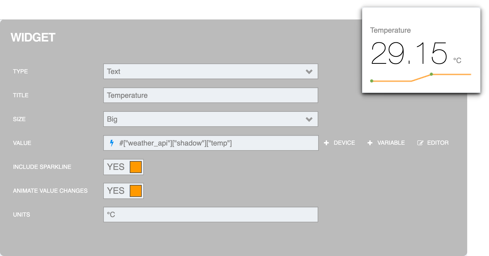
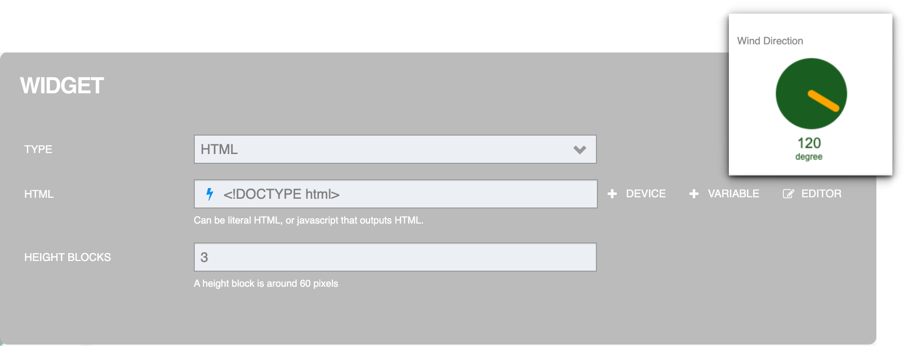
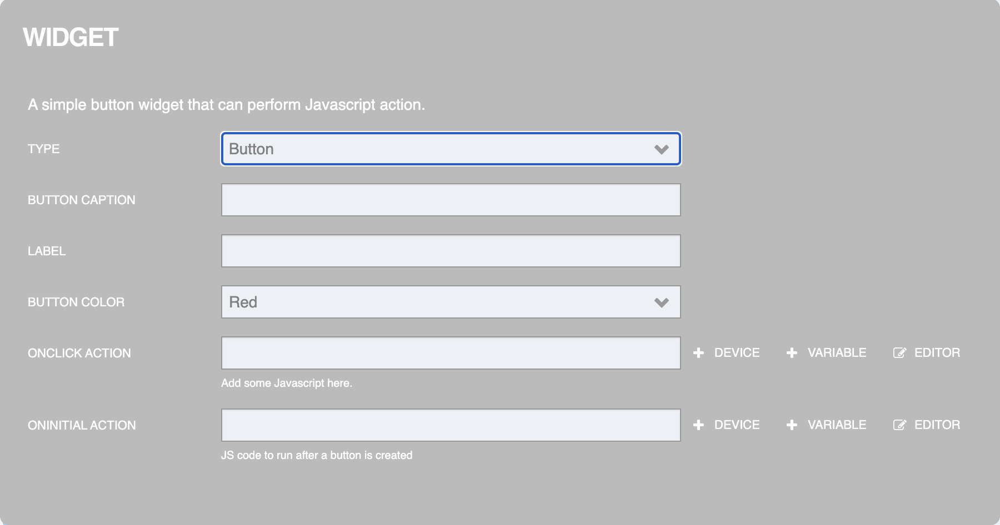

Dashboard
=================

เป็นส่วนที่ใช้ในการแสดงผลข้อมูลที่เก็บอยู่ใน Platform เช่นเดียวกับ Panel แต่ความแตกต่างในการนำไปใช้งานสำหรับ Dashboard จะเหมาะกับการดูข้อมูลแบบ Realtime มากกว่า และสามารถควบคุมสั่งงานย้อนกลับไปที่อุปกรณ์ (Device) ได้ การเข้าใช้งาน Dashboard ให้คลิกที่เมนู Console > Dashboard จะปรากฏหน้าจอดังรูปต่อไปนี้

.. image:: _static/dashboard.png

|

การสร้าง Dashboard
-------------------------

จากรูปด้านบน เมื่อเข้าที่เมนู "Dashboard" ให้คลิกที่ปุ่ม "Create" มุมบนด้านขวามือเพื่อสร้าง Dashboard เมื่อคลิกแล้วจะปรากฏฟอร์มสำหรับกรอกข้อมูลดังรูป

.. image:: _static/dashboard_create.png
 
จากรูปด้านบนข้อมูล Dashboard ที่สามารถระบุได้มีดังนี้

.. rst-class:: left-align-left-col

	.. list-table::
		:widths: 30 70
		  
		* - **Dashboard Name**
		  - ชื่อ Dashboard
		* - **Dashboard Description**
		  - คำอธิบาย Dashboard


เมื่อกรอกข้อมูลเรียบร้อยแล้วให้คลิกที่ปุ่ม "SAVE" ก็จะปรากฏรายการ Dashboard ใหม่ที่พึ่งสร้างขึ้นมา ดังรูป


จากรูปด้านบน หลังรายการ Dashboard แต่ละรายการจะมีไอคอนสำหรับ แก้ไข/ลบ รายการได้ สำหรับการตั้งค่า Dashboard ให้คลิกเข้าไปที่แต่ละรายการเพื่อเข้าไปดำเนินการต่อ

|

การตั้งค่า Dashboard
-------------------------

Dashboard แต่ละรายการที่มีการสร้างไว้ หากต้องการตั้งค่าการทำงานหรือการแสดงผลข้อมูลต่าง ๆ ให้คลิกเข้าไปที่รายการ Dashboard นั้น ๆ จะปรากฏหน้าจอดังรูป


จากรูปด้านบน การตั้งค่า Dashboard มีส่วนที่สามารถดำเนินการได้ดังนี้

|

ส่วนที่ 1 Dashboard Name & Status
`````````````````````````````````````````

เป็นส่วนที่แสดงชื่อของ Dashboard ที่เลือกเข้ามาตั้งค่า และแสดงสถานะของ Agent ที่ทำหน้าที่เป็นตัวกลางในการสื่อสารหรือแลกเปลี่ยนข้อมูลระหว่าง Dashboard กับ Platform ถ้าแสดงสถานะเป็น "Connected" (สีเขียน) คือ เชื่อมต่อกับ Platform อยู่ หากแสดงเป็น "Disconnected" (สีเทา) คือ เชื่อมต่อ Platform ไม่ได้ ซึ่งสาเหตุอาจเกิดจากอุปกรณ์หรือเครื่องคอมพิวเตอร์ที่ใช้เปิด Dashboard ไม่สามารถเชื่อมต่ออินเตอร์เน็ตได้ หรืออาจะเป็นที่ปัญหาที่ฝั่ง Platform ไม่หพร้อมให้เชื่อมต่อ เป็นต้น

|

ส่วนที่ 2 แถบ Dashboard
`````````````````````````

ส่วนนี้จะเป็นที่แสดงผลข้อมูลหรือใช้ในการดู Dashboard ที่มีการตั้งค่าไว้ ในกรณีที่ต้องการปรับแก้ Dashboard ก็จะดำเนินการในส่วนนี้เช่นกัน แต่หากต้องการเข้าสู่โหมดแก้ไข Dashboard ต้องคลิกปุ่ม Edit (ส่วนที่ 4)

.. image:: _static/dashboard_view_mode.png

|

ส่วนที่ 3 แถบ Setting
`````````````````````````

ส่วนนี้ใช้สำหรับตั้งแก้ไขชื่อและรายละเอียดของ Dashboard (Dashboard setting) และการกำหนด Device และสิทธิ์ในการเข้าถึง ของ Dashboard นั้น ๆ ดังรูปต่อไปนี้


จากรูปด้านบน การกำหนด Device และสิทธิ์การเข้าถึงให้คลิกที่ปุ่ม "Add device" จะปรากฏฟอร์มสำหรับกรอกข้อมูลดังรูป


จากรูปด้านบนข้อมูล Add device เข้า Dashboard ที่สามารถระบุได้มีดังนี้

.. rst-class:: left-align-left-col

	.. list-table::
		:widths: 20 80
		  
		* - **Device**
		  - รายการ Device ทั้งหมดที่สร้างขึ้นภายใต้ Project นั้น ๆ
		* - **Alias**
		  - นามแฝงหรือ Label เพื่อสื่อความหมาย (ค่า Default คือ Device Name)
		* - **Privileges**
		  - สิทธิ์ในการเข้าถึง Device มี 6 สิทธิ์ ดังนี้ Subscribe Message, Publish Message, Read Shadow, Write Shadow, Read Feed และ Write Feed
		
เมื่อกรอกข้อมูลเรียบร้อยแล้วให้คลิกที่ปุ่ม "SAVE" ก็จะปรากฏรายการ Device ที่ Add Privileges ขึ้นมาดังรูป


|

ส่วนที่ 4 ปุ่ม Edit
`````````````````````````

ส่วนนี้จะเป็นการเปลี่ยนโหมดแถบ Dashboard (ส่วนที่ 2) จากโหมดดูเป็นโหมดแก้ไข Dashboard ดังรูปต่อไปนี้


จากรูปด้านบนจะปรากฏปุ่ม "Add Panel" เพื่อใช้สำหรับเพิ่ม Panel ใหม่เข้ามาและภายใน Panel ถึงสามารถเลือก Widget ที่จะใช้งานภายใน Dashboard อีกที ส่วนปุ่ม "Cancel" ใช้สำหรับออกจากโหมดแก้ไข หากมีการปรับเปลี่ยนการตั้งค่าใน Dashboard ปุ่ม "Save" จะปรากฏขึ้นมาอัตโนมัติเพื่อให้สามารถบันทึกการเปลี่ยนแปลงได้ ดังรูป


จากรูปด้านบนเป็นการเพิ่ม Panel เข้ามา โดยภายใน Panel มีตัวดำเนินการทั้งหมด 4 ปุ่ม ดังนี้

- **(A) : ปุ่ม Add Widget** ใช้สำหรับเพิ่ม Widget (Visualization & Controller) ซึ่ง Widget มีให้เลือกทั้งหมด 8 ประเภท ได้แก่ Text, HTML, Indicator Light, Gauge, Button, Toggle, Slider และ Chart โดยการตั้งค่าแต่ละ Widget จะแต่ต่างกันไป (ดูรายละเอียดเพิ่มเติมในแต่ละ Widget) จากรูปต่อไปนี้เป็นตัวอย่างหน้าจอการตั้งค่า Widget : Gauge เมื่อตั้งค่าเสร็จให้คลิกปุ่ม "Done" หรือถ้าต้องการยกเลิกการ Add Widget ให้คลิกที่ปุ่ม "Cancel" ที่มุมบนด้านขวามือของหน้าจอ


นอกจากตัวดำเนินการของ Panel แล้ว หากมีการเพิ่ม Widget เข้าไปใน Panel ส่วนของ Widget ก็จะมีตัวดำเนินการด้วยเช่นกัน โดยนำเมาส์ไปวางในแต่ละ Widget ก็จะปรากฏตัวดำเนินการต่าง ๆ ขึ้นมาดังรูป


สำหรับตัวดำเนินการปุ่มแรกของ Widget จะใช้สำหรับสลับลำดับ Widget ใน Panel ซึ่งปุ่มนี้จะปรากฏเมื่อมี Widget มากกว่า 1 ใน Panel นั้น ๆ

- **(B) : ปุ่ม Duplicate Panel** ใช้สำหรับสร้าง Panel ใหม่ แต่เป็นการคัดลอกจาก Panel ที่สร้างไว้แล้ว โดยระบบจะคัดลอกทุกอย่างที่อยู่ภายใน Panel มาสร้างเป็น Panel ใหม่ให้ทั้งหมด (กรณีเป็นปุ่มใน Widget Operation จะเป็นการคัดลอกและสร้างเป็น Widget ภายใน Panel เดิม)


- **(C) : ปุ่ม Setting Panel** ใช้สำหรับกำหนดชื่อ (TITLE) และขนาดความกว้าง (CULUMNS) ของ Panel ดังรูป เมื่อตั้งค่าเสร็จให้คลิกปุ่ม "Done" หรือถ้าต้องการยกเลิกการ Setting Panel ให้คลิกที่ปุ่ม "Cancel" ที่มุมบนด้านขวามือของหน้าจอ (กรณีเป็นปุ่มใน Widget Operation จะเป็นการเข้าแก้ไขการตั้งค่า Widget นั้น ๆ)


- **(D) : ปุ่ม Delete Panel** ใช้สำหรับลบ Panel รวมถึงทุกสิ่งทุกอย่างที่อยู่ภายใน Panel นั้น ๆ ด้วย เมื่อคลิกลบไปแล้ว ระบบจะมีการให้ยืนยันการลบดังกล่าวอีกครั้ง (กรณีเป็นปุ่มใน Widget Operation จะเป็นการลบเฉพาะ Widget นั้น ๆ)


.. caution:: ข้อควรระวังในการ Edit Dashboard

	หลังจากทำการแก้ไขการตั้งค่าต่าง ๆ ใน Dashboard ก่อนออกจากหน้าจอ Dashboard ทุกครั้งควรตรวจสอบว่ามีกดปุ่ม "Save" ปรากฏขึ้นที่มุมบนด้านขวามือหรือไม่ ถ้ามีต้องกดปุ่มเพื่อบันทึกการเปลี่ยนแปลงต่าง ๆ ด้วยตัวเองทุกครั้ง เพราะระบบไม่บันทึกอัตโนมัติให้ หากลืมกดปุ่ม "Save" และออกจากหน้าจอดังกล่าวไป ข้อมูลที่แก้ไขไปทั้งหมดจะไม่ถูกบันทึกลงฐานข้อมูล เมื่อเข้ามาที่ Dashboard ก็จะเห็นการแสดงผลตามการตั้งค่าเดิมก่อนทำการแก้ไข

|

ส่วนที่ 5 ปุ่ม Info (i)
`````````````````````````

ส่วนนี้ใช้สำหรับดูข้อมูล ID และ Secret ของ Dashboard ซึ่งเป็น Credential ของ Agent ที่เป็นตัวกลางในการสื่อสารหรือแลกเปลี่ยนข้อมูลระหว่าง Dashboard กับ Platform 


|

ส่วนที่ 6 ปุ่ม Sharing
`````````````````````````

ส่วนนี้ใช้สำหรับแชร์ Dashboard ให้ผู้อื่นสามารถเข้าถึงได้ตามสิทธิ์ที่จะมีการตั้งค่าไว้ โดยเมื่อคลิกที่ปุ่ม Sharing จะปรากฏ Popup สำหรับตั้งค่าการแชร์ดังรูปต่อไปนี้


จากรูปด้านบน การแชร์แยกการแชร์ได้เป็น 2 ประเภท คือ

6.1 แชร์แบบระบุ User
************************

จะเป็นการแชร์ให้ผู้ใช้ที่มี Account ใช้งาน Platform อยู่แล้ว โดยข้อมูลที่สามารถระบุได้มีดังนี้

.. rst-class:: left-align-left-col

	.. list-table::
		:widths: 20 80
		  
		* - **Authorized Access**
		  - Account หรืออีเมลที่ลงทะเบียนใช้งานในระบบแล้ว
		* - **ระบดับสิทธิ์**
		  - "Viewer" คือ สามารถดู Dashboard ได้เท่านั้น, "Editor" คือ สามารถดูและแก้ไข Dashboard ได้
		
เมื่อกรอกข้อมูลเรียบร้อยแล้วให้คลิกที่ปุ่ม "Invite" ก็จะปรากฏรายการ Account และระดับสิทธิ์ที่ได้รับขึ้นมาดังรูป


จากรูปด้านบนในกรอบสีแดงเป็นรายการ Account ที่มีการให้สิทธิ์เข้าถึง Dashboard ซึ่งสามารถทำการแก้ไขสิทธิ์หรือลบรายการออกได้โดยคลิกเลือกที่ Dropdown รายการระดับสิทธิ์เพื่อดำเนินการ ส่วนไปไอคอนรูปกระดิ่งด้านหลังรายการ จะใช้ในการตั้งค่าการเปิด/ปิดการแจ้งเตือน (Push Notifiication) ของ Dashboard สำหรับแต่ละ Account

เมื่อเซ็ต Account ที่ต้องการให้สิทธิ์เข้าถึงเรียบร้อยแล้วให้คัดลอกลิงค์ (คลิกปุ่ม "Copy Link") หรือ QR Code (คลิกปุ่ม "Get QR") เพื่อส่งให้บุคคลที่เป็นเจ้าของ Account เหล่านั้นใช้ในการเข้าถึง Dashboard ซึ่งผู้ใช้จะต้องมีการยืนยันตัวตนกับ Platform ด้วย Account ที่ได้รับสิทธิ์ก่อนถึงสามารถเข้าถึง Dashboard ได้

6.2 แชร์แบบทุกคนที่มีลิงค์สามารถเข้าถึงได้
**********************************

จะเป็นการแชร์ให้ใครก็ได้โดยที่ไม่ต้องมีการยืนยันตัวตนใด ๆ ขอแค่มี URL ที่ระบบสร้างขึ้นสำหรับเข้าถึง Dashboard ก็สามารถเข้าใช้งาน Dashboard ได้ตามสิทธิ์ที่เซ็ตไว้ในลิงค์นั้น ๆ ซึ่งจะอยู่ที่ส่วนล่างของ Popup การแชร์ (กรอบสีแดง) ดังรูป


จากรูปด้านบนองค์ประกอบแต่ละส่วนมีรายระเอียดดังนี้

- **(E) : เลือกประเภทการแชร์** ส่วนนี้จะเป็น Dropdown ที่สามารถเลือกได้ว่าจะให้มีการแชร์ประเภทไหนได้บ้าง ถ้าเลือกเป็น "Anyone with link" จะสามารถแชร์แบบทุกคนที่มีลิงค์สามารถเข้าถึงได้ (6.2) แต่ถ้าเลือกเป็น "Only Specific users" จะแชร์แบบระบุ User (6.1) ได้เท่านั้น

- **(F) : เลือกระดับสิทธิ์** ส่วนนี้จะเป็น Dropdown สำหรับทำการกำหนดสิทธิ์ในการเข้าถึง Dashboard ของลิงค์ในการแชร์ ถ้าเลือกเป็น "Can view" จะสามารถดู Dashboard ได้เท่านั้น แต่ถ้าเลือกเป็น "Can edit" ก็จะสามารถดูและแก้ไข Dashboard ได้

- **(G) : ลิงค์ (URL) สำหรับเข้าถึง Dashboard** ส่วนนี้จะแสดงลิงค์ที่ระบบสร้างขึ้น โดยจะต้องส่งลิงค์ที่ให้ผู้ที่ต้องการเข้าถึง Dashboard และบุคคลที่ทราบลิงค์จะสามารถเข้าถึง Dashboard ตามสิทธิ์ที่กำหนดไว้โดยไม่ต้องยืนยันตัวตน

- **(H) : ปุ่ม Copy public link to clipboard** ส่วนนี้จะช่วยอำนวยความสะดวกในการคัดลอกลิงค์สำหรับการแชร์ Dashboard เมื่อคลิกปุ่มนี้ลิงค์ใน (G) จะถูกคัดลอกให้อัตโนมัติ

- **(I) : ปุ่ม Show public QR code** ส่วนนี้ใช้สำหรับสร้าง QR Code เพื่อใช้สำหรับการแชร์ Dashboard โดยคลิกที่ปุ่มดังกล่าวระบบจะแสดง QR Code สำหรับแสกนเข้า Dashboard

- **(J) : ปุ่ม Regenerate link** ส่วนนี้จะใช้ในการสร้างลิงค์ใหม่สำหรับการแชร์ Dashboard และจะส่งผลให้ลิงค์เดิมไม่สามารถใช้งานได้

- **(K) : ปุ่ม Set expiration time for pubilc link** ส่วนนี้ใช้สำหรับกำหนดอายุการใช้งานของลิงค์ที่แชร์ว่าสามารถใช้งานได้นานเท่าไร โดยเมื่อคลิกที่ปุ่มนี้ระบบจะแสดงหน้าจอสำหรับกำหนดอายุการใช้งานของลิงค์ให้ดังรูป เมื่อเลือกอายุแล้วให้คลิกที่ปุ่ม "Apply" (หากไม่กำหนดค่า Default คือ ไม่มีวันหมดอายุ)

.. image:: _static/dashboard_sharing_setexpire.png

- **(L) : ปุ่ม Enable push notifiication** ส่วนนี้ใช้ในการตั้งค่าการเปิด/ปิดการแจ้งเตือน (Push Notifiication) ของ Dashboard (เช่นเดียวกับไอคอนกระดิ่งใน 6.1)

|

.. note:: การตั้งค่าการแชร์ Dashboard ที่ควรรู้
    
    - ลิงค์การแชร์ทั้ง 2 ประเภทที่ระบบสร้างขึ้นจะไม่เหมือนกัน และแต่ละประเภทการแชร์จะมีลิงค์ที่ใช้งานได้เพียงประเภทและ 1 ลิงค์เท่านั้น
    
    - การแชร์แบบระบุ User (6.1) หากต้องการยกเลิกสิทธิ์การแชร์หรือเปลี่ยนสิทธิ์การแชร์ ให้ดำเนินการที่แต่ละรายการ Account นั้น ๆ ด้วยการลบรายการหรือแก้ไขสิทธิ์ตามลำดับ
    
    - การแชร์แบบทุกคนที่มีลิงค์สามารถเข้าถึงได้ (6.2) หากต้องการยกเลิกสิทธิ์การแชร์ให้ทำการเปลี่ยน Dropdown เลือกประเภทการแชร์ (E) เป็น "Only Specific users" ลิงค์การแชร์จะไม่สามารถใช้งานได้ แต่หากเซ็ตกลับเป็น "Anyone with link" ลิงค์เดิมหากยังไม่หมดอายุจะกลับมาใช้งานได้เช่นเดิม แต่หากไม่ต้องการให้ลิงค์เดิมใช้งานได้อีกให่้ทำการสร้างลิงค์ใหม่โดยการคลิกที่ ปุ่ม Regenerate link (J)
    
    - ลิงค์การแชร์แบบทุกคนที่มีลิงค์สามารถเข้าถึงได้ (6.2) การเปลี่ยนสิทธิ์หรือการกำหนดอายุการใช้งานไม่ได้ทำให้ URL เปลี่ยนแปลง แต่ระบบจะทำการเช็คการตั้งค่าใหม่จากฐานข้อมูลโดยตรง

|

ส่วนที่ 7 ปุ่ม Other
`````````````````````````

ส่วนที่เป็นไอคอนจุด 3 จุด เมื่อคลิกระบบจะแสดงเมนูย่อยสำหรับดำเนินการกับ Dashboard ดังนี้

- **Enter fullscreen** ใช้สำหรับขยายหน้าจอเพื่อดู Dashboard ในโหมดเต็มหน้าจอดังรูป


- **Import** ใช้สำหรับนำเข้า Script การตั้งค่า Dashboard ซึ่งมีลักษณะเป็น JSON File ที่อาจจะทำการ Backup เก็บไว้เพื่อเข้าสู่ระบบ

- **Export** ใช้สำหรับส่งออก Script การตั้งค่า Dashboard ซึ่งมีลักษณะเป็น JSON File เพื่อการ Backup หรืออาจจะต้องการเก็บไว้เป็น Template และนำไปใช้โดยการ Import ในรายการก่อนหน้านี้

- **Reset** ใช้สำหรับลบ Dashboard (Panel และ Widget) ทั้งหมดออก โดยเมื่อคลิกระบบจะมี Popup เพื่อให้ทำการยืนยันที่จะดำเนินการ หากยืนยันให้คลิกปุ่ม "OK" ระบบจะทำการเคลียร์ Dashboard ออกทั้งหมด หลังจากสามารถทำการสร้าง Dashboard ใหม่ หรือถ้าต้องการออกจากหน้าจอตั้งค่า Dashboard ให้คลิกปุ่ม "Save" เพื่อบันทึก

|

การตั้งค่า Widget
--------------------

Widget คือ ชุดโปรแกรมเล็ก ๆ ของ Dashboard ที่เตรียมไว้เพื่อให้ผู้ใช้เลือกมาเป็นองค์ประกอบในการตั้งค่าการแสดงผลหรือสั่งการผ่าน Dashboard ได้ โดยแต่ละ Widget จะมีลักษณะการใช้งานและการตั้งค่าที่แตกต่างกันไป สามารถแบ่งเป็นกลุ่มใหญ่ ๆ ได้ 2 ประเภท คือ

1. **Monitoring Widget** หมายถึง Widget ที่ใช้สำหรับการแสดงผลข้อมูล (Data Visualization) หรือเป็นการอ่านค่าข้อมูลจาก Datasource ใน Platform อย่างเดียวไม่ ได้แก่ Text, HTML, Indicator Light, Gauge, Chart

2. **Controller Widget** หมายถึง Widget ที่สามารถสั่งการหรือเขียนค่าข้อมูลกลับไปที่ Datasource ใน Platform ได้ เพื่อใช้ควบคุมหรือสั่งการอุปกรณ์อื่น ๆ ที่รอรับคำสั่งได้ ได้แก่ HTML, Button, Toggle, Slider

การอ้างอิงค่าหรือเรียกใช้ฟังก์ชันต่าง ๆ สำหรับอ่านหรือเขียนข้อมูลผ่าน Platform รูปแบบการอ้างอิงจะเป็นการอ้างจากผ่าน Device ซึ่งจะเป็น Datasource จาก Platform การเซ็ตค่าใน Widget มีวิธีสังเกตง่าย ๆ ว่าช่องไหนสามารถกรอก Configuration ในการอ้างอิงค่าหรือเรียกใช้ฟังก์ชันจาก Datasource ของ Platform ได้จะมีสัญลักษณ์รูป "สายฟ้า" หรือมีปุ่ม "+ Device" อยู่ด้านหลังช่องช่องนั้น ดังรููปด้านล่าง เพื่อแค่คลิกที่ปุ่ม "+ Device" หรือพิมพ์ "#" ระบบจะแสดงรายการมาให้เลือกอัตโนมัติ (Auto Complete) โดยที่ไม่ต้องพิมพ์เองทั้งหมด


รูปแบบการตั้งค่าใน Widget เพื่ออ่านค่าข้อมูลหรือเรียกใช้ฟังก์ชันต่าง ๆ จาก Datasource ใน Platform มีดังนี้

#["...Device Name..."]["status"]
    ใช้สำหรับอ่านค่าสถานะการเชื่อมต่อ Platform ของ Device นั้น ๆ ค่าที่ได้จะเป็น 0 หรือ 1 (0 = ไม่เชื่อมต่อ, 1 = เชื่อมต่ออยู่) 

|

#["...Device Name..."]["shadow"]["... Object Key 1 ...."] ... ["... Object Key n ...."]
    ใช้สำหรับอ่านค่า Shadow ของ Device นั้น ๆ โดยการอ้างอิงจะเป็นการอ้างอิงทอดไปเป็นชั้น ๆ ตามโครงสร้าง JSON ของ Shadow

|

#["...Device Name..."]["feed"]
    ใช้สำหรับอ่านค่า Feed (Timeseries Database) ซึ่งจะเหมาะสำหรับใช้กับ Widget ประเภท "Chart"

|

#["...Device Name..."]["msg"]["... Topic Path 1..."] ... ["... Topic Path n..."]
    ใช้สำหรับอ่านค่าที่ได้จากการ Subscribe ตาม Topic ที่ Dashboard นั้น ๆ เองมีการ Subscribe ไว้อยู่แล้ว ซึ่งระบบก็จะดึงข้อมูล Topic Path มาให้เลือกอัตโนมัติ (Auto Complete) ได้เช่นกัน หาก Device มีการ Subscribe Topic ไว้แล้ว แต่กรณีที่ต้องการกำหนดไว้ใน Widget ก่อน รูปแบบการเซ็ต Topic ใน Widget ถ้า Topic ที่ Subscribe ผ่าน MQTT คือ ``@msg/home/bedroom/light`` การเซ็ตค่าใน Widget เพื่อ Subscribe Topic ดังกล่าวเป็นดังนี้ ``#["...Device Name..."]["msg"]["home"]["bedroom"]["light"]``

|

#["...Device Name..."]["id"]
    ใช้สำหรับอ่านค่า Device ID ของ Device นั้น ๆ

|

#["...Device Name..."].writeShadow("...Key...", "...Value...")
    เป็นการเรียกใช้ฟังก์ชันเพื่อเขียนค่าหรืออัพเดทค่าลง Shadow ของ Device นั้น ๆ โดย Parameter ที่ต้องระบุในฟังก์ชันมี 2 ค่า คือ Key หมายถึง ฟิลด์ใน Shadow ที่ต้องการเขียนค่า และ Value ค่าที่ต้องการเขียนหรืออัพเดท กรณีที่ฟิลด์ใน Shadow ที่ต้องการเขียนข้อมูล ซึ่งการที่ส่ง Parameter เป็น String 2 ค่าเข้าไปจะใช้ได้ในกรณีที่อัพเดท Shadow ที่มีโครงสร้าง JSON แบบชั้นเดียวเท่านั้น ถ้าเป็นการอัพเดทฟิลดืที่อยู่ซ้อนหลายชั้นจะต้องส่ง Parameter เพียง Parameter เดียวเป็น JSON เข้าไปอัพเดทได้เลย

    .. admonition:: ตัวอย่าง

        .. code-block:: json

            {
                "A": 1,
                "B": {  
                    "b1": 2,
                    "b2": "Y"
                }
            }
        
        จาก JSON ด้านบนเป็นตัวอย่างโครงสร้างของ Shadow ที่ต้องการอัพเดท

        - ถ้าต้องการอัพเดท "A" เขียนคำสั่งดังนี้ ``#["...Device Name..."].writeShadow("A", 2)``
        - ถ้าต้องการอัพเดท "b2" เขียนคำสั่งดังนี้ ``#["...Device Name..."].writeShadow({"B":{"b2":"N"}})``

|

#["...Device Name..."].publishMsg("...Topic...","...Message...")
    เป็นการเรียกใช้ฟังก์ชันเพื่อ Publish Message ไปยัง Topic ที่ต้องการ ซึ่งการกำหนด Topic ไม่ต้องมี ``@msg`` เหมือนการ Publish ไป MQTT Broker โดยตรง เช่น 
    
    ``#["...Device Name..."].publishMsg("send/to/my/topic", "hello")``

|

#["...Device Name..."].privateMsg("...Topic...","...Message...")
    เป็นการเรียกใช้ฟังก์ชันเพื่อ Publish Message หาตัวเองเท่านั้น โดยการรับ Message จะต้องเป็นการ Subscribe Topic ``@private/...Topic...`` ที่ Publish ไป หรือจะ Subscribe Topic ``@private/#`` ก็ได้ ซึ่งฟังก์ชันนี้ไม่สามารถ Subscribe ใน Dashboard ได้ ตัวอย่างเช่น 

    ``#["...Device Name..."].privateMsg("send/data/to/my", "hello")``

    ซึ่งถ้าตัวเองต้องการรับข้อมูลให้ททำการ Subscribe Topic ``@private/#`` หรือ ``@private/send/data/to/my``

|

Widget : Text
----------------

เป็น Widget ประเภท Monitoring Widget ใช้สำหรับแสดงผลในรูปแบบข้อความ (Plain Text) ลักษณะหน้าจอการตั้งค่าเป็นดังนี้


จากรูปด้านบนข้อมูลที่สามารถระบุเพื่อตั้งค่ามีดังนี้

- **TYPE** คือ ชนิดของ Widget (เลือกเป็น Text)

- **TITLE** คือ ชื่อกำกับ Widget หรือชื่อฟิลด์ข้อมูล

- **SIZE** คือ กำหนดขนาดตัวอักษร มีให้เลือก 2 ขนาด ได้แก่ Regular (ขนาดปกติ) และ Big (ขนาดใหญ่)

- **VALUE** คือ กำหนดค่าที่ต้องการแสดงผล ซึ่งเป็นส่วนที่สามารถอ่านค่าข้อมูลจาก Datasource ใน Platform ได้ เช่น ``#["device_name"]["shadow"]["temp"]``

- **INCLUDE SPARKLINE** คือ แสดงเส้นกราฟจากค่า ``VALUE`` ซึ่งค่าที่นำมาแสดงเป็นตัวเลข (YES แสดงกราฟ, NO ไม่แสดงกราฟ)

- **ANIMATE VALUE CHANGES** คือ การสร้างภาพเคลื่อนไหวเพื่อแสดงผลการเปลี่ยนแปลงของค่า (YES เคลื่อนไหว, NO ไม่เคลื่อนไหว)

- **UNITS** คือ หน่วยนับของข้อมูล

เมื่อกรอกข้อมูลการตั้งค่า Widget เรียบร้อยแล้วให้คลิกปุ่ม "Done" มุมบนด้านขวามือ ตัวอย่างการตั้งค่าและผลลัพธ์ที่ได้เป็นดังรูปต่อไปนี้



|

Widget : HTML
----------------

เป็น Widget ที่สามารถตั้งค่าให้เป็นประเภท Monitoring Widget หรือ Controller Widget ก็ได้ เพราะสามารถเขียนโค้ดเป็นภาษา HTML หรือ Javascript ลงไปเหมือนการสร้างหน้าเว็บ HTML ได้เลย ลักษณะหน้าจอการตั้งค่าเป็นดังนี้

.. image:: _static/dashboard_widgethtml1.png

จากรูปด้านบนข้อมูลที่สามารถระบุเพื่อตั้งค่ามีดังนี้

- **TYPE** คือ ชนิดของ Widget (เลือกเป็น HTML)

- **HTML** คือ ช่องเขียนโค้ด HTML หรือ Javascript เพื่อแสดงผล ซึ่งสามารถอ้างอิงการอ่านค่าข้อมูลหรือเรียกใช้ฟังก์ชันต่าง ๆ จาก Datasource ใน Platform รูปแบบการอ้างอิงดังตัวอย่างต่อไปนี้ ``${#["device_name"]["shadow"]["temp"]}``

- **Height Blocks** คือ ขนาดความสูงของพื้อที่ที่ใช้แสดงผล

เมื่อกรอกข้อมูลการตั้งค่า Widget เรียบร้อยแล้วให้คลิกปุ่ม "Done" มุมบนด้านขวามือ ตัวอย่างการตั้งค่าและผลลัพธ์ที่ได้เป็นดังรูปต่อไปนี้

*ตัวอย่างที่ 1 : นำค่าใน Shadow มาแสดงผล*



.. code-block:: html

    <!DOCTYPE html>
    <html>
    <body>
    Wind Direction
    <canvas id="myCanvas" width="300" height="300">
    Sorry, your browser does not support canvas.
    </canvas>

    <script>
    let angle = ${#["weather_api"]["shadow"]["wind"]["deg"]}; // Read Shadow
    const canvas = document.getElementById("myCanvas");
    const ctx = canvas.getContext("2d");
            
    ctx.globalCompositeOperation = "source-over";

    ctx.arc(110,65,49,0,2*Math.PI);
    ctx.fillStyle = "#1B5E20";
    ctx.fill();

    ctx.font = "20px Arial";
    ctx.fillStyle = "#1B5E20";
    ctx.fillText(angle,90,140);
            
    ctx.font = "12px Arial";
    ctx.fillStyle = "#1B5E20";
    ctx.fillText("degree",88,156);

    angle = (angle + 1) % 360;

    ctx.translate(110,65); // First translate the context to the center you wish to rotate around.
    ctx.rotate(angle*Math.PI/180 ); // Then do the actual rotation.
    ctx.translate(-110,-65)

    ctx.beginPath();
    ctx.lineWidth=10;  
    ctx.lineCap='round';    
    ctx.moveTo(110,65);
    ctx.lineTo(110,26);
    ctx.strokeStyle = "orange";
    ctx.stroke();
    </script>
    </body>
    </html>

|

*ตัวอย่างที่ 2 : การอัพเดทค่ากลับไปที่ Shadow*


.. code-block:: html

    <style>
        #output {
            font-size: 24px;
            margin-bottom: 10px;
            color: #333; 
            text-align:center;
        }
        #minus, #plus {
            font-size: 18px;
            margin: auto;
            cursor: pointer;
            padding: 7px 10px;
            background-color: #3498db;
            color: #fff; 
            border: none; 
            border-radius: 2px; 
        }

        #minus:hover, #plus:hover {
            background-color: #2980b9; 
        }

        #input {
            font-size: 18px;
            padding: 7px;
            font-weight: bold; 
        }
        </style>

        <h1 id="output">Fan Speed : ${#["fan"]["shadow"]["speed"]}</h1>
        <button id="minus">−</button>
        <input type="text" inputmode="numeric" style="width:60%" id="input" />
        <button id="plus">+</button>

        <script>
        const minusButton = document.getElementById('minus');
        const plusButton = document.getElementById('plus');
        const inputField = document.getElementById('input');
        const outputField = document.getElementById('output');

        function updateData() {
            outputField.textContent = "Value: " + currentValue;
            #["fan"].writeShadow("speed", currentValue); //Write Shadow
        }
        let currentValue = ${#["fan"]["shadow"]["speed"]};
        inputField.value = currentValue;

        minusButton.addEventListener('click', event => {
            event.preventDefault();
            currentValue -= 1;
            inputField.value = currentValue;
            updateData();
        });

        plusButton.addEventListener('click', event => {
            event.preventDefault();
            currentValue += 1;
            inputField.value = currentValue;
            updateData();
        });
        </script>

|

Widget : Indicator Light
-----------------------------

เป็น Widget ประเภท Monitoring Widget ใช้สำหรับแสดงผลในลักษณะสถานะที่มี 2 สถานะที่สามารถเกิดขึ้นได้ เช่น สถานะ ON/OFF, Online/Offline เป็นต้น ลักษณะหน้าจอการตั้งค่าเป็นดังนี้

.. image:: _static/dashboard_indicatorlight1.png

จากรูปด้านบนข้อมูลที่สามารถระบุเพื่อตั้งค่ามีดังนี้

- **TYPE** คือ ชนิดของ Widget (เลือกเป็น Indicator Light)

- **TITLE** คือ ชื่อกำกับ Widget หรือชื่อฟิลด์ข้อมูล

- **LIGHT ON COLOR** คือ สีที่ต้องการให้แสดงเมื่อสถานะเป็น ON หรือหากต้องการค่าสีที่อ่านค่าจาก Datasource ให้ระบุในช่อง "OR" ที่อยู่ถัดลงมา

- **LIGHT OFF COLOR** คือ สีที่ต้องการให้แสดงเมื่อสถานะเป็น OFF หรือหากต้องการค่าสีที่อ่านค่าจาก Datasource ให้ระบุในช่อง "OR" ที่อยู่ถัดลงมา

- **LIGHT STATE** คือ รับค่าสถานะที่จะมีการเปลี่ยนแปลง โดยสถานะ ON ส่งค่าเป็น ``TURE`` หรือ 1, สถานะ OFF ส่งค่าเป็น ``FALSE`` หรือ 0

- **BLINKING** คือ การกระพริบของไฟ (``TURE`` หรือ 1 เพิ่มเปิดการกระพริบของไฟ)

- **BLINK FREQUENCY** คือ ความถี่การกระพริบของไฟ หน่วยเป็นเฮิร์ทซ์ (Hz)

- **ON TEXT** คือ ข้อความที่ต้องการแสดงเมื่อสถานะเป็น ``TURE`` หรือ 1 (สามารถดึงค่าจาก Datasource หรือกรอกค่าลงไปโดยตรงก็ได้)

- **OFF TEXT** คือ ข้อความที่ต้องการแสดงเมื่อสถานะเป็น ``FALSE`` หรือ 0 (สามารถดึงค่าจาก Datasource หรือกรอกค่าลงไปโดยตรงก็ได้)

เมื่อกรอกข้อมูลการตั้งค่า Widget เรียบร้อยแล้วให้คลิกปุ่ม "Done" มุมบนด้านขวามือ ตัวอย่างการตั้งค่าและผลลัพธ์ที่ได้เป็นดังรูปต่อไปนี้


ผลลัพธ์ที่ได้เป็นดังนี้


|

Widget : Gauge
--------------------

เป็น Widget ประเภท Monitoring Widget ใช้สำหรับแสดงผลในรูปแบบการวัดค่า สามารถกำหนดค่าสูงสุด/ต่ำสุดได้ ลักษณะหน้าจอการตั้งค่าเป็นดังนี้

.. image:: _static/dashboard_widgetgauge1.png

จากรูปด้านบนข้อมูลที่สามารถระบุเพื่อตั้งค่ามีดังนี้

- **TYPE** คือ ชนิดของ Widget (เลือกเป็น Gauge)

- **TITLE** คือ ชื่อกำกับ Widget หรือชื่อฟิลด์ข้อมูล

- **VALUE** คือ ค่าข้อมูลที่ต้องการแสดงผล (สามารถดึงค่าจาก Datasource หรือกรอกค่าลงไปโดยตรงก็ได้)

- **UNITS** คือ หน่วยนับของข้อมูล

- **MINIMUM** คือ ค่าต่ำสุดที่สามารถแสดงผลได้ (ตัวเลข)

- **MAXIMUM** คือ ค่าสูงสุดที่สามารถแสดงผลได้ (ตัวเลข)

- **DECIMAL DIGIT** คือ จำนวนเลขทศนิยม

- **HUMAN FRIENDLY NUMBER** คือ การแปลงค่าข้อมูลที่เป็นตัวเลขในรูปแบบเลขฐานสิบเป็นรูปแบบที่เป็นจำนวนเต็มที่มีหน่วยวัดต่าง ๆ เช่น แปลงค่า 1,000 เป็น 1K แปลงค่า 1,000,000 เป็น 1M เป็นต้น

- **RANGE COLOR** คือ รูปแบบการแสดงสีตามช่วงค่าของตัวเลข โดยใช้สีที่แตกต่างกันเพื่อแสดงความต่างของช่วงค่านั้น ๆ (กดที่คำว่า ADD เพื่อระบุสีและช่วงของค่าข้อมูล)

- **RANGE ON PERCENT** คือ การแสดงค่าตัวเลขในช่วงร้อยละของค่าที่กำหนดไว้

เมื่อกรอกข้อมูลการตั้งค่า Widget เรียบร้อยแล้วให้คลิกปุ่ม "Done" มุมบนด้านขวามือ ตัวอย่างการตั้งค่าและผลลัพธ์ที่ได้เป็นดังรูปต่อไปนี้


|

Widget : Button
------------------

เป็น Widget ประเภท Controller Widget ใช้สำหรับสร้างปุ่มกดบน Dashboard และเมื่อกดจะเกิดการทำงานบางอย่างขึ้นตามที่ตั้งค่าไว้ ลักษณะหน้าจอการตั้งค่าเป็นดังนี้



จากรูปด้านบนข้อมูลที่สามารถระบุเพื่อตั้งค่ามีดังนี้

- **TYPE** คือ ชนิดของ Widget (เลือกเป็น Button)

- **BUTTON CAPTION** คือ ข้อความที่แสดงบนปุ่ม

- **LABEL** คือ ข้อความกำกับ/อธิบาย

- **BUTTON COLOR** คือ กำหนดสีของปุ่ม

- **ONCLICK ACTION** คือ การทำงานที่เกิดขึ้นเมื่อมีการกดปุ่ม

- **ONINITIAL ACTION** คือ การทำงานที่เกิดครั้งแรกเมื่อปุ่มถูกสร้างขึ้น

เมื่อกรอกข้อมูลการตั้งค่า Widget เรียบร้อยแล้วให้คลิกปุ่ม "Done" มุมบนด้านขวามือ ตัวอย่างการตั้งค่าและผลลัพธ์ที่ได้เป็นดังรูปต่อไปนี้


|

Widget : Toggle
------------------

เป็น Widget ประเภท Controller Widget ใช้สำหรับสร้างปุ่มกดแบบ 2 สถานะสลับกันไปมา (คล้ายกับสวิทช์เปิด/ปิดไฟ) ลักษณะหน้าจอการตั้งค่าเป็นดังนี้

.. image:: _static/dashboard_widgettoggle1.png

จากรูปด้านบนข้อมูลที่สามารถระบุเพื่อตั้งค่ามีดังนี้

- **TYPE** คือ ชนิดของ Widget (เลือกเป็น Toggle)

- **LABEL** คือ ข้อความกำกับ/อธิบาย

- **TOGGLE ON COLOR** คือ สีที่ต้องการให้แสดงเมื่อสถานะเป็น ON หรือหากต้องการค่าสีที่อ่านค่าจาก Datasource ให้ระบุในช่อง "OR" ที่อยู่ถัดลงมา

- **TOGGLE OFF COLOR** คือ สีที่ต้องการให้แสดงเมื่อสถานะเป็น OFF หรือหากต้องการค่าสีที่อ่านค่าจาก Datasource ให้ระบุในช่อง "OR" ที่อยู่ถัดลงมา

- **TOGGLE ON CAPTION** คือ ข้อความที่ต้องการแสดงเมื่อสถานะเป็น ``TURE`` หรือ 1 (สามารถดึงค่าจาก Datasource หรือกรอกค่าลงไปโดยตรงก็ได้)

- **TOGGLE OFF CAPTION** คือ ข้อความที่ต้องการแสดงเมื่อสถานะเป็น ``FALSE`` หรือ 0 (สามารถดึงค่าจาก Datasource หรือกรอกค่าลงไปโดยตรงก็ได้)

- **TOGGLE STATE** คือ รับค่าสถานะที่มีการเปลี่ยนแปลง (ซิงค์ข้อมูลกับค่าใน Platform) โดยสถานะ ON ส่งค่าเป็น ``TURE`` หรือ 1, สถานะ OFF ส่งค่าเป็น ``FALSE`` หรือ 0

- **DISABLE TOGGLE** คือ เงื่อนไขที่จะใช้ในการปิดการใช้งาน Toggle เมื่อค่าเป็น ``TURE`` หรือ 1 Toggle จะถูกปิดการใช้งาน

- **ONTOGGLEON ACTION** คือ การทำงานที่เกิดขึ้นเมื่อเปลี่ยนสถานะจาก OFF เป็น ON

- **ONTOGGLEOFF ACTION** คือ การทำงานที่เกิดขึ้นเมื่อเปลี่ยนสถานะจาก ON เป็น OFF

- **ONINITIAL ACTION** คือ การทำงานที่เกิดครั้งแรกเมื่อ Toggle ถูกสร้างขึ้น

เมื่อกรอกข้อมูลการตั้งค่า Widget เรียบร้อยแล้วให้คลิกปุ่ม "Done" มุมบนด้านขวามือ ตัวอย่างการตั้งค่าและผลลัพธ์ที่ได้เป็นดังรูปต่อไปนี้


|

Widget : Slider
------------------

เป็น Widget ประเภท Controller Widget ใช้สำหรับสร้าง Slid Bar เพื่อกำหนดค่าในการควบคุม เช่น ความคุมความเร็วการทำงานรอบมอเตอร์ กำหนดระดับแสงสว่างของหลอดไฟ เป็นต้น ลักษณะหน้าจอการตั้งค่าเป็นดังนี้

.. image:: _static/dashboard_widgetslider1.png

จากรูปด้านบนข้อมูลที่สามารถระบุเพื่อตั้งค่ามีดังนี้

- **TYPE** คือ ชนิดของ Widget (เลือกเป็น Slider)

- **SLIDER CAPTION** คือ ข้อความกำกับ/อธิบาย

- **FILLED COLOR** คือ สีที่แสดงบนแถบ Slider เมื่อถูกเลื่อน

- **DISPLAY VALUE** คือ ค่าของ Slider ที่มีการเลื่อนไป จะแสดงที่มุมบนด้านขวาของ Slider

- **MIN VALUE** คือ ค่าต่ำสุดที่สามารถกำหนดได้

- **MAX VALUE** คือ ค่าสูงสุดที่สามารถกำหนดได้

- **STEP** คือ จำนวนการเพิ่ม/ลดใน 1 Step เมื่อมีการเลื่อน Slider

- **SENSITIVITY (MS)** คือ ค่าความไว

- **INITIAL VALUE** คือ ค่าเริ่มต้น

- **AUTO UPDATED VALUE** คือ รับค่าที่มีการเปลี่ยนแปลง (ซิงค์ข้อมูลกับค่าใน Platform) และอัพเดทค่าใน Slider

- **DISABLE SLIDER** คือ เงื่อนไขที่จะใช้ในการปิดการใช้งาน Slider เมื่อค่าเป็น ``TURE`` หรือ 1 Slider จะถูกปิดการใช้งาน

- **ONSTART ACTION** คือ การทำงานเมื่อเริ่มต้นที่มีการเลื่อนเปลี่ยนค่า Slider

- **ONSLIDE ACTION** คือ การทำงานระหว่างที่มีการเลื่อนเปลี่ยนค่า Slider

- **ONSTOP ACTION** คือ การทำงานเมื่อสิ้นสุดการเลื่อนเปลี่ยนค่า Slider

- **ONINITIAL ACTION** คือ การทำงานที่เกิดครั้งแรกเมื่อ Slider ถูกสร้างขึ้น

เมื่อกรอกข้อมูลการตั้งค่า Widget เรียบร้อยแล้วให้คลิกปุ่ม "Done" มุมบนด้านขวามือ ตัวอย่างการตั้งค่าและผลลัพธ์ที่ได้เป็นดังรูปต่อไปนี้


        
|

Widget : Chart
------------------

เป็น Widget ประเภท Monitoring Widget ใช้สำหรับแสดงผลในรูปแบบเส้นกราฟ เหมาะกับการนำไปเแสดงผลข้อมูล Feed ใน Platform ลักษณะหน้าจอการตั้งค่าเป็นดังนี้

.. image:: _static/dashboard_widgetchart.png

จากรูปด้านบนข้อมูลที่สามารถระบุเพื่อตั้งค่ามีดังนี้

- **TYPE** คือ ชนิดของ Widget (เลือกเป็น Chart)

- **TITLE** คือ ชื่อกำกับ Widget หรือชื่อฟิลด์ข้อมูล

- **DATA SOURCE** คือ แหล่งข้อมูลที่จะนำมาแสดงผลเส้นกราฟ (สามารถดึงค่า Datasource จาก Device ใน Platform ได้)

- **FILTER** คือ ฟิลด์ข้อมูลที่ต้องการนำมาแสดงเส้นกราฟ ถ้าไม่ระบุระบบจะแสดงผลทุกฟิลด์

- **QUERY FROM THE LAST** คือ การเลือกช่วงข้อมูลที่จะนำมาแสดงเส้นกราฟ โดยระบุจำนวนอ้างอิงจากเวลาล่าสุดของข้อมูลย้อนหลังไป สามารถเลือกหน่วยเวลาย้อนหลังได้ ดังนี้  Second, Minute, Hour, Day, Month และ Year

- **STRICT TIME RANGE** คือ ความแม่นยำของช่วงเวลา

- **PLOT MODE** คือ ลักษณะการ Plot ของกราฟ

- **TYPE OF CHART** คือ ลักษณะการแสดงผลเส้นกราฟ เลือกได้ 2 แบบ ได้แก่ Line เป็นเส้นกราฟปกติ, Step เป็นขั้นบันไดแสดงให้เห็นถึงการขึ้นลงของค่าที่ชัดเจนขึ้น

- **X AXIS TITLE** คือ ข้อความกำกับแกน X

- **Y AXIS TITLE** คือ ข้อความกำกับแกน Y

- **BEGIN AT 0** คือ เปิด/ปิด การเริ่มต้นที่ 0

- **MAKER** คือ การส่งคำสั่งควบคุมเปิด-ปิดอุปกรณ์

- **LINE COLORS** คือ สีของเส้นกราฟ สามารถระบุเป็น code สีเองได้หรือเลือกแถบสีที่ระบบมีให้ โดยสีที่กำหนดให้แต่ละเส้นกราฟจะจับคู่ฟิลด์ให้ตามลำดับที่กำหนดในช่อง ``FILTER``

- **NO. OF Y-AXIS** คือ จำนวนของแกน Y

- **BLOCKS HEIGHT** คือ ความสูงของ Block ที่แสดงกราฟ

เมื่อกรอกข้อมูลการตั้งค่า Widget เรียบร้อยแล้วให้คลิกปุ่ม "Done" มุมบนด้านขวามือ ตัวอย่างการตั้งค่าและผลลัพธ์ที่ได้เป็นดังรูปต่อไปนี้

