.. raw:: html

    
<b>TH</b> | <a href="https://docs.netpie.io/en/device-config.html">EN</a>

.. _device-config:

Device Configuration
=====================

Device Shadow
------------------

คือ ฐานข้อมูลเสมือนของอุปกรณ์ เป็นฐานข้อมูลเล็ก ๆ ที่มีคู่อยู่กับอุปกรณ์ (Device) ทุกตัว ใช้สำหรับเก็บข้อมูลต่าง ๆ เกี่ยวกับอุปกรณ์นั้น ๆ (Device Shadow Data) เช่น ข้อมูลที่เกิดจากเซนเซอร์  ข้อมูลการกำหนดองค์ประกอบต่าง ๆ (Device Configuration) เป็นต้น 

.. code-block:: json

	{
		"config": {
			"lastupdate": "2020-06-01",
			"var": {
				"v1": "a",
				"v2": true,
				"v3": 1
			},
			"version": 1
		},
		"enable": true,
		"items": ["a", "b", "c"]
	}

|

.. note:: การลบฟิลด์ใน Shadow ผ่าน |portal_url|

	การบันทึก Shadow ผ่านหน้าเว็บ Portal จะเป็นการบันทึกแบบผสาน (Merge) ดังนั้น ถ้าต้องการลบฟิลด์ใดฟิลด์หนึ่งจาก Shadow จะใช้วิธีลบออกจากช่องกรอก Shadow ไม่ได้ ต้องใช้วิธีเซ็ตฟิลด์นั้นให้เป็นค่า null เมื่อบันทึกระบบจะทำการลบฟิลด์นั้นออกจาก Shadow ให้

|

Device Schema
------------------

Schema เป็นตัวกำหนดโครงสร้างข้อมูลใน shadow โดยปกติ device จะไม่ถูกบังคับให้ต้องมี schema หาก device นั้นไม่มี schema ทุกการเขียน shadow จะถูกบันทึกลงไปใน DeviceShadow 
โดยไม่มีการประมวลผลใดๆเบื้องต้น เช่น เปลี่ยนหน่วยข้อมูล ก่อนการบันทึกหรือก่อนการนำค่าไปใช้ต่อ

โดย Device Schema จะประกาศในรูปแบบ JSON มีลักษณะดังนี้

.. code-block:: json

	{
  		"additionalProperties": false,
  		"properties": {
    		"temp": {
      			"operation": {
        			"transform": {
          				"expression": "($.temp * 1.8) + 32"
        			}
      			},
      			"type": "number"
    		},
    		"place": {
      			"type": "string"
    			}
  		}
	}

Device Schema จะประกอบไปด้วย

:additionalProperties *(boolean)*:
	
	สถานะการอนุญาตให้บันทึกข้อมูลลง Shadow หรือ Timeseries Database ในกรณีที่ข้อมูลไม่ตรงตามที่กำหนดใน Properties

	``additionalProperties : true`` => อนุญาตให้บันทึกลง Shadow หรือ Timeseries Database

	``additionalProperties : false`` => ไม่อนุญาตให้บันทึกเฉพาะส่วนที่ไม่ตรงตาม Properties

	**ตัวอย่าง** Schema มีการกำหนด Properties เป็น temp, humid ข้อมูลที่ส่งมาเป็น temp, humid และ color ถ้าหาก additionalProperties เป็น true ข้อมูลของ color จะถูกบันทึกลงไปใน shadow หรือ feed แต่หากเป็น false จะมีเพียง humid และ temp เท่านั้นที่จะถูกบันทึกลง shadow หรือ Timeseries Database

:properties *(json)*:

	เริ่มจากกำหนดชื่อฟิลด์ (จากตัวอย่าง  คือ "temp" และ "place") และกำหนดคุณสมบัติของแต่ละฟิลด์ซึ่งจะอยู่ในรูปแบบ JSON โดยจะแยก 2 ส่วน คือ

	- ``operation`` สำหรับตั้งค่าการจัดการข้อมูลในฟิลด์นั้น ๆ ประกอบด้วย

		``transform`` การแปลงข้อมูล (Data Transformation) ก่อนการจัดเก็บ

			``expression`` คือ สูตรหรือวิธีการแปลงข้อมูล (Data Transformation) ก่อนการจัดเก็บ

			**ตัวอย่าง** จาก *Device Schema Example* กำหนด ``expression`` เท่ากับ ``($.temp * 1.8) + 32`` เป็นการแปลงหน่วยอุณหภูมิค่าที่เซนเซอร์วัดได้จากหน่วยเซลเซียสเป็นฟาเรนไฮต์ โดยนำมาคูณด้วย 1.8 และบวกด้วย 32 จะได้ค่าอุณหภูมิเป็นหน่วยฟาเรนไฮต์ ก่อนบันทึกลงใน Device Shadow หรือ Timeseries Database

	- ``type`` คือ ชนิดของข้อมูลในฟิลด์นั้น ๆ ได้แก่ number, string, boolean, array, object 

|

.. caution:: 

	การกำหนดชื่อฟิลด์ใน Properties Schema ต้องประกอบด้วยอักษรภาษาอังกฤษ (a-z, A-Z), ตัวเลข (0-9) หรือ Underscore (_) เท่านั้น ห้ามมีอักขระพิเศาอื่น ๆ นอกเหนือจากนี้ เพราะจะไม่สามารถเก็บข้อมูลได้

|

โดยที่สามารถใช้ประโยชน์จาก schema ได้ในหลายลักษณะต่อไปนี้

**1. ใช้สำหรับ validate data type**

สามารถกำหนดค่าต่างๆของฟิวด์ข้อมูลได้ เช่น data type, minimum, maximum ถ้าตัวแปรใน shadow ฟิวด์ไหน ไม่ผ่านเงื่อนไขการ validate ตัวแปรนั้นจะถูกเอาออกไป 
เสมือนไม่ได้ส่งเข้ามา ส่วนตัวแปรอื่นๆ จะยังคงถูกนำไปประมวลผลต่อไป 

.. code-block:: json

	{
		"additionalProperties": true,
		"properties": {
			"temp": {
				"type": "number",
				"minimum": 0,
				"maximum": 100,
				"default": 25,
			}
		}
	}

แต่ถ้าตัวแปรที่ส่งเข้ามา มีชนิดต่างจากที่ระบุใน schema ระบบจะพยายาม convert ให้ในรูปแบบที่เหมาะสมที่สุด

- ``กรณีที่ 1`` เขียนตัวแปรผิดชนิด ลงตัวแปร schema ชนิด string ระบบจะแปลงเป็น string อัตโนมัติ เช่น

.. rst-class:: left-align-left-col

	.. list-table::
		:widths: 20 40

		* - **Variable**
		  - **Tranformed Variable**
		* - 2
		  - “2”
		* - true
		  - “true”
		* - {x: 123}
		  - “{\”x\”:123}”

- ``กรณีที่ 2`` เขียนตัวแปรผิดชนิด ลงตัวแปร schema ชนิด number ระบบจะแปลงเป็น number อัตโนมัติ หากแปลงได้ แต่ถ้าแปลงไม่ได้ จะไม่สนใจตัวแปรนี้
	
.. rst-class:: left-align-left-col

	.. list-table::
		:widths: 20 40

		* - **Variable**
		  - **Tranformed Variable**
		* - “2.3”
		  - 2.3
		* - true
		  - 1
		* - {x: 123}
		  - ไม่สนใจตัวแปรนี้

- ``กรณีที่ 3`` เขียนตัวแปรผิดชนิด ลงตัวแปร schema ชนิด boolean ระบบจะแปลงเป็น boolean อัตโนมัติ แต่ถ้าแปลงไม่ได้ หรือกำกวม จะไม่สนใจตัวแปรนี้
		
.. rst-class:: left-align-left-col

	.. list-table::
		:widths: 20 40
		
		* - **Variable**
		  - **Tranformed Variable**
		* - “TruE”
		  - true
		* - “False”
		  - false
		* - 0
		  - false
		* - 1
		  - true
		* - {x: 123}
		  - ไม่สนใจตัวแปรนี้

**2. ใช้แปลงค่าของข้อมูลเบื้องต้น**

สามารถใส่ฟังก์ชั่น เพื่อแปลงค่าก่อนนำไปใช้ ค่าตัวแปรที่ขึ้นต้นด้วย $. เป็นการอ้างอิงค่าที่ถูกอัพเดตเข้ามาใหม่ สามารถถอด dot notaion path แบบนี้ได้ $home.bedroom.temp  
เช่น ตัวอย่างการแปลงหน่วยของค่า sensor ที่เข้ามา จาก C เป็น F 

.. code-block:: json

	{
		"additionalProperties": true,
		"properties": {
			"temp": {
				"type": "number",
				"minimum": 0,
				"maximum": 100,
				"operation": {
					"transform": {
						"expression": "$.temp*9/5 + 32"
					}
				}
			}
		}
	}

Schema Decimal Transform
~~~~~~~~~~~~~~~~~~~~~~~~~~~~

นอกจากนี้ยังสามารถอ้างอิงค่าเก่าด้วยตัวแปรได้โดยใช้ $$. และ $.เป็นการอ้างอิงค่าที่ถูกอัพเดตเข้ามาใหม่ เช่นตัวอย่าง จะเป็นการ smoothing ค่า ด้วยการหาค่าเฉลี่ยถ่วงน้ำหนักกับค่าเดิม ส่วนฟิวด์​ dp คือ decimal places หรือตำแหน่งทศนิยม 
เช่น ถ้ากำหนดค่า dp: 1 คือทศนิยม 1 ตำแหน่ง แล้วค่าที่ส่งเข้ามาเป็น 0.3333333333 จะถูกแปลงเป็น 0.3 

.. code-block:: json

	{
		"additionalProperties": true,
		"properties": {
			"humid": {
				"type": "number",
				"operation": {
					"transform": {
						"expression": "0.9*$$.humid + 0.1*$.humid",
						"dp": 1
					}
				}
			}
		}
	}

Schema Array Transform 
~~~~~~~~~~~~~~~~~~~~~~~~~~~~

ฟีเจอร์ Transform มีฟังก์ชั่นพิเศษ ที่สามารถเรียกใช้ได้ ได้แก่

- ``concat(array, array)``   รวม array สองตัวเข้าด้วยกัน

- ``slice(array, int)``  ตัดตัวแปรตามจำนวนที่กำหนด ฟิวด์ที่สองหากเป็นลบจะเป็นการตัดจากด้านหลัง

- ``sort(array, int)``   เรียงลำดับ array ใหม่ ฟิวด์ที่สองค่าบวกลบ (เช่น -1, 1 ) จะเป็นการระบุทิศทางการเรียง

- ``reverse(array)``   กลับทิศ array

.. code-block:: json

		{
		"properties": {
			"temp": {
				"operation": {
					"transform": {
						"expression": "$.temp"
			}
		}
		},
		"log": {
			"operation": {
				"transform": {
					"expression": "concat($$.log, [$.temp])"
			}
		}
		},
		"log5": {
			"operation": {
				"transform": {
					"expression": "slice(concat($$.log5, [$.temp]), -5)"
			}
		}
		},
		"log5R": {
			"operation": {
				"transform": {
					"expression": "slice(reverse($$.log5))"
			}
		}
		},
		"top5": {
			"operation": {
				"transform": {
					"expression": "slice(sort(concat($$.top5, [$.temp])), -5)"
			}
		}
		},
		"bottom5": {
			"operation": {
				"transform": {
					"expression": "slice(sort(concat($$.bottom5, [$.temp]), -1), -5)"
					}
				}
			}
		}
	}

Shadow Timestamp
~~~~~~~~~~~~~~~~~~~~

จุดประสงค์สำคัญของการเขียน shadow คือการบันทึกค่าข้อมูลที่เกิดขึ้น บางครั้งแทนที่ค่านั้นจะเป็นค่าของเวลาปัจจุบัน อาจจะต้องการบันทึกค่าในอดีต สามารถกำหนดค่า timestamp ของจุดข้อมูลได้โดย

- ``Publish Topic`` @shadow/data/update

โดยที่ Payload คือ

.. code-block:: json

	{
  		"data": {
    		"temp": 24.5,
    		"Humid": 63.9
  		},
  		"timestamp": 1684982518000
	}

หากมีการกำหนดให้ store ลง feed ค่าเวลาของจุดข้อมูลจะเป็นเลข timestamp ตัวนี้ แทนที่จะเป็นค่า default ซึ่งก็คือค่า timestamp  ของเวลาปัจจุบัน   หากค่า timestamp ที่กำหนด เก่ากว่าฟิวด์ ​timestamp ของ shadow 
ค่าจะไม่ถูกเขียนทับลง shadow แต่ส่วนของ feed จะมีการ trigger, transform  และ store ตามปกติ เราจึงสามารถใช้กลไกนี้ ในการอัพเดตค่าย้อนหลังใน feed ได้

Shadow Batch Update
~~~~~~~~~~~~~~~~~~~~~~~~

เราสามารถเขียนค่าลง shadow ได้ครั้งละมากๆ จะมีประโยชน์เวลาที่ต้องการเขียน feed ย้อนหลัง ค่าที่ใหม่ที่สุดจะไปปรากฎใน shadow  แต่หาก timestamp ที่มากที่สุดยังน้อยกว่าค่า timestamp ของ shadow ค่าที่เขียนลงไป จะไม่ไปทับค่าล่าสุดของ shadow แต่จะยังมีการส่งไป store และ รัน trigger ตามปกติ

- ``Publish Topic`` @shadow/data/update

โดยที่ Payload คือ

.. code-block:: json

	{
		"batch" : [
			{"data":{"temp":25.9, "humid":9.6}, "ts":-90000},
			{"data":{"temp":25.3, "humid":9.8}, "ts":-60000},
			{"data":{"temp":24.5, "humid":9.1}, "ts":-30000},
			{"data":{"temp":26.8, "humid":8.2}, "ts":0}
		],
		"merged": true
	}

หลังการเขียน จะมี message ตอบกลับทาง topic @private/shadow/batch/update/response เพื่อยืนยัน ปัจจุบัน NETPIE กำหนด max record size ไว้ที่ 100 ถ้าคำสั่งมีจำนวน record เกิน DeviceShadow 
จะไม่บันทึกค่าให้ และจะตอบ error กลับทาง @private/shadow/batch/update/response เช่นกัน

Shadow Options
~~~~~~~~~~~~~~~~~~

การเขียน shadow มี option พิเศษ ที่ใช้ override ค่าบางอย่างจากการเขียน ได้แก่

- ``merged`` เป็นการกำหนดลักษณะการเขียน shadow ว่าจะให้แทรกค่าเข้าไปค่าเดิม (merged: true)  หรือ เขียนทับ shadow ทั้งตัวด้วยค่าที่ระบุ (merged: false)   ถ้าไม่ระบุ จะใช้ค่าปกติเป็น merged: true

- ``store`` หากเซตเป็น false จะเป็นการระบุให้การเขียนครั้งนี้ ไม่ต้องเก็บค่าเข้า feed 

- ``trigger``  หากเซตเป็น false จะเป็นการระบุให้การเขียนครั้งนี้ ไม่ต้องรัน trigger 

Option เหล่านี้ สามารถใช้ได้ทั้งการเขียนแบบค่าเดียว และการเขียนแบบ batch

Datatag
~~~~~~~~~~~~~

datatag คือ feature ใหม่เป็น feature ที่ช่วยในการสร้าง feed ในการเก็บข้อมูล shadow ลง feed โดยที่ไม่จำเป็นต้องเขียน shadow schema อีกต่อไป หากไม่ได้มีความต้องการที่จะคุม format ของฟิวด์และ data type ใน schema 
หรือต้องการทำ data expression ก็สามารถทิ้ง schema เป็นค่าว่างได้เลย ตามรูป

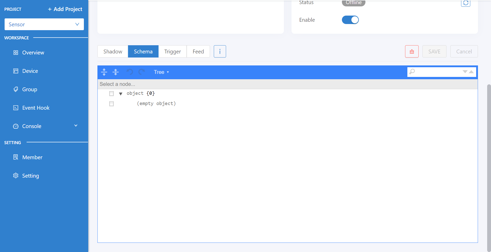

แต่เพื่อเป็นการอำนวยความสะดวกให้กับผู้ใช้ที่คุ้นเคยกับระบบ feed เดิม จึงเพิ่มทางเลือกในการสร้าง feed ผ่าน schema ตัวอย่างการเขียน schema แบบเดิม ในลักษณะนี้

.. code-block:: json

	{
        "properties": {
                "temp": {
                        "operation": {
                                "store": {
                                        "ttl": "7d"
                                },
                                "type": "number"
                        	}
                	}
        	}
	}

เมื่อเซฟจะพบว่า schema เปลี่ยนไปเพราะฟิวด์ store จะถูกลบออกไปจาก schema โดยที่ ฟิวด์ store จะไปอยู่ในหน้า datatag แทน

.. code-block:: json

	{
    	"properties": {
                "temp": {
                        "type": "number"
                	}
        	}
    	}
	
แต่จะไปเกิด datatag ในหน้า feed อัตโนมัติเหมือนกับการกดสร้างเองตามรูป

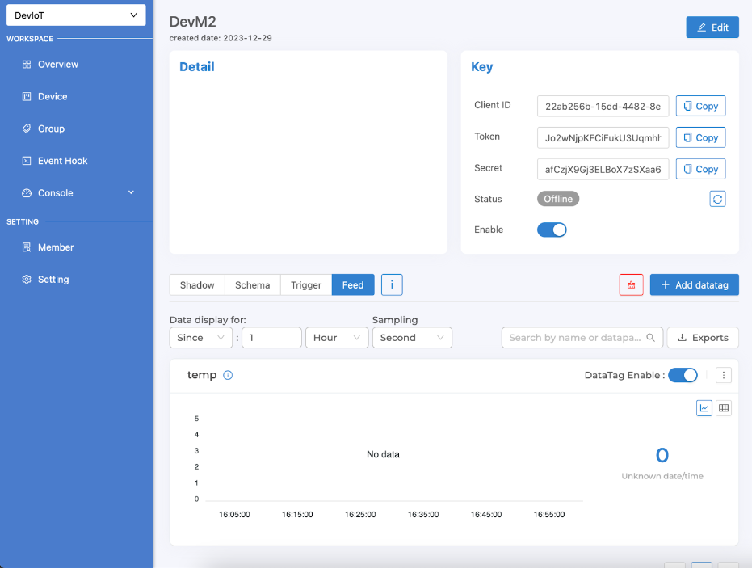

ในกรณีที่ device มี datatag ชื่อนี้อยู่ก่อนแล้ว การเซฟ schema ลงไปจะไม่เกิดการสร้าง datatag ใหม่เพิ่ม ในขณะเดียวกัน การเซฟ schema ที่ขาดฟิวด์ store ดังกล่าวอีกครั้ง ก็จะไม่มีผลทำให้ datatag 
ถูกลบออกจาก feed กลไกการสร้าง datatag อัตโนมัตินี้ จะทำงานครั้งแรกเพียงครั้งเดียว เพื่ออำนวยความสะดวกกับ user เท่านั้น

ดูรายละเอียดการใช้งาน datatag เพิ่มเติมได้ที่ :ref:`device-feed`

.. _trigger-and-action:

Device Trigger and Event Hook
-----------------------------

Device Trigger
~~~~~~~~~~~~~~~~~~~

เป็นระบบที่ผูกการเปลี่ยนแปลงข้อมูลของ Device (Device Shadow) เข้ากับการกระทำภายนอก (Event Hook) เช่น การตั้งค่าแจ้งเตือนตามสถานะต่าง ๆ ตามเงื่อนไขการทำงานของ Device ที่ถูกตั้งค่าไว้ การจัดการข้อมูล Trigger ให้เข้าไปที่ Device ที่ต้องการ จากนั้นคลิกไปแทบที่ชื่อว่า Trigger ดังรูปต่อไปนี้

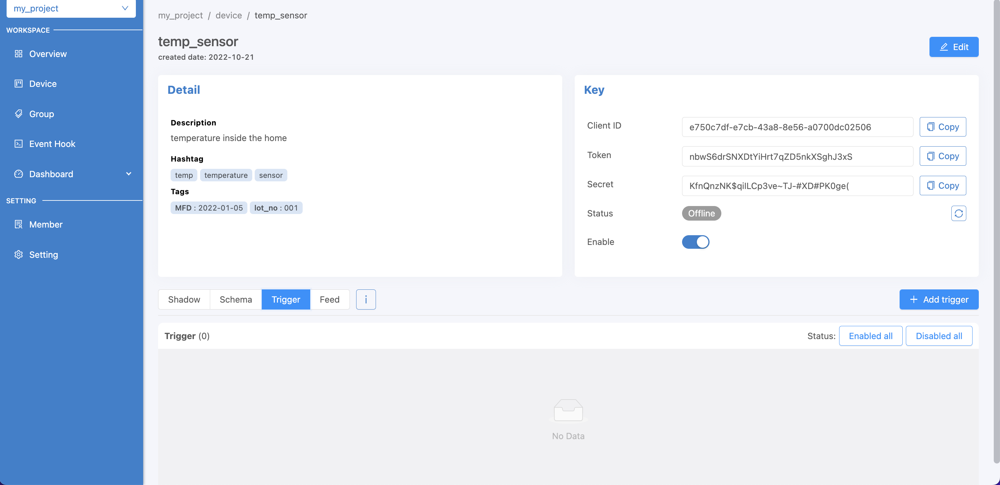

เริ่มสร้าง Trigger โดยการคลิกที่ปุ่ม Add Trigger จะปรากฏหน้าจอให้ทำการตั้งค่าต่าง ๆ ดังรูปต่อไปนี้

.. image:: _static/trigger_tab_add.png

จากรูปด้านบนข้อมูลที่ต้องระบุมีดังนี้

- Trigger ID (string) : รหัสของ Trigger ซึ่งระบบจะสร้างให้อัตโนมัติหรือผู้ใช้ต้องการกำหนดเองก็ได้
- Status : สถานะเปิด/ปิดการใช้งาน Trigger
- Trigger Title (string): ชื่อหรือคำอธิบายสั้น ๆ เกี่ยวกับ Trigger
- Event : ประเภทการเปลี่ยนแปลงข้อมูลของ Device (Device Shadow) มี 2 ประเภทให้เลือก ดังนี้

	- ``SHADOW.UPDATED`` จะเกิด Trigger เมื่อ Device Shadow Data มีการเปลี่ยนแปลงตรงตามเงื่อนไข (``Under conditions``) ที่กำหนดไว้

	- ``DEVICE.STATUSCHANGED`` จะเกิด Trigger เมื่อ Device เปลี่ยนสถานะการเชื่อมต่อ Platform (Online/Offline) และตรงตามเงื่อนไข (``Under conditions``) ที่กำหนดไว้ ซึ่งการกำหนดเงื่อนไขสำหรับ Trigger Event นี้มีได้ 3 รูปแบบ ดังนี้

		- ต้องการให้ Trigger ทุกครั้งที่สถานะการเชื่อมต่อ Platform เปลี่ยนไม่ว่าจะ Online เป็น Offline หรือ Offline เป็น Online ให้เซ็ตเงื่อนไข (``Under conditions``) ให้เป็นจริงเสมอ เช่น ``true == true`` หรือ ``1 == 1`` เป็นต้น 

		- ต้องการให้ Trigger ในกรณีที่เปลี่ยนสถานะเป็น Online เท่านั้น ให้เซ็ต ให้เซ็ตเงื่อนไข (``Under conditions``) เป็น ``$NEW.STATUS == 1``

		- ต้องการให้ Trigger ในกรณีที่เปลี่ยนสถานะเป็น Offline เท่านั้น ให้เซ็ต ให้เซ็ตเงื่อนไข (``Under conditions``) เป็น ``$NEW.STATUS == 0``

- Under conditions : เมื่อเลือก ``Event`` แล้วส่วนนี้ถึงปรากฏ ซึ่งสามารถเลือก UI ที่จะใช้กำหนดได้ 2 แบบ คือ

	- แบบ Basic จะเป็นฟอร์มให้ระบุเงื่อนไข โดยระบุค่าทั้ง 2 ฝั่ง (ค่าส่วนนี้สามารถใส่ Operators เข้าไปได้) ที่จะทำการเปรียบเทียบด้วย Comparisons ที่ต้องการ ถ้ามีหลายเงื่อนไขให้คลิกที่ปุ่ม Add และแต่ละเงื่อนไขคั่นด้วยเครื่องหมาย ``&&`` (and) หรือ  ``||`` (or)

	- แบบ Custom จะเป็นการกำหนดเงื่อนไขแบบพิมพ์ได้เองอิสระ หรือใช้ในกรณีที่เงื่อนไขมีความซํบซ้อนมากจน UI แบบ Basic ไม่รองรับในการกรอก การกำหนดเงื่อนไขแบบนี้ ถ้าเงื่อนไขมีความซับซ้อนหรือกรอกไม่ถูกต้อง ระบบจะไม่สามารถแปลงกลับไปเป็นแบบ Basic เพื่อแสดงผลให้ได้ ดังนั้นก็จะส่งผลให้ผู้ใช้ไม่สามารถคลิกเลือกไปที่แบบ Basic ได้จนกว่าจะปรับแก้ให้ระบบสามารถแปลงกลับ หรือลบข้อมูลที่กรอกไว้ในแบบ Custom ออกหมดก่อนที่จะคลิกกลับไปที่แบบ Basic

- Action to : เลือก Event hook ที่ต้องการให้ทำงานต่อเมื่อเกิดการ Trigger โดยรายการใน Dropdown จะได้มาจากการรายการที่ถูกสร้างในเมนู Event Hooks ด้านซ้ายมือ
- With this context variables : ประกาศตัวแปรที่จะส่งไปเรียกใช้ใน Event hook โดยทำการประกาศชื่อตัวแปรในช่องฝั่งซ้ายมือ และกำหนดค่าในช่องฝั่งขวามือ ซึ่งค่าที่กำหนดจะเป็นค่าคงที่ ค่าตัวแปรจาก Shadow หรือค่าตัวแปรจากระบบมีให้เรียกใช้ได้ ส่วนการอ้างอิงเพื่อใช้งานที่ Event hook จะใช้เป็น ``{{context.ชื่อตัวแปร}}``

ตัวอย่างการตั้งค่า Trigger ทั้ง ``SHADOW.UPDATED`` และ ``DEVICE.STATUSCHANGED`` ตามรูปต่อไปนี้

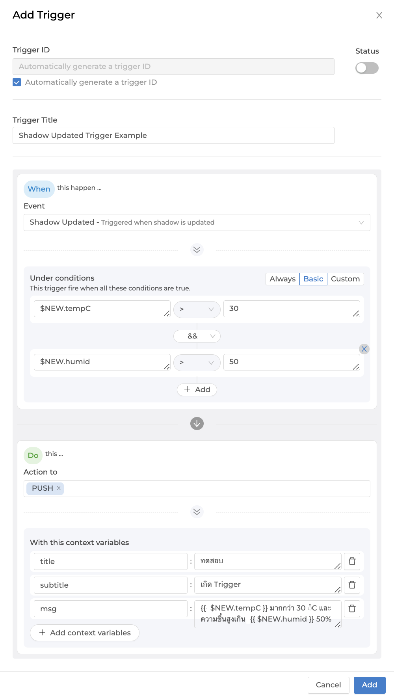

การอ้างอิงค่า Shadow ใน Trigger
~~~~~~~~~~~~~~~~~~~~~~~~~~~~~~

สำหรับการอ้างอิงค่าตัวแปร Shadow สามารถเรียกใช้ใน Condition หรือ Context Variable ของ Trigger มีรูปแบบดังนี้

- ``$CUR.พาธ.ของ.ตัว.แปร`` ค่าปัจจุบันล่าสุดที่ถูกอัพเดท ($NEW merge $PREV) โดยขึ้นต้นด้วย $CUR ตามด้วย Path ตามโครงสร้างใน Shadow

- ``$NEW.พาธ.ของ.ตัว.แปร`` ค่าใหม่ที่ส่งมาอัพเดทลง Shadow โดยขึ้นต้นด้วย $NEW ตามด้วย Path ตามโครงสร้างใน Shadow

- ``$PREV.พาธ.ของ.ตัว.แปร`` ค่าก่อนหน้าที่จะถูกอัพเดทลง Shadow โดยขึ้นต้นด้วย $PREV ตามด้วย Path ตามโครงสร้างใน Shadow

ความแตกต่างระหว่าง $NEW, $CUR และ $PREV ใน Trigger
~~~~~~~~~~~~~~~~~~~~~~~~~~~~~~~~~~~~~~~~~~~~~~~~~

เขียนเป็นสมการความสัมพันธ์ระหว่าง 3 ค่าจะได้เป็น ``$CUR = $PREV merge $NEW``

ตัวอย่างการอ้างอิง ``$NEW``, ``$CUR`` และ ``$PREV``

``Shadow 1``

.. code-block:: json

	{ 
		"f1": "d1", 
		"f2": ["A", "B", "C"], 
		"f3": { "a1": 1, "a2": 2, "a3": 3 }
	}

Write Shadow แบบ Merge ด้วยค่านี้ ``{ "data": { "f2": "A"} }``

``Shadow 2``

.. code-block:: json

	{ 
		"f1": "d1", 
		"f2": "A", 
		"f3": { "a1": 1, "a2": 2, "a3": 3 }
	}

จาก JSON ด้านบน ``Shadow 1`` คือ Shadow ก่อนที่จะมีการ Update และ ``Shadow 2`` คือ Shadow หลังทำการ Update เรียบร้อยแล้ว โดยการ Update เป็นการอัพเดทค่าของ f2 ใน Shadow ถ้ามีการอ้างอิงค่าใน Trigger แบบ ``$NEW``, ``$CUR`` และ ``$PREV`` ตามแต่ละค่าใน Shadow จะได้ค่าเป็นดังนี้

การอ้างอิงค่า ``f1`` :

	- ``$PREV.f1`` มีค่าเป็น ``d1``

	- ``$NEW.f1`` มีค่าเป็น	``null``

	- ``$CUR.f1`` มีค่าเป็น	``d1``

การอ้างอิงค่า ``f2`` :

	- ``$PREV.f2`` มีค่าเป็น	``"A", "B", "C"``

	- ``$NEW.f2`` มีค่าเป็น	``"A"``

	- ``$CUR.f2`` มีค่าเป็น	``"A"``

การอ้างอิงค่า ``f3`` :

	- ``$PREV.f3`` มีค่าเป็น	``[object Object]``

	- ``$NEW.f3`` มีค่าเป็น	``null``

	- ``$CUR.f3`` มีค่าเป็น	``[object Object]``

|

การอ้างอิงตัวแปรอื่น ๆ ภายในระบบ
~~~~~~~~~~~~~~~~~~~~~~~~~~~~~~

สำหรับการอ้างอิงค่าตัวแปรที่ระบบมีให้เรียกใช้ใน Condition หรือ Context Variable ของ Trigger มีรูปแบบดังนี้

- ``$DEVICEID`` รหัสของ Device ที่เป็นเจ้าของ Shadow

- ``$ALIAS`` ชื่อของ Device ที่เป็นเจ้าของ Shadow

- ``$PROJECTID`` รหัสของ Project ที่ Shadow สังกัด

- ``$PROJECTNAME`` ชื่อของ Project ที่ Shadow สังกัด

- ``$GROUPID`` รหัสของ Group ที่ Shadow สังกัด

- ``$GROUPNAME`` ชื่อของ Group ที่ Shadow สังกัด

- ``$NEW.STATUS`` รหัสสถานะปัจจุบันของ Device (``1`` คือ online, ``0`` คือ offline)

- ``$NEW.STATUSTEXT`` ข้อความสถานะปัจจุบันของ Device (``online`` คือ เชื่อมต่อ Platform อยู่, ``offline`` คือ ไม่ได้เชื่อมต่อ Platform)

- ``$OLD.STATUS`` รหัสสถานะก่อนหน้าของ Device (``1`` คือ online, ``0`` คือ offline)

- ``$OLD.STATUSTEXT`` ข้อความสถานะก่อนหน้าของ Device (``online`` คือ เชื่อมต่อ Platform อยู่, ``offline`` คือ ไม่ได้เชื่อมต่อ Platform)

|

Operators ที่เรียกใช้งานได้ใน Condition ของ Trigger
~~~~~~~~~~~~~~~~~~~~~~~~~~~~~~~~~~~~~~~~~~~~~~~~~~

- ``+``  บวกค่า, ต่อ String

- ``-`` ลบค่า

- ``*`` คูณค่า

- ``/`` หารค่า

- ``//`` หารค่าแบบไม่แสดงผลในส่วนที่เป็นเศษ

- ``%`` หารค่าแบบแสดงผลเฉพาะเศษ

- ``^`` ยกกำลังค่า

- ``&&`` ตรรกะและ (Logical AND)

- ``||`` ตรรกะหรือ (Logical OR)

|

Comparisons ที่เรียกใช้งานได้ใน Condition ของ Trigger
~~~~~~~~~~~~~~~~~~~~~~~~~~~~~~~~~~~~~~~~~~~~~~~~~~~

- ``==`` เท่ากับ

- ``===`` ค่าและประเภทของค่าเท่ากับ

- ``!=`` ไม่เท่ากับ

- ``!==`` ค่าหรือประเภทของค่าไม่เท่ากับ

- ``>`` มากกว่า

- ``>=`` มากกว่าหรือเท่ากับ

- ``<`` น้อยกว่า

- ``<=`` น้อยกว่าหรือเท่ากับ

- ``in`` มีค่าอยู่ในลิสรายการ (Array or String) 

|

Event Hook
~~~~~~~~~~~~~~

เป็นตัวกลางที่ใช้กำหนดว่าเมื่อเกิด Trigger จะให้ดำเนินการอะไร ซึ่งจะต้องไปกำหนดที่ |portal_url| เมนู *Event Hooks* ดังรูป

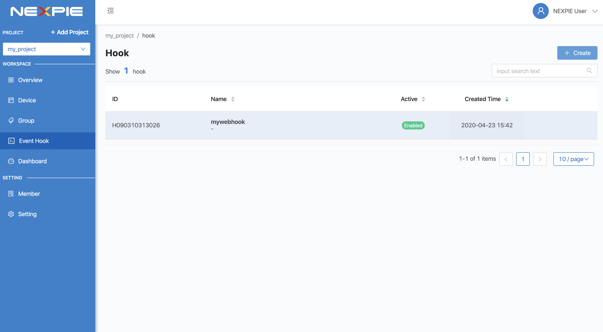

สร้าง Event Hook โดยการคลิกที่ปุ่ม "Create" กรอกข้อมูล สำหรับ *Type* คือ ชนิดของ Event Hook ซึ่งปัจจุบันมีเพียงชนิดเดียว คือ WEBHOOK ในอนาคตจะมีการพัฒนาชนิดอื่นๆ ตามมา จากนั้นคลิกที่ปุ่ม "Create" ระบบจะทำการสร้าง Event Hook ให้ ดังรูป

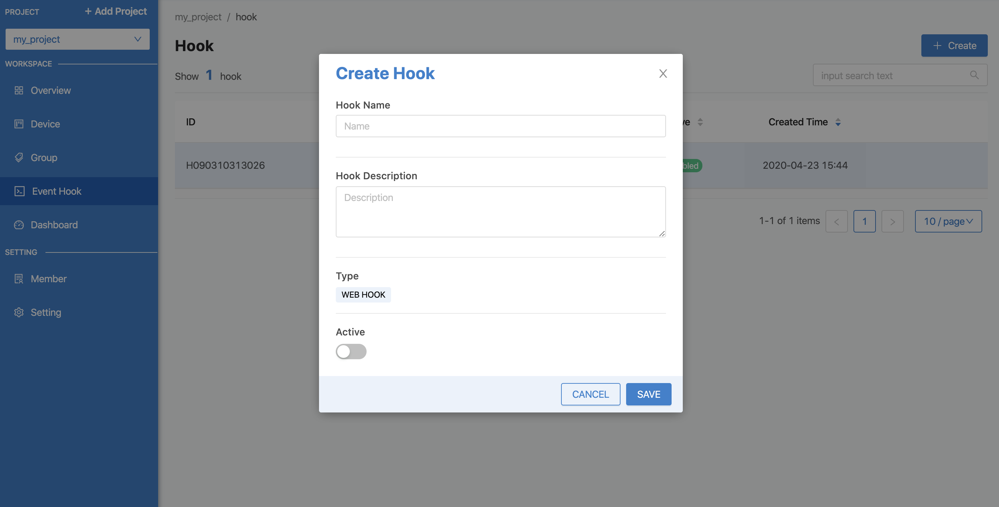

จากนั้นคลิกที่รายการ Event Hook ที่สร้างเพื่อเข้าไปตั้งค่าการทำงาน โดย Configuration จะกำหนดในรูปแบบ JSON ดังรูป

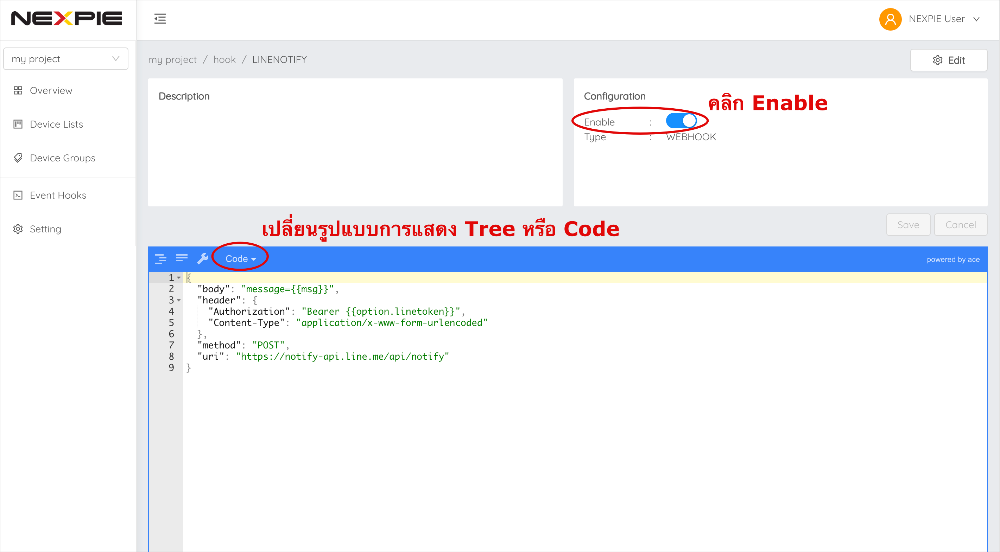

.. code-block:: json

	{
		"body": "message=Temperature of {{context.devicename}} is changed to {{context.temp}}ํC",
  		"header": {
    		"Authorization": "Bearer {{context.linetoken}}",
			"Content-Type": "application/x-www-form-urlencoded"
		},
  		"method": "POST",
  		"uri": "https://notify-api.line.me/api/notify"
	}

.. _event-hook-context:

จาก *Event Hook Example* เป็นตัวอย่างการทำ Line Alert จะเห็นได้ว่าสามารถกำหนดค่าได้ 4 Attributes คือ 

- ``body`` คือ ส่วนของข้อความที่จะส่งไปแสดงยังปลายทาง ซึ่งมีการนำ Context Variable ที่เซ็ตไว้ใน Trigger มาใช้งาน 

- ``header`` คือ ข้อมูลเพิ่มเติมที่ต้องการส่งไปยังปลายทาง เช่น Authorization, Content-Type เป็นต้น เหมือกับ HTTP Headers

- ``method`` คือ ส่วนที่กำหนดว่าปลายทางต้องการให้ส่งไปในแบบไหน GET, POST หรือ PUT เหมือกับ HTTP Methods

- ``uri`` คือ Endpoint ปลายทางที่กำหนดว่าต้องการให้ส่งไปที่ใด

ใน Event Hook สามารถอ้างอิงตัวแปรต่าง ๆ ที่เซ็ตไว้ใน Context Variable ของ Trigger ได้ โดยใช้รูปแบบนี้ ``{{context.ชื่อตัวแปร}}`` จากตัวอย่างด้านบนมีการอ้างอิงหรือเรียกใช้งาน Context Variable ของ Trigger 3 ค่า คือ ``{{context.devicename}}``, ``{{context.temp}}``  และ ``{{context.linetoken}}`` การเซ็ต Context Variable ใน Trigger จะเป็นดังรูปต่อไป

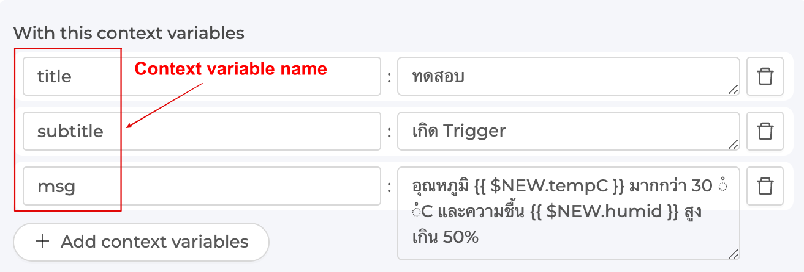

|

.. note:: การอ้างอิงข้อมูลตัวแปรใน Trigger และ Event Hook

	จะเห็นได้ว่าการอ้างอิงตัวแปรจะมี 2 รูปแบบ คือ แบบที่ต้องครอบ และไม่ต้องครอบด้วย {{...}} เนื่องด้วยประเภทของข้อมูลที่มีการอ้างตัวแปรที่ต่างกัน นั่นคือ ถ้าเป็นการอ้างอิงในเงื่อนไข (Condition) จะสามารถอ้างอิงตัวแปรได้โดยที่ไม่ต้องใส่ {{...}} ครอบตัวแปร แต่ถ้าเป็นอ้างอิงในข้อความ (String) จำเป็นต้องมีการครอบตัวแปรด้วย {{...}} เสมอ

|

.. _device-feed:

Device Feed
------------------

สำหรับจัดการและดูข้อมูลใน Timeseries Database ของแต่ละ Device ซึ่งจะแสดงในรูปแบบของกราฟเส้นแยกตามฟิลด์ และยังสามารถดาวน์โหลดข้อมูลออกมาเป็นไฟล์ .csv ได้ โดยการใช้งานให้เข้าไปที่ Device ที่ต้องการ จากนั้นคลิกไปแทบที่ชื่อว่า Feed ดังรูปต่อไปนี้

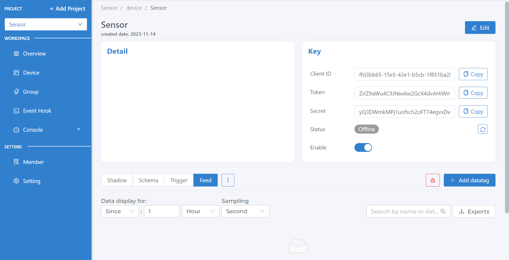
	
เมื่อมีการเก็บข้อมูลลงใน Timeseries Database จะปรากฏกราฟข้อมูลแยกตามฟิลด์ที่กำหนดให้เก็บข้อมูล ลักษณะจะเป็นดังรูปด้านล่าง 

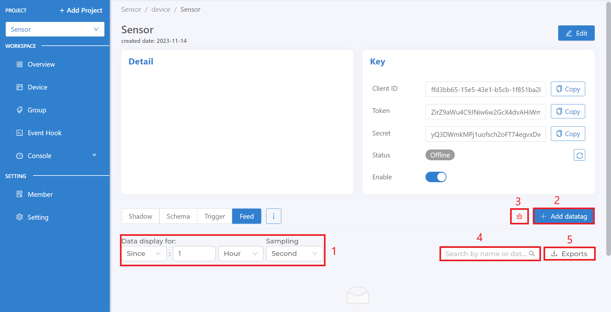

จากรูปด้านบน การใช้งานในแต่ละส่วนสามารถตั้งค่าหรือมีรายละเอียดการใช้งานดังนี้

**1. ตั้งค่าช่วงเวลาในการดึงข้อมูลมาแสดงกราฟ**

สามารถกำหนดช่วงเวลาได้ 2 แบบ คือ

- ``Since`` คือ การกำหนดช่วงเวลาแบบให้แสดงข้อมูลจากปัจจุบันย้อนหลังไปเท่าไร โดยให้กรอกตัวเลขจำนวนเต็มและเลือกหน่วยที่ต้องการ จากนั้นกดปุ่ม Apply ระบบจะดึงข้อมูลตามช่วงเวลาที่กำหนดมาแสดงในกราฟของทุกฟิลด์ข้อมูล การตั้งค่าเป็นดังรูปต่อไปนี้

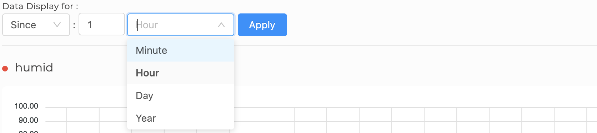

- ``From to`` คือ การกำหนดช่วงเวลาแบบระบุทั้งเวลาเริ่มต้นและสิ้นสุดที่ต้องการให้แสดงข้อมูล โดยระบุวันเวลาเริ่มต้นและสิ้นสุดตามที่ต้องการ จากนั้นกดปุ่ม Apply ระบบจะดึงข้อมูลตามช่วงเวลาที่กำหนดมาแสดงในกราฟของทุกฟิลด์ข้อมูล การตั้งค่าเป็นดังรูปต่อไปนี้

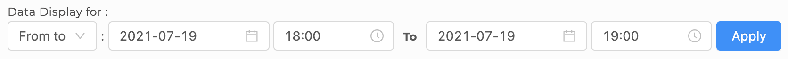

**2. เพิ่ม datatag**

datatag คือ feature ที่ช่วยในการสร้าง feed โดยที่ไม่ต้องเขียน shadow schema สามารถสร้างโดยกดที่ปุ่ม "Add datatag" quota ของ datatag สามารถใช้ได้ |tag_project| tags / project , |tag_device| tags / device 

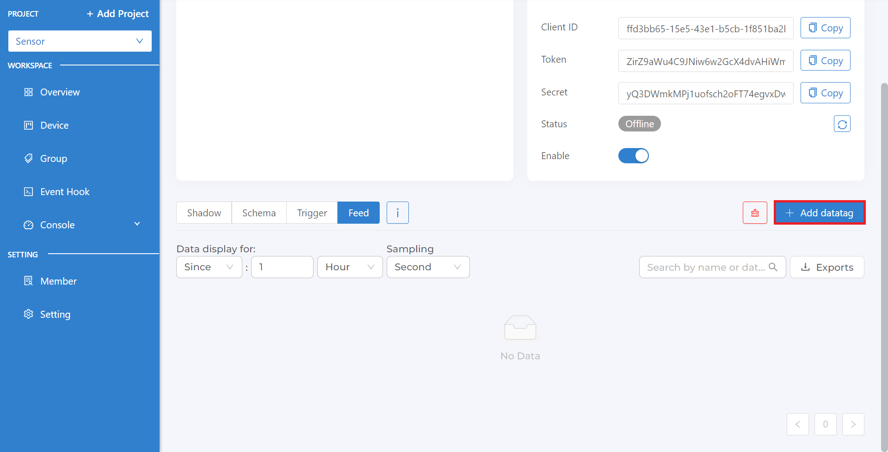

ในการเพิ่ม datatag ทำการกดปุ่ม datatag จะขึ้นหน้าต่างดังรูป

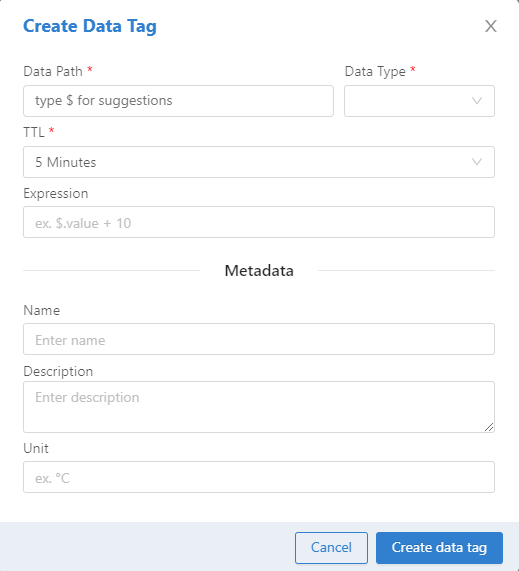

ทำการเลือกค่าที่อยู่ใน shadow ที่ต้องการนำมาแสดง โดยทำการใส่ $ จะแสดงค่า value ที่อยู่ใน shadow ขึ้นมาดังรูป

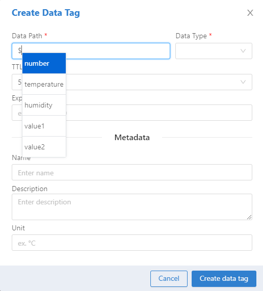

จากนั้นทำการเลือก value ที่ต้องการแสดงโดยมีค่าต่างๆดังนี้

- ``Data Path`` คือตำแหน่งของฟิวด์ใน shadow ที่ต้องการเช่น

.. list-table::
   :header-rows: 1
   
   * - Shadow
     - Data Path
   * - {"temp":25}
     - temp
   * - {"home"{"temp":25}}
     - home.temp
   
- ``Data Type`` คือประเภทที่ต้องการเก็บ ประเภทต้องตรงกับค่าใน shadow เช่น ค่าใน shadow เป็น number data type ก็ต้องเซ็ทเป็น number

- ``TTL`` คือระยะเวลาที่ต้องการเก็บข้อมูลเมื่อเวลาผ่านไปข้อมูลจะถูกลบออกไปโดยอัตโนมัติตามเวลาที่ตั้งไว้

- ``Expression`` คือการแปลงข้อมูล เช่น ต้องการแปลงจากเซลเซียสเป็นฟาเรนไฮต์ ทำการใส่ ($.value * 1.8) + 32 ลงในช่อง Expression ได้เลย โดยที่ $.value จะเป็นการอ้างอิงชื่อจาก datapath แต่ละ datatag นั้นๆ

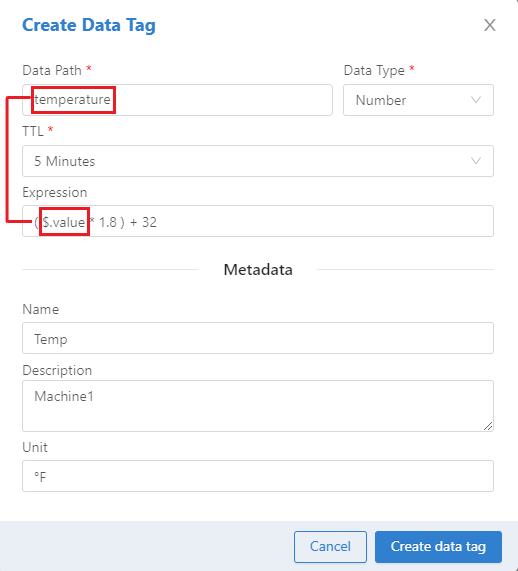

เมื่อทำการใส่ค่าดังรูปค่าที่ได้จากเซลเซียสจะถูกแปลงเป็นฟาเรนไฮต์

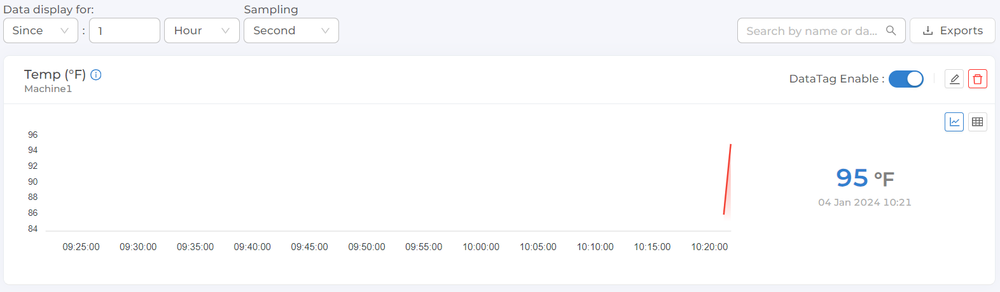

- ``Name`` คือชื่อของ datatag

- ``Description`` คือคำอธิบาย datatag

- ``Unit`` คือหน่วยของข้อมูลที่ต้องการนำมาแสดง

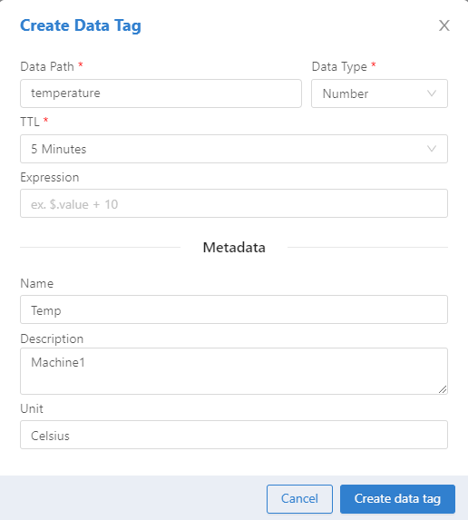

เมื่อทำการกรอกค่าดังรูปจะได้ Feed ขึ้นมา

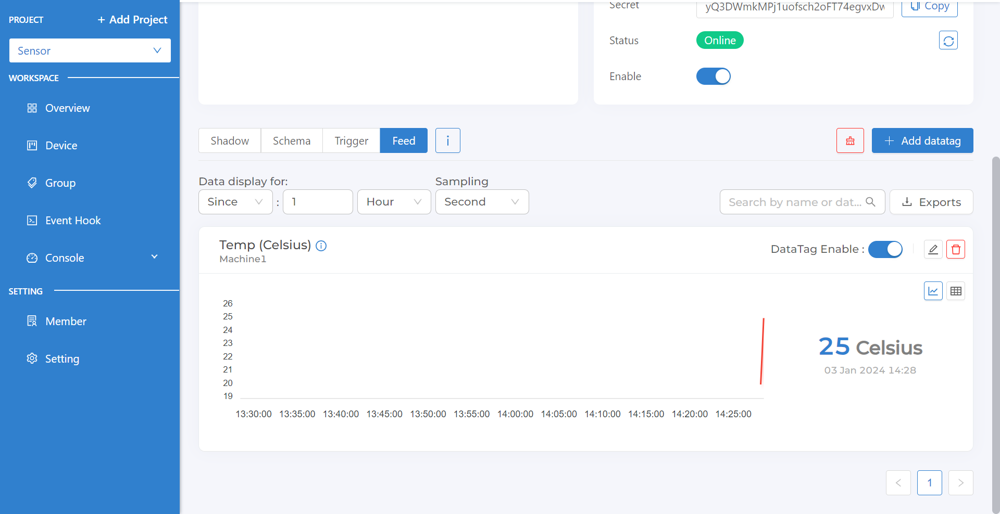

.. warning:: 
	- ควรตั้ง Data Type ของ feed ให้สอดคล้องกับข้อมูลที่เขียนเข้า shadow เพราะระบบจะพยายาม cast type ให้ตรงกับ type ที่กำหนดไว้  เช่น “2” เป็น 2 แต่ในกรณีที่แย่ที่สุดอาจจะ cast ไม่ได้ เช่น ถ้าเราตั้ง type เป็น “number” แต่เขียนค่าลง shadow ว่า “14 June 2023” แบบนี้ข้อมูลจะไม่เกิดการเขียนจุดลง feed
	- การลบ Datatag ข้อมูล time series ที่เก็บมาจะถูกลบทิ้งไปด้วย
	
**3. ลบ datatag**

เป็นการลบ datatag ทั้งหมดออก

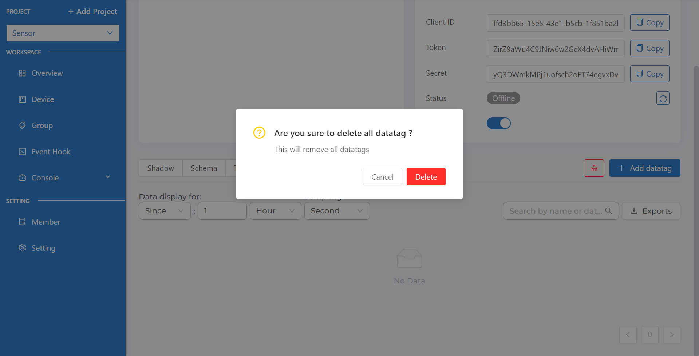

**4. Search หา datatag**

จะเป็นการหา datatag ที่ต้องการได้

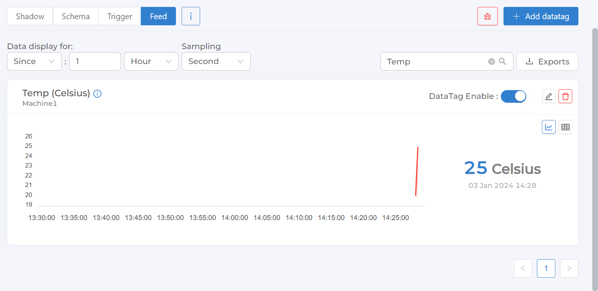

**5. การดาวน์โหลดข้อมูล (Export Feed)**

เป็นการดาวน์โหลดข้อมูลที่เก็บใน Timeseries Database ตามช่วงเวลาที่กำหนด ออกมาเป็นไฟล์ .csv โดยคลิกที่ปุ่ม `Exports` จะปรากฏหน้าสำหรับตั้งค่าการดาวน์โหลดข้อมูลดังรูปต่อไปนี้

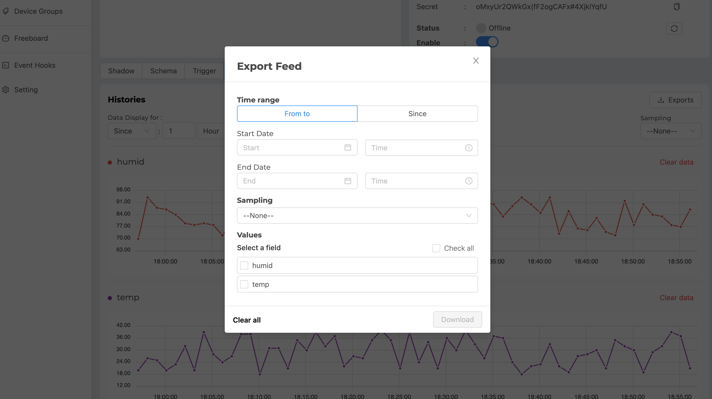

จากรูปด้านบน ข้อมูลที่ต้องระบุสำหรับการดาวน์โหลดข้อมูล มีดังนี้

- ``Time range`` คือ ช่วงเวลาที่ต้องการข้อมูล จะเหมือนในข้อ `1. ตั้งค่าช่วงเวลาในการดึงข้อมูลมาแสดงกราฟ`

- ``Sampling`` คือ การกำหนดความละเอียดของข้อมูล จะเหมือนในข้อ `2. ค่าความถี่ในการเฉลี่ยข้อมูล (Sampling)`

- ``Values`` คือ การเลือกฟิลด์ข้อมูลที่ต้องการ

เมื่อกรอกข้อมูลครบแล้วปุ่ม Download จะ Active ขึ้นมาให้สามารถกดได้ ทำการกดเพื่อดาวน์โหลดข้อมูล ส่วน `Clear all` ใช้สำหรับ Reset การตั้งค่าสำหรับดาวน์โหลดข้อมูล

|

.. note:: จำนวนจุดข้อมูลสูงสุดที่ระบบกำหนดให้ดึงข้อมูลได้ในแต่ละครั้ง

	ในการดึงข้อมูลจาก Timeseries Database เพื่อการเรียกดูหรือการดาวน์โหลดข้อมูล ระบบจำกัดจำนวนจุดสูงสุดที่ไม่เกิน 100,000 จุดข้อมูล โดยคิดจากจำนวนข้อมูลดิบ (Raw Data) ก่อนที่จะมีการประมวลแปลงความละเอียดข้อมูลตาม `Sampling` ที่เลือก และเป็นการนับรวมจากทุกฟิลด์ที่มีการเรียกข้อมูลมา ถ้าข้อมูลดึงมาเกินกว่า 100,000 จุดข้อมูล ระบบจะทำการตัดข้อมูลออกแบบอัตโนมัติ โดยข้อมูลจะถูกเรียงลำดับจากเวลาเริ่มต้นถึงเวลาสิ้นสุดที่เลือกดึงข้อมูล และข้อมูลส่วนท้ายที่เกินจะถูกตัดออก