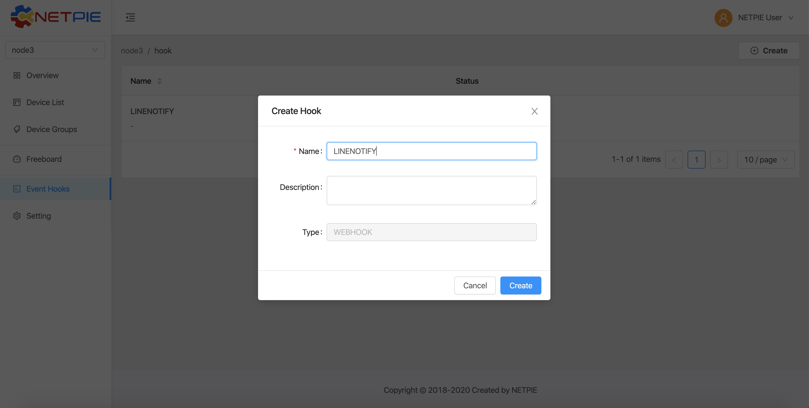
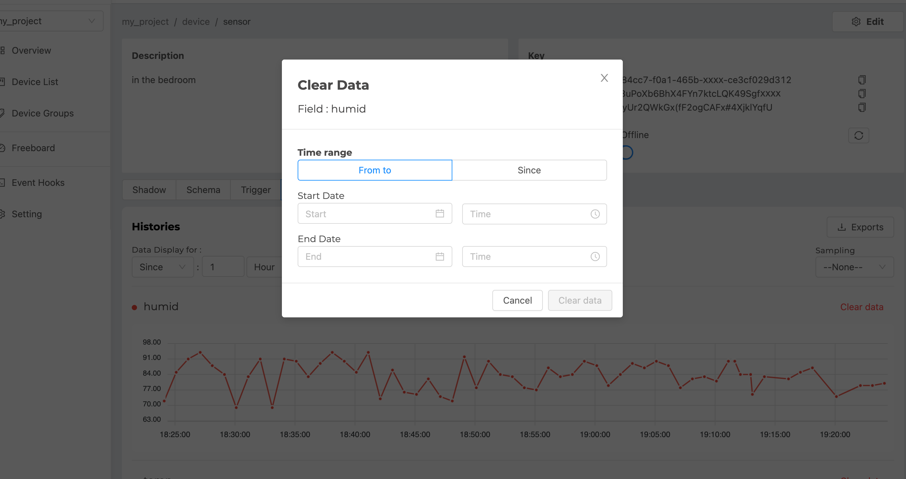

.. raw:: html

    
<b>TH</b> | <a href="https://docs.netpie.io/en/device-config.html">EN</a>

Device Configuration
=====================

|

Device Shadow
------------------

|

คือ ฐานข้อมูลเสมือนของอุปกรณ์ เป็นฐานข้อมูลเล็ก ๆ ที่มีคู่อยู่กับอุปกรณ์ (Device) ทุกตัว ใช้สำหรับเก็บข้อมูลต่าง ๆ เกี่ยวกับอุปกรณ์นั้น ๆ (Device Shadow Data) เช่น ข้อมูลที่เกิดจากเซนเซอร์ ข้อมูลการกำหนดองค์ประกอบต่าง ๆ (Device Configuration) เป็นต้น

|

Device Schema
------------------

|

นิยามของ Device Schema ในที่นี้ คือ แผงผังข้อมูลที่กำหนดไว้เพื่อใช้กำกับ Device Shadow สำหรับ Device ที่ต้องมีการจัดการข้อมูล แนะนำให้สร้าง Device Schema ของข้อมูลเตรียมไว้ Device Schema เสมือนเป็น Device Template ทำให้ Server สามารถ

- การตรวจสอบชนิดข้อมูล (Data Validation)
- การแปลงข้อมูล (Data Transformation) เช่น เปลี่ยนหน่วยของข้อมูล เป็นต้น
- การเก็บข้อมูลลงใน Timeseries Database 

โดย Device Schema จะประกาศในรูปแบบ JSON มีลักษณะดังนี้

.. code-block:: json

	{
	    "additionalProperties": false,
	    "properties": {
	        "temp": {
	            "operation": {
	                "store": {
	                    "ttl": "30d"
	                },
	                "transform": {
	                    "expression": "($.temp * 1.8) + 32"
	                }
	            },
	            "type": "number"
	        },
		    "place": {
		      "operation": {
		        "store": {
		          "ttl": "7m"
		        }
		      },
		      "type": "string"
		    }
	    }
	}

|

Device Schema จะประกอบไปด้วย

:additionalProperties *(boolean)*:
	
	สถานะการอนุญาตให้บันทึกข้อมูลลง Shadow หรือ Timeseries Database ในกรณีที่ข้อมูลไม่ตรงตามที่กำหนดใน Properties

	``additionalProperties : true`` => อนุญาตให้บันทึกลง Shadow หรือ Timeseries Database

	``additionalProperties : false`` => ไม่อนุญาตให้บันทึกเฉพาะส่วนที่ไม่ตรงตาม Properties

	**ตัวอย่าง** Schema มีการกำหนด Properties เป็น temp, humid ข้อมูลที่ส่งมาเป็น temp, humid และ color ถ้าหาก additionalProperties เป็น true ข้อมูลของ color จะถูกบันทึกลงไปใน shadow หรือ feed แต่หากเป็น false จะมีเพียง humid และ temp เท่านั้นที่จะถูกบันทึกลง shadow หรือ Timeseries Database

:properties *(json)*:

	เริ่มจากกำหนดชื่อฟิลด์ (จากตัวอย่าง  คือ "temp" และ "place") และกำหนดคุณสมบัติของแต่ละฟิลด์ซึ่งจะอยู่ในรูปแบบ JSON โดยจะแยก 2 ส่วน คือ

	- ``operation`` สำหรับตั้งค่าการจัดการข้อมูลในฟิลด์นั้น ๆ ประกอบด้วย

		``store`` สำหรับตั้งค่าการเก็บข้อมูลลง Timeseries Database

			``ttl`` คือ ระยะเวลาของการเก็บข้อมูลใน Timeseries Database แต่ละจุดข้อมูลที่มีอายุการเก็บครบตามที่กำหนดจะถูกลบทิ้งอัตโนมัติ จำเป็นต้องกำหนดค่านี้ ระบบถึงจะเก็บข้อมูลลง Timeseries Database การกำหนดค่าจะระบุตัวเลขจำนวนเต็มตามด้วยหน่วยเวลา ดังนี้ ms(มิลลิวินาที), s(วินาที), m(นาที) h(ชั่วโมง), d(วัน), y(ปี) ถ้าไม่ระบุหน่วยค่า default จะเป็น ms(มิลลิวินาที) 

			**ตัวอย่าง** 30d หมายถึง เก็บข้อมูลนาน 30 วัน, 1y หมายถึง เก็บข้อมูลนาน 1 ปี, 3000 หมายถึง เก็บข้อมูลนาน 3 วินาที

		``transform`` การแปลงข้อมูล (Data Transformation) ก่อนการจัดเก็บ

			``expression`` คือ สูตรหรือวิธีการแปลงข้อมูล (Data Transformation) ก่อนการจัดเก็บ

			**ตัวอย่าง** จาก *Device Schema Example* กำหนด ``expression`` เท่ากับ ``($.temp * 1.8) + 32`` เป็นการแปลงหน่วยอุณหภูมิค่าที่เซนเซอร์วัดได้จากหน่วยเซลเซียสเป็นฟาเรนไฮต์ โดยนำมาคูณด้วย 1.8 และบวกด้วย 32 จะได้ค่าอุณหภูมิเป็นหน่วยฟาเรนไฮต์ ก่อนบันทึกลงใน Device Shadow หรือ Timeseries Database

	- ``type`` คือ ชนิดของข้อมูลในฟิลด์นั้น ๆ ได้แก่ number, string, boolean, array, object 
|

.. caution:: 

	การกำหนดชื่อฟิลด์ใน Properties Schema ต้องประกอบด้วยอักษรภาษาอังกฤษ (a-z, A-Z), ตัวเลข (0-9) หรือ Underscore (_) เท่านั้น ห้ามมีอักขระพิเศษอื่น ๆ นอกเหนือจากนี้ เพราะจะไม่สามารถเก็บข้อมูลได้
	
|

.. _trigger-and-action:

Device Trigger and Event Hook
-----------------------------

|

เป็นระบบที่ผูกการเปลี่ยนแปลงข้อมูลของ Device (Device Shadow) เข้ากับการกระทำภายนอก (Event Hook) เช่น การตั้งค่าแจ้งเตือนตามสถานะต่าง ๆ ตามเงื่อนไขการทำงานของ Device ที่ถูกตั้งค่าไว้ การใช้งาน Trigger จะประกาศในรูปแบบ JSON มีลักษณะดังนี้

.. code-block:: json

	{
	    "enabled": true,
	    "trigger": [
	        {
	            "action": "EVENT_HOOK_NAME",
	            "event": "SHADOW.UPDATED or DEVICE.STATUSCHANGED",
	            "condition": "Operation List ==, !=, >, >=, <, <=, in",
	            "msg": "text",
	            "option": {}
	        }
	    ]
	}

|

จาก *Trigger Format* สามารถอธิบายได้ดังนี้

:enabled *(boolean)*:

	สถานะเปิด/ปิดการใช้งาน Trigger

	``enabled : true`` => เปิดการใช้งาน Trigger

	``enabled : false`` => ปิดการใช้งาน Trigger

:trigger *(array)*:

	การตั้งค่าต่าง ๆ ของ Trigger ซึ่งสามารถตั้งค่าได้หลาย Trigger แต่ละ Trigger มีองค์ประกอบที่สามารถตั้งค่าได้ดังนี้

	- ``action`` คือ เมื่อเกิด Trigger จะให้กระทำอะไร โดยระบุชื่อ Event Hook ที่ต้องการให้กระทำจากรายการที่ได้สร้างไว้ที่เมนู *Event Hooks* ใน |portal_url|

	- ``event`` คือ ประเภทการเปลี่ยนแปลงข้อมูลของ Device (Device Shadow) มี 2 ที่ระบุได้ ดังนี้

		``event : SHADOW.UPDATED`` => จะเกิด Trigger เมื่อ Device Shadow Data มีการเปลี่ยนแปลงตรงตามเงื่อนไข (``condition``) ที่กำหนดไว้ (กรณีนี้จำเป็นต้องกำหนด ``condition`` ควบคู่ด้วย ถ้าไม่กำหนดจะไม่เกิด Trigger) สำหรับการอ้างอิงค่าตัวแปรใน Event ประเภทนี้ ได้แก่

			- ``$DEVICEID`` => รหัสของ Device ที่เป็นเจ้าของ Shadow

			|

			- ``$CUR.พาธ.ของ.ตัว.แปร`` ค่าปัจจุบันล่าสุดที่ถูกอัพเดท และ merge กับค่าเก่าแล้ว โดยขึ้นต้นด้วย $CUR ตามด้วย Path ตามโครงสร้างใน Shadow

			|

			- ``$NEW.พาธ.ของ.ตัว.แปร`` => ค่าใหม่เฉพาะส่วนที่มีการอัพเดทลง Shadow โดยขึ้นต้นด้วย $NEW ตามด้วย Path ตามโครงสร้างใน Shadow

			|

			- ``$PREV.พาธ.ของ.ตัว.แปร`` => ค่าก่อนหน้าที่จะอัพเดทลง Shadow โดยขึ้นต้นด้วย $PREV ตามด้วย Path ตามโครงสร้างใน Shadow

		``event : DEVICE.STATUSCHANGED`` => จะเกิด Trigger เมื่อ Device เปลี่ยนสถานะการเชื่อมต่อ Platform จากเชื่อมต่อ (Online) เป็นไม่เชื่อมต่อ (Offline) หรือ จากไม่เชื่อมต่อ (Offline) เป็นเชื่อมต่อ (Online) สำหรับการอ้างอิงค่าตัวแปรใน Event ประเภทนี้ ได้แก่

			- ``$DEVICEID`` => รหัสของ Device ที่เป็นเจ้าของ Shadow

			|

			- ``$ALIAS`` => ชื่อของ Device ที่เป็นเจ้าของ Shadow

			|

			- ``$PROJECTID`` => รหัสของ Project ที่ Shadow สังกัด

			|

			- ``$PROJECTNAME`` => ชื่อของ Project ที่ Shadow สังกัด

			|

			- ``$GROUPID`` => รหัสของ Group ที่ Shadow สังกัด

			|

			- ``$GROUPNAME`` => ชื่อของ Group ที่ Shadow สังกัด

			|

			- ``$BILLINGID`` => รหัสของ Billing ที่ Shadow สังกัด

			|

			- ``$NEW.STATUS`` => รหัสสถานะปัจจุบันของ Device (``1`` คือ online, ``0`` คือ offline)

			|

			- ``$NEW.STATUSTEXT`` => ข้อความสถานะปัจจุบันของ Device (``online`` คือ เชื่อมต่อ Platform อยู่, ``offline`` คือ ไม่ได้เชื่อมต่อ Platform)

			|

			- ``$OLD.STATUS`` => รหัสสถานะก่อนหน้าของ Device (``1`` คือ online, ``0`` คือ offline)

			|

			- ``$OLD.STATUSTEXT`` => ข้อความสถานะก่อนหน้าของ Device (``online`` คือ เชื่อมต่อ Platform อยู่, ``offline`` คือ ไม่ได้เชื่อมต่อ Platform)

	- ``condition`` คือ เงื่อนไขการเปลี่ยนแปลงของ Device Shadow Data จะใช้ในกรณีที่ ``event : SHADOW.UPDATED`` ถ้าการเปลี่ยนแปลงตรงตามเงื่อนไขที่กำหนดจึงจะเกิด Trigger เช่น อุณหภูมิเปลี่ยนจากเดิม, อุณหภูมิลดต่ำลงจากเดิม หรือ อุณหภูมิมากกว่าค่าที่กำหนดไว้ เป็นต้น เครื่องหมายที่สามารถใช้งานในเงื่อนไขได้ แยกเป็น 2 ประเภท คือ Operators และ Comparisons ดังนี้

		Operators ประกอบด้วย

			- ``+`` => บวกค่า, ต่อ String

			- ``-`` => ลบค่า

			- ``*`` => คูณค่า

			- ``/`` => หารค่า

			- ``//`` => หารค่าแบบไม่แสดงผลในส่วนที่เป็นเศษ

			- ``%`` => หารค่าแบบแสดงผลเฉพาะเศษ

			- ``^`` => ยกกำลังค่า

			- ``&&`` => ตรรกะและ (Logical AND)

			- ``||`` => ตรรกะหรือ (Logical OR)

		Comparisons ประกอบด้วย

			- ``==`` => เท่ากับ

			- ``!=`` => ไม่เท่ากับ

			- ``>`` => มากกว่า

			- ``>=`` => มากกว่าหรือเท่ากับ

			- ``<`` => น้อยกว่า

			- ``<=`` => น้อยกว่าหรือเท่ากับ

			- ``in`` => มีค่าอยู่ในลิสรายการ (Array or String) 

	- ``msg`` คือ ข้อความที่ต้องการให้ส่งแจ้งเตือนกรณีเกิด Trigger

	- ``option`` ใช้สำหรับกำหนดค่าอื่น ๆ (ถ้ามี) นอกเหนือจากที่มีระบุไว้ในข้างต้น ช่วยให้ผู้ใช้สามารถกำหนดตัวแปรเฉพาะสำหรับตัวเอง เพื่อไปประยุกต์ใช้ใน Event Hook ได้ยืดหยุ่นยิ่งขึ้น

|

**ความแตกต่างระหว่าง $NEW, $CUR และ $PREV ใน Trigger**

|

เขียนเป็นสมการความสัมพันธ์ระหว่าง 3 ค่าจะได้เป็น ``$CUR`` = ``$PREV`` merge ``$NEW``

|

- ``$PREV`` คือ ค่าเดิมใน Shadow ก่อนที่จะมีการ Update
- ``$NEW`` คือ ค่าใหม่ที่ส่งมา Update ใน Shadow
- ``$CUR`` คือ ค่าปัจจุบันหลังทำการ Update Shadow เรียบร้อยแล้ว

|

ตัวอย่างการอ้างอิง $NEW, $CUR และ $PREV

.. code-block:: json

	{ //shadow 1
		"f1": "d1", 
		"f2": ["A", "B", "C"], 
		"f3": { "a1": 1, "a2": 2, "a3": 3 }
	}

Write Shadow แบบ Merge ด้วยค่านี้ ``{ "data": { "f2": "A"} }``

.. code-block:: json

	{ //shadow 2
		"f1": "d1", 
		"f2": "A", 
		"f3": { "a1": 1, "a2": 2, "a3": 3 }
	}

|

จากตารางด้านบน Shadow1 คือ Shadow ก่อนที่จะมีการ Update และ Shadow2 คือ Shadow หลังทำการ Update เรียบร้อยแล้ว โดยการ Update เป็นการอัพเดทค่าของ f2 ใน Shadow ถ้ามีการอ้างอิงค่าใน Trigger แบบ $NEW, $CUR และ $PREV ตามแต่ละค่าใน Shadow จะได้ค่าเป็นดังนี้

|

การอ้างอิงค่า f1 :

	- ``$PREV.f1`` มีค่าเป็น	``d1``

	- ``$NEW.f1`` มีค่าเป็น	``null``

	- ``$CUR.f1`` มีค่าเป็น	``d1``

|

การอ้างอิงค่า f2 :

	- ``$PREV.f2`` มีค่าเป็น	``"A", "B", "C"``

	- ``$NEW.f2`` มีค่าเป็น	``"A"``

	- ``$CUR.f2`` มีค่าเป็น	``"A"``

|

การอ้างอิงค่า f3 :

	- ``$PREV.f3`` มีค่าเป็น	``[object Object]``

	- ``$NEW.f3`` มีค่าเป็น	``null``

	- ``$CUR.f3`` มีค่าเป็น	``[object Object]``

|

**ตัวอย่างการใช้งาน Trigger**

.. code-block:: json

	{
	    "enabled": true,
	    "trigger": [
	        {
	            "action": "LINENOTIFY",
	            "event": "SHADOW.UPDATED",
	            "condition": "$NEW.bedroom.temp > $PREV.bedroom.temp",
	            "msg": "bedroom temperature is increased from {{$PREV.bedroom.temp}} to {{$NEW.bedroom.temp}}",
	            "option": {
	                "linetoken": "Line Token"
	            }
	        },
	        {
	            "action": "LINENOTIFY",
	            "event": "DEVICE.STATUSCHANGED",
	            "msg": "{\"status\":\"{{$NEW.STATUS}}\",\"topic\":\"{{$DEVICEID}}\"}",
		    "option": {
        		"linetoken": "Line Token"
	        	}
		}
	    ]
	}

|

1. Event SHADOW.UPDATED

จาก *Event SHADOW.UPDATED Example* การจะเกิด Trigger ได้ก็ต่อเมื่ออุณหภูมิใหม่ ($NEW.bedroom.temp) มากกว่าจากอุณหภูมิก่อนหน้า ($PREV.bedroom.temp) โดยกำหนดไว้ที่ ``condition`` ดังนี้ ``$NEW.bedroom.temp > $PREV.bedroom.temp`` เมื่อเกิด trigger ก็จะโดยจะแจ้งเตือนไปยัง Line Application ซึ่งได้ถูกสร้างไว้ใน |portal_url| จะอธิบายในหัวข้อ Event Hook ส่วน ``msg`` ข้อความที่ต้องการให้ส่งแจ้งเตือนกรณีเกิด Trigger ก็สามารถอ้างอิงค่าข้อมูลตัวแปรมาแสดงได้ด้วยเช่นกัน แต่การอ้างอิงตัวแปรใน String ตัวแปรต้องถูกครอบด้วย {{ ... }} ดังตัวอย่าง ``{{PREV.bedroom.temp}}`` (ถ้าเป็น ``condition`` อ้างอิงตัวแปรได้เลย) สุดท้าย คือ ``option`` ใช้สำหรับส่งค่าตัวแปรต่างๆ ที่จำเป็นต้องใช้ใน Event Hook ในที่นี้คือ ``linetoken`` สำหรับการได้รับอนุญาตส่งข้อความเข้า Line Application ได้

|

2. Event DEVICE.STATUSCHANGED

จาก *Event DEVICE.STATUSCHANGED Example* จะเกิด Trigger ต่อเมื่อสถานะการเชื่อมต่อ Platform ของ Device มีการเปลี่ยนแปลง (online/offline) ชื่อ ``action`` กำหนดเป็น ``DeviceStatusPush`` จากตัวอย่างจะเห็นได้ว่ากรณีนี้ไม่ต้องกำหนด ``condition`` เหมือนกรณี Event SHADOW.CHANGED เนื่องจากเงือนไขคือการเปลี่ยนแปลงสถานะของ Device นั่นเอง

|

3. Event Hook

เป็นตัวกลางที่ใช้กำหนดว่าเมื่อเกิด Trigger จะให้ดำเนินการอะไร ซึ่งจะต้องไปกำหนดที่ |portal_url| เมนู *Event Hooks* ดังรูป :

|

สร้าง Event Hook โดยการคลิกที่ปุ่ม "Create" กรอกข้อมูล สำหรับ *Type* คือ ชนิดของ Event Hook ซึ่งปัจจุบันมีเพียงชนิดเดียว คือ WEBHOOK ในอนาคตจะมีการพัฒนาชนิดอื่นๆ ตามมา จากนั้นคลิกที่ปุ่ม "Create" ระบบจะทำการสร้าง Event Hook ให้ ดังรูป :

|

จากนั้นคลิกที่รายการ Event Hook ที่สร้างเพื่อเข้าไปตั้งค่าการทำงาน โดย Configuration จะกำหนดในรูปแบบ JSON ดังรูป คือ

.. image:: _static/event_hooks_setconfig.png

|

.. code-block:: json

	{
	    "body": "message={{msg}}",
	    "header": {
	        "Authorization": "Bearer {{option.linetoken}}",
	        "Content-Type": "application/x-www-form-urlencoded"
	    },
	    "method": "POST",
	    "uri": "https://notify-api.line.me/api/notify"
	}

|

จาก *Event Hook Example* เป็นตัวอย่างการทำ Line Alert จะเห็นได้ว่าสามารถกำหนดค่าได้ 4 Attributes คือ 

- ``body`` คือ ส่วนของข้อมูล ในที่นี้ คือ ข้อความ (``msg``) ที่จะส่งไปแสดงยังปลายทาง 

- ``header`` คือ ข้อมูลเพิ่มเติมที่ต้องการส่งไปยังปลายทาง เช่น Authorization, Content-Type เป็นต้น เหมือกับ HTTP Headers

- ``method`` คือ ส่วนที่กำหนดว่าปลายทางต้องการให้ส่งไปในแบบไหน GET, POST หรือ PUT เหมือกับ HTTP Methods

- ``uri`` คือ Endpoint ปลายทางที่กำหนดว่าต้องการให้ส่งไปที่ใด

ใน Event Hook สามารถอ้างอิงตัวแปรต่างๆ ที่ส่งมาจาก Trigger ได้ โดยใช้สัญลักษณ์ {{...}} ครอบตัวแปรนั้นๆ ตัวอย่างเช่น จะอ้างอิงตัวแปร ``msg`` จาก Trigger จะใช้เป็น ``{{msg}}`` หรือจะใช้ linetoken ที่สร้างใน option จะใช้เป็น ``{{option.linetoken}}`` เป็นต้น

|

.. note:: การอ้างอิงข้อมูลตัวแปรจาก Device ใน Trigger

	กรณีที่ต้องการอ้างอิงข้อมูลตัวแปรในปัจจุบันที่พึ่งถูกอัพเดทให้ขึ้นต้นด้วย $CUR และตามด้วย Path ของตัวแปร ``$CUR.พาธ.ของ.ตัว.แปร``

	|

   	กรณีที่ต้องการอ้างอิงข้อมูลตัวแปรในอดีตหรือข้อมูลก่อนหน้าให้ขึ้นต้นด้วย $PREV และตามด้วย Path ของตัวแปร ``$PREV.พาธ.ของ.ตัว.แปร``

   	|

   	การอ้างอิงตัวแปรจะถูกแยกเป็น 2 ส่วน คือ อ้างอิงใน ``condition`` และ ``msg`` ถ้าเป็น ``condition`` สามารถอิงอ้างตามรูปแบบด้านบนได้เลย 
   	ถ้าเป็นการอ้างอิงใน ``msg`` เป็นการนำตัวแปรมาใช้เป็น String ต้องครอบด้วย {{...}} ดังนี้ ``{{$NEW.พาธ.ของ.ตัว.แปร}}`` หรือ ``{{$PREV.พาธ.ของ.ตัว.แปร}}`` Path แต่ละลำดับชั้นคั่นด้วยจุดเหมือนการอ้างอิงตัวแปรใน JSON

|

Device Feed
------------------

|

สำหรับจัดการและดูข้อมูลใน Timeseries Data เบื้องต้นของแต่ละ Device ซึ่งจะแสดงในรูปแบบของกราฟเส้น แยกตามฟิลด์ (หรือก็คือ Properties ที่กำหนดอยู่ใน Device Schema) และยังสามารถดาวน์โหลดข้อมูลออกมาเป็นไฟล์ .csv ได้ โดยการใช้งานให้เข้าไปที่ Device ที่ต้องการ จากนั้นคลิกไปแทบที่ชื่อว่า Feed ดังรูปต่อไปนี้

เมื่อมีการเก็บข้อมูลลงใน Timeseries Database จะปรากฏกราฟข้อมูลแยกตามฟิลด์ที่กำหนดให้เก็บข้อมูล ลักษณะจะเป็นดังรูปด้านล่าง ที่มีการเก็บข้อมูล 2 ฟิลด์ คือ humid และ temp

จากรูปด้านบน การใช้งานในแต่ละส่วนสามารถตั้งค่าหรือมีรายละเอียดการใช้งานดังนี้

|

**1. ตั้งค่าช่วงเวลาในการดึงข้อมูลมาแสดงกราฟ**

สามารถกำหนดช่วงเวลาได้ 2 แบบ คือ

- ``Since`` คือ การกำหนดช่วงเวลาแบบให้แสดงข้อมูลจากปัจจุบันย้อนหลังไปเท่าไร โดยให้กรอกตัวเลขจำนวนเต็มและเลือกหน่วยที่ต้องการ จากนั้นกดปุ่ม Apply ระบบจะดึงข้อมูลตามช่วงเวลาที่กำหนดมาแสดงในกราฟของทุกฟิลด์ข้อมูล การตั้งค่าเป็นดังรูปต่อไปนี้

|

- ``From to`` คือ การกำหนดช่วงเวลาแบบระบุทั้งเวลาเริ่มต้นและสิ้นสุดที่ต้องการให้แสดงข้อมูล โดยระบุวันเวลาเริ่มต้นและสิ้นสุดตามที่ต้องการ จากนั้นกดปุ่ม Apply ระบบจะดึงข้อมูลตามช่วงเวลาที่กำหนดมาแสดงในกราฟของทุกฟิลด์ข้อมูล การตั้งค่าเป็นดังรูปต่อไปนี้

**2. ค่าความถี่ในการเฉลี่ยข้อมูล (Sampling)**

เป็นการกำหนดความละเอียดในการแสดงข้อมูล โดยสามารถกำหนดได้ทั้งหมด 7 ระดับ ดังนี้

- ``None`` คือ เป็นการแสดงข้อมูลที่มีความละเอียดสูงสุด โดยข้อมูลที่นำมาแสดงจะเป็นข้อมูลดิบ (Raw Data) ที่ ณ ช่วงเวลานั้น

- ``Second`` คือ เป็นการนำข้อมูลจริงทั้งหมดในช่วงเวลาที่กำหนดมาประมวลผล โดยทุก 1 วินาทีที่มีข้อมูลมากกว่า 1 จุด จะถูกนำมาหาค่าเฉลี่ยเพื่อให้ได้ค่าเหลือเพียง 1 จุด/วินาที

- ``Minute`` คือ เป็นการนำข้อมูลจริงทั้งหมดในช่วงเวลาที่กำหนดมาประมวลผล โดยทุก 1 นาทีที่มีข้อมูลมากกว่า 1 จุด จะถูกนำมาหาค่าเฉลี่ยเพื่อให้ได้ค่าเหลือเพียง 1 จุด/นาที

- ``Hour`` คือ เป็นการนำข้อมูลจริงทั้งหมดในช่วงเวลาที่กำหนดมาประมวลผล โดยทุก 1 ชั่วโมงที่มีข้อมูลมากกว่า 1 จุด จะถูกนำมาหาค่าเฉลี่ยเพื่อให้ได้ค่าเหลือเพียง 1 จุด/ชั่วโมง

- ``Day`` คือ เป็นการนำข้อมูลจริงทั้งหมดในช่วงเวลาที่กำหนดมาประมวลผล โดยทุก 1 วันที่มีข้อมูลมากกว่า 1 จุด จะถูกนำมาหาค่าเฉลี่ยเพื่อให้ได้ค่าเหลือเพียง 1 จุด/วัน

- ``Week`` คือ เป็นการนำข้อมูลจริงทั้งหมดในช่วงเวลาที่กำหนดมาประมวลผล โดยทุก 1 สัปดาห์ที่มีข้อมูลมากกว่า 1 จุด จะถูกนำมาหาค่าเฉลี่ยเพื่อให้ได้ค่าเหลือเพียง 1 จุด/สัปดาห์

- ``Year`` คือ เป็นการนำข้อมูลจริงทั้งหมดในช่วงเวลาที่กำหนดมาประมวลผล โดยทุก 1 ปีที่มีข้อมูลมากกว่า 1 จุด จะถูกนำมาหาค่าเฉลี่ยเพื่อให้ได้ค่าเหลือเพียง 1 จุด/ปี ซึ่งเป็นระดับที่ความละเอียดของข้อมูลต่ำที่สุด

|

**3. การดาวน์โหลดข้อมูล (Export Feed)**

เป็นการดาวน์โหลดข้อมูลที่เก็บใน Timeseries Database ตามช่วงเวลาที่กำหนด ออกมาเป็นไฟล์ .csv โดยคลิกที่ปุ่ม `Exports` จะปรากฏหน้าสำหรับตั้งค่าการดาวน์โหลดข้อมูลดังรูปต่อไปนี้

จากรูปด้านบน ข้อมูลที่ต้องระบุสำหรับการดาวน์โหลดข้อมูล มีดังนี้

- ``Time range`` คือ ช่วงเวลาที่ต้องการข้อมูล จะเหมือนในข้อ `1. ตั้งค่าช่วงเวลาในการดึงข้อมูลมาแสดงกราฟ`

- ``Sampling`` คือ การกำหนดความละเอียดของข้อมูล จะเหมือนในข้อ `2. ค่าความถี่ในการเฉลี่ยข้อมูล (Sampling)`

- ``Values`` คือ การเลือกฟิลด์ข้อมูลที่ต้องการ

เมื่อกรอกข้อมูลครบแล้วปุ่ม Download จะ Active ขึ้นมาให้สามารถกดได้ ทำการกดเพื่อดาวน์โหลดข้อมูล ส่วน `Clear all` ใช้สำหรับ Reset การตั้งค่าสำหรับดาวน์โหลดข้อมูล

|

**4. การลบจุดข้อมูล (Clear data)**

จะใช้สำหรับลบจุดข้อมูลใน Timeseries Database ตามช่วงเวลาที่กำหนด โดยทุกฟิลด์ข้อมูลจะมีลิงค์ `Clear data` กำกับไว้ทุกฟิลด์ คลิกที่ฟิลด์ใดก็จะเป็นการลบเฉพาะข้อมูลในฟิลด์นั้นๆ เมื่อคลิกที่ลิงค์ `Clear data` ของฟิลด์ใดฟิลด์หนึ่ง จะปรากฏหน้าสำหรับตั้งค่าการลบข้อมูลดังรูปต่อไปนี้

จากรูปด้านบน จะแสดงชื่อฟิลด์ที่ต้องลบข้อมูล และต้องกำหนดช่วงเวลา (Time range) ที่จะลบจุดข้อมูลออก โดยรูปแบบการกำหนดช่วงเวลาจะเหมือนในข้อ `1. ตั้งค่าช่วงเวลาในการดึงข้อมูลมาแสดงกราฟ` เมื่อกรอกข้อมูลครบแล้วปุ่ม Clear data จะ Active ขึ้นมาให้สามารถกดได้ ทำการกดเพื่อลบข้อมูลออกจาก Timeseries Database

|

.. note:: จำนวนจุดข้อมูลสูงสุดที่ระบบกำหนดให้ดึงข้อมูลได้ในแต่ละครั้ง

	ในการดึงข้อมูลจาก Timeseries Database เพื่อการเรียกดูหรือการดาวน์โหลดข้อมูล ระบบจำกัดจำนวนจุดสูงสุดที่ไม่เกิน 100,000 จุดข้อมูล โดยคิดจากจำนวนข้อมูลดิบ (Raw Data) ก่อนที่จะมีการประมวลแปลงความละเอียดข้อมูลตาม `Sampling` ที่เลือก และเป็นการนับรวมจากทุกฟิลด์ที่มีการเรียกข้อมูลมา ถ้าข้อมูลดึงมาเกินกว่า 100,000 จุดข้อมูล ระบบจะทำการตัดข้อมูลออกแบบอัตโนมัติ โดยข้อมูลจะถูกเรียงลำดับจากเวลาเริ่มต้นถึงเวลาสิ้นสุดที่เลือกดึงข้อมูล และข้อมูลส่วนท้ายที่เกินจะถูกตัดออก