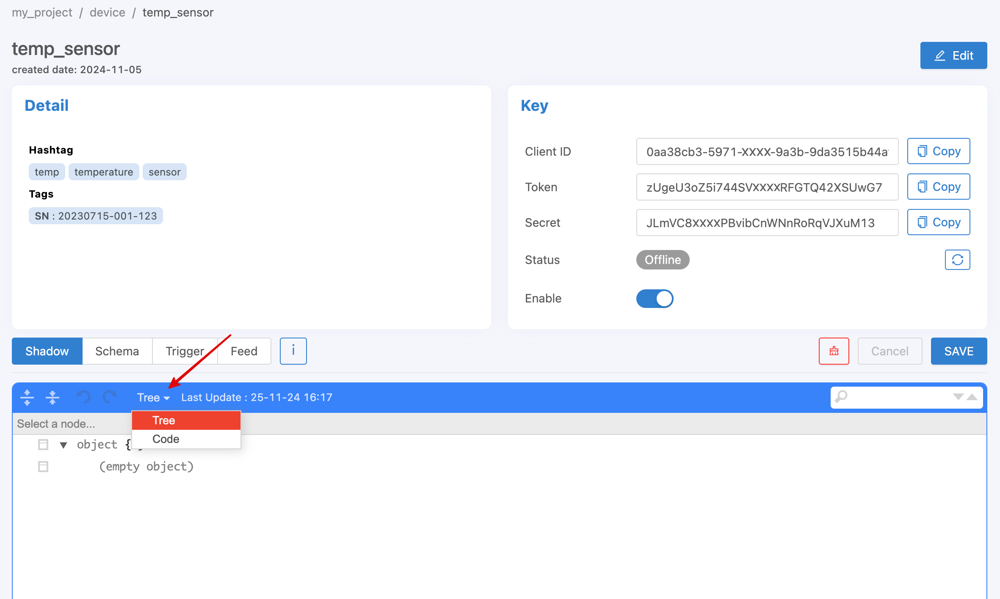
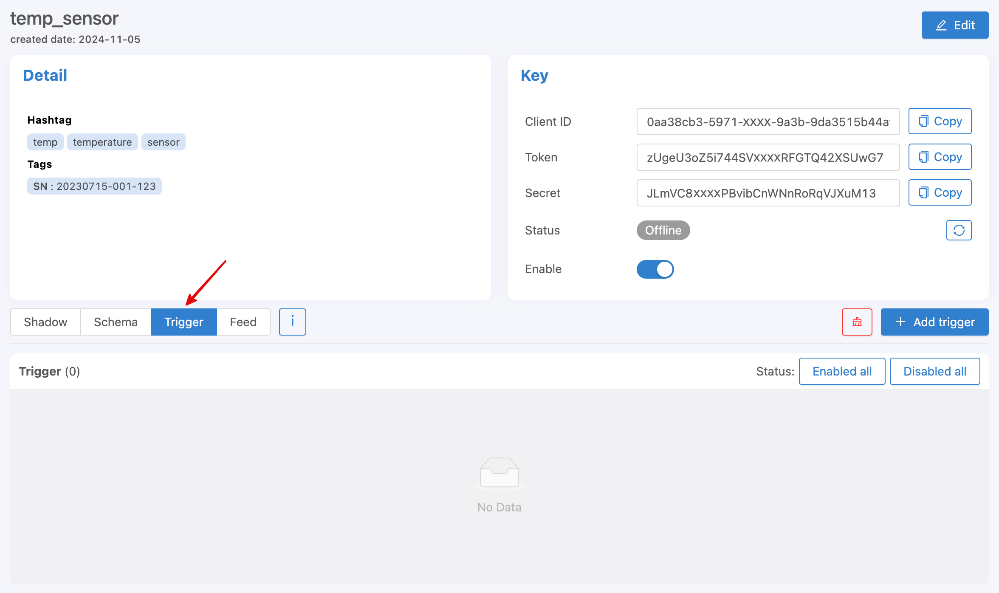
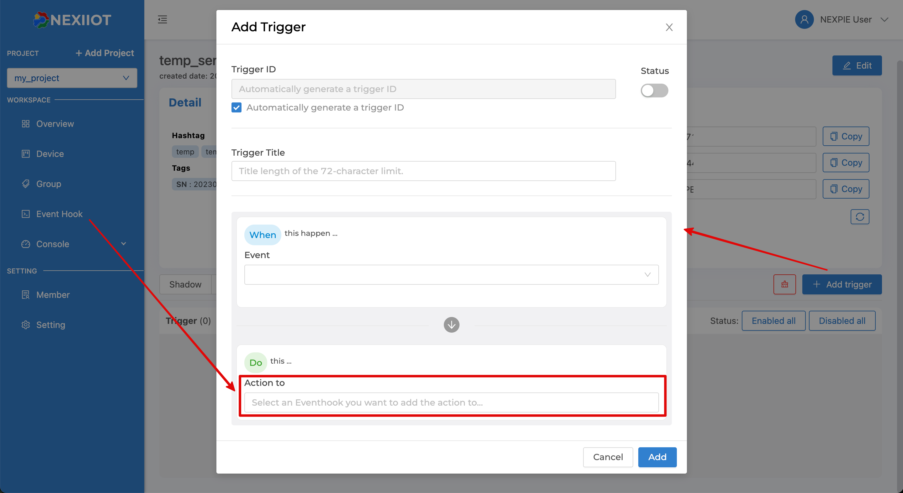
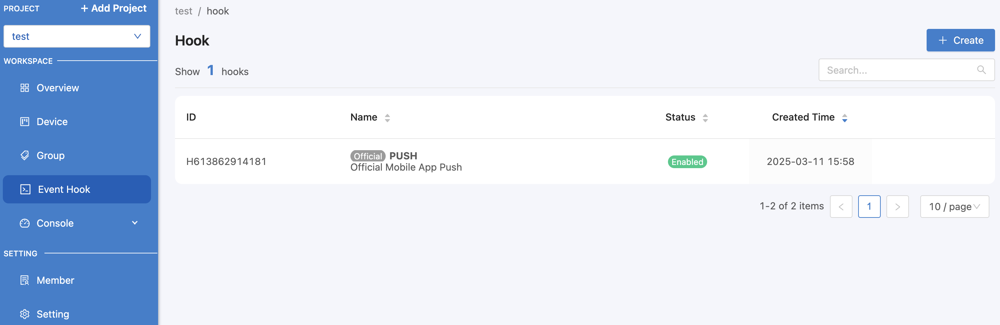

.. raw:: html

    <div align="right"><b>TH</b> | <a href="https://docs.netpie.io/en/device-config.html">EN</a></div>

.. _device-config:

Device Configuration
=====================

ส่วนนี้จะเกี่ยวข้องกับการตั้งค่าต่าง ๆ ที่เกี่ยวข้องหรืออยู่ภายใต้ Device นั้น ๆ ซึ่งการเข้าจัดการข้อมูลส่วนนี้ผ่าน |portal_url| ให้เข้าที่เมนู *Device* จากนั้นเลือกคลิกเข้าไปที่ Device ที่ต้องการ และเลือกตั้งค่าต่าง ๆ ที่มีการแสดงแยกเป็นแถบข้อมูลในแต่ละส่วนดังรูปต่อไปนี้


|

Device Shadow
------------------

คือ ฐานข้อมูลเสมือนของ Device เป็นฐานข้อมูลเล็ก ๆ ที่มีคู่กับ Device ทุกตัว ใช้สำหรับเก็บข้อมูลที่ Device นั้น ๆ จะเป็นผู้เข้าถึงและจัดการ เช่น ข้อมูลที่เกิดจากเซนเซอร์ ข้อมูลการกำหนดองค์ประกอบต่าง ๆ ของ Device (Device Configuration) เป็นต้น ซึ่งในส่วนนี้ผู้ใช้สามารถออกแบบได้อย่างอิสระว่าจะประกอบด้วยข้อมูลอะไรบ้าง โดยลักษณะโครงสร้างข้อมูลจะอยู่ในรูปแบบของ JSON (Key-value) ดังตัวอย่างต่อไปนี้

.. code-block:: json

	{
		"config": {
			"lastupdate": "2020-06-01",
			"var": {
				"v1": "a",
				"v2": true,
				"v3": 1
			},
			"version": 1
		},
		"enable": true,
		"items": ["a", "b", "c"]
	}

หากคัดลอกตัวอย่างด้านบนไปเซ็ตค่าให้ Device ที่ต้องการผ่านหน้า Portal จะมีลักษณะดังนี้ (กรณีต้องการคัดลอก code มาวางให้ทำการเปลี่ยนประเภทแสดงผลจาก Tree เป็น Code)



|

.. note:: การลบฟิลด์ใน Shadow ผ่าน |portal_url|

	การบันทึก Shadow ผ่านหน้าเว็บ Portal จะเป็นการบันทึกแบบผสาน (Merge) ดังนั้น ถ้าต้องการลบฟิลด์ใดฟิลด์หนึ่งจาก Shadow จะใช้วิธีลบออกจากช่องกรอก Shadow ไม่ได้ ต้องใช้วิธีเซ็ตฟิลด์นั้นให้เป็นค่า null เมื่อบันทึกระบบจะทำการลบฟิลด์นั้นออกจาก Shadow ให้

|

Shadow Timestamp
````````````````````````

จุดประสงค์สำคัญของการเขียน shadow คือการบันทึกค่าข้อมูลที่เกิดขึ้น บางครั้งแทนที่ค่านั้นจะเป็นค่าของเวลาปัจจุบัน อาจจะต้องการบันทึกค่าในอดีต สามารถกำหนดค่า timestamp ของจุดข้อมูลได้โดย

- ``Publish Topic`` @shadow/data/update

โดยที่ Payload คือ

.. code-block:: json

	{
  		"data": {
    		"temp": 24.5,
    		"Humid": 63.9
  		},
  		"timestamp": 1684982518000
	}


หากมีการกำหนดให้เก็บข้อมูลลง feed ค่าเวลาของจุดข้อมูลจะเป็นเลข timestamp ตัวนี้ แทนที่จะเป็นค่า default ซึ่งก็คือค่า timestamp  ของเวลาปัจจุบัน หากค่า timestamp ที่กำหนดเก่ากว่าฟิวด์ timestamp ของ shadow ค่าจะไม่ถูกเขียนทับลง shadow แต่ส่วนของ feed จะมีการบันทึกข้อมูลตามปกติ เราจึงสามารถใช้กลไกนี้ในการอัพเดตค่าย้อนหลังใน feed ได้

|

Shadow Batch Update
````````````````````````

เราสามารถเขียนค่าลง shadow ได้ครั้งละมากๆ จะมีประโยชน์เวลาที่ต้องการเขียน feed ย้อนหลัง ค่าที่ใหม่ที่สุดจะไปปรากฎใน shadow  แต่หาก timestamp ที่มากที่สุดยังน้อยกว่าค่า timestamp ของ shadow ค่าที่เขียนลงไป จะไม่ไปทับค่าล่าสุดของ shadow แต่จะยังมีการส่งไป store และ รัน trigger ตามปกติ

- ``Publish Topic`` @shadow/data/update

โดยที่ Payload คือ

.. code-block:: json

	{
		"batch" : [
			{"data":{"temp":25.9, "humid":9.6}, "ts":-90000},
			{"data":{"temp":25.3, "humid":9.8}, "ts":-60000},
			{"data":{"temp":24.5, "humid":9.1}, "ts":-30000},
			{"data":{"temp":26.8, "humid":8.2}, "ts":0}
		],
		"merged": true
	}

หลังการเขียน จะมี message ตอบกลับทาง topic @private/shadow/batch/update/response เพื่อยืนยัน ปัจจุบัน NETPIE กำหนด max record size ไว้ที่ 100 ถ้าคำสั่งมีจำนวน record เกิน DeviceShadow 
จะไม่บันทึกค่าให้ และจะตอบ error กลับทาง @private/shadow/batch/update/response เช่นกัน

|

Shadow Options
````````````````````````

การเขียน shadow มี option พิเศษ ที่ใช้ override ค่าบางอย่างจากการเขียน ได้แก่

- ``merged`` เป็นการกำหนดลักษณะการเขียน shadow ว่าจะให้แทรกค่าเข้าไปค่าเดิม (merged: true)  หรือ เขียนทับ shadow ทั้งตัวด้วยค่าที่ระบุ (merged: false)   ถ้าไม่ระบุ จะใช้ค่าปกติเป็น merged: true

- ``store`` หากเซตเป็น false จะเป็นการระบุให้การเขียนครั้งนี้ ไม่ต้องเก็บค่าเข้า feed 

- ``trigger``  หากเซตเป็น false จะเป็นการระบุให้การเขียนครั้งนี้ ไม่ต้องรัน trigger 

Option เหล่านี้ สามารถใช้ได้ทั้งการเขียนแบบค่าเดียว และการเขียนแบบ batch

|

Device Schema
------------------

นิยามของ Device Schema ในที่นี้ คือ การประกาศโครงสร้างข้อมูลหรือข้อกำหนดต่าง ๆ เพื่อใช้กำกับ Device Shadow ให้เป็นไปตามเงื่อนไขที่ต้องการ โดย Device ที่รูปแบบโครงสร้างข้อมูลที่ชัดเจนตั้งแต่ต้น แนะนำให้สร้าง Device Schema ของข้อมูลเตรียมไว้เสมือนเป็น Device Template ทำให้ระบบช่วยควบคุมข้อมูลที่ Device Shadow ให้เป็นไปตามที่กำหนดไว้ได้ ซึ่งสิ่งที่ระบบจะช่วยดำเนินการให้เมื่อมีการประกาศ Device Schema มีดังนี้

- การกำหนดฟิลด์ (Properties) ที่สามารถบันทึกได้
- การตรวจสอบชนิดข้อมูล (Data Validation)
- การแปลงค่าข้อมูล (Data Transformation) เช่น เปลี่ยนหน่วยของข้อมูล เป็นต้น 

ลักษณะของ Device Schema จะเป็น JSON เช่นเดียวกันกับ Device Shadow แต่จะไม่สามารถกำหนดได้อย่างอิสระ เพราะจะต้องเป็นรูปแแบบที่ระบบเข้าใจและนำไปประมวลผลต่อได้ โดย Device Schema จะประกาศในรูปแบบ JSON มีลักษณะดังนี้

.. code-block:: json

	{
		"additionalProperties": false,
		"properties": {
			"tempF": {
				"operation": {
					"transform": {
						"expression": "($.tempC * 1.8) + 32",
						"dp": 2
					}
				},
				"type": "number",
				"autofill": true
			},
			"tempC": {
				"type": "number"
			},
			"humid": {
				"type": "number",
				"minimum": 0,
				"maximum": 100
			},
			"place": {
				"type": "string"
			}
		}
	}

หากคัดลอกตัวอย่างด้านบนไปเซ็ตค่าให้ Device ที่ต้องการผ่านหน้า Portal จะมีลักษณะดังนี้ (กรณีต้องการคัดลอก code มาวางให้ทำการเปลี่ยนประเภทแสดงผลจาก Tree เป็น Code เช่นเดียวกับ Shadow)

จากตัวอย่างด้านบน Device Schema จะประกอบไปด้วย

:additionalProperties *(boolean)*:
	
	สถานะการอนุญาตให้บันทึกฟิลด์ข้อมูลลง Device Shadow ในกรณีที่ชื่อฟิลด์ข้อมูลไม่ตรงตามที่กำหนดใน Properties

	``true`` => อนุญาตให้บันทึกลง Device Shadow ได้ทั้งหมด

	``false`` => อนุญาตให้บันทึกได้เฉพาะส่วนที่มีการกำหนดไว้ใน Properties

	**ตัวอย่าง** Device Schema จากตัวอย่างด้านบนมีการกำหนด Properties เป็น ``tempF``, ``tempC``, ``humid``, ``place`` ถ้าข้อมูลที่ส่งมาบันทึก คือ ``{ "temp": 28, "humid": 8.9 }`` หาก ``additionalProperties : true`` ข้อมูลจะถูกบันทึกลงไปใน Device Shadow ทั้งสองฟิลด์ แต่หากเป็น ``additionalProperties : false`` จะมีเพียง ``humid`` ฟิลด์เดียวเท่านั้นที่จะถูกบันทึกลง Device Shadow

	|

:properties *(json)*:

	เป็นการประกาศชื่อฟิลด์ (จากตัวอย่าง  คือ ``tempF``, ``tempC``, ``humid``, ``place``) และกำหนดคุณสมบัติของแต่ละฟิลด์ซึ่งจะอยู่ในรูปแบบ JSON โดยจะแยก 2 ส่วน คือ

	- ``operation`` สำหรับตั้งค่าการจัดการข้อมูลในฟิลด์นั้น ๆ ประกอบด้วย

		``transform`` สำหรับการแปลงค่าข้อมูล (Data Transformation) ก่อนการจัดเก็บ

			``expression`` สูตรหรือวิธีการแปลงค่าข้อมูล (Data Transformation) ก่อนการจัดเก็บ ซึ่งสามารถอ้างอิงจากชื่อฟิลด์ใดก็ได้ที่มีการส่งค่าเข้ามาเพื่อบันทึกลง Shadow โดยรูปแบบการอ้างอิง คือ ``$.ชื่อฟิลด์``

			**ตัวอย่าง** Device Schema จากตัวอย่างด้านบน มีการกำหนด ``expression`` ที่ฟิลด์ ``tempF`` เท่ากับ ``($.tempC * 1.8) + 32`` เป็นการแปลงค่าอุณหภูมิจากหน่วยเซลเซียสเป็นฟาเรนไฮต์ โดยนำมาคูณด้วย 1.8 และบวกด้วย 32 จะได้ค่าอุณหภูมิเป็นหน่วยฟาเรนไฮต์ ก่อนบันทึกลงใน Device Shadow โดยการอ้างอิงค่าจากฟิลด์ ``tempC`` มาคำนวณและบันทึกลงฟิลด์ ``tempF``

			``dp`` หรือ decimal point ใช้สำหรับกำหนดจำนวนจุดทศนิยมที่ของค่าที่จะให้ Platform บันทึกที่กี่ตำแหน่ง จากตัวอย่างด้านบน ``"dp" : 2`` ถ้า ``tempF`` คำนวณค่าออกมาได้ 78.584 ค่าที่จะบันทึกลงใน Shadow จะเท่ากับ 78.58 เป็นต้น

	- ``type`` คือ ชนิดของข้อมูลในฟิลด์นั้น ๆ ได้แก่ number, string, boolean, array, object

	- ``maximum`` ใช้กำหนดค่าสูงสุดที่ Platform จะอนุญาตให้บันทึกสำหรับฟิลด์ที่กำหนด ``type`` เป็น number

	- ``minimum`` ใช้กำหนดค่าต่ำสุดที่ Platform จะอนุญาตให้บันทึกสำหรับฟิลด์ที่กำหนด ``type`` เป็น number

	- ``autofill`` ใช้ในการกำหนดให้ระบบทำการเขียนค่าฟิลด์นั้น ๆ อัตโนมัติด้วยค่าเดิมใน Shadow แม้จะไม่มีการส่งค่าของฟิลด์ดังกล่าวเข้ามาเขียนด้วยก็ตาม ใช้ในกรณีที่ต้องการกระตุ้นให้ระบบทราบว่าฟิลด์ดังกล่าวจะมีการอัพเดทข้อมูล แต่ข้อมูลไม่ได้เกิดจากการส่งค่ามาโดยตรง เป็นการคำนวณจากค่าฟิลด์อื่นๆ ที่ส่งเข้ามา หรือกรณีมีการตั้งค่าให้บันทึกข้่อมูลลง Feed (Timeseries Database) และต้องการให้ข้อมูลทุกฟิลด์มีการเก็บค่าทุกช่วงเวลาถ้าไม่มีการส่งค่าเข้ามาระบบจะบันทึกเป็นค่าเดิมให้อัตโนมัติ เพื่อเวลาดึงข้อมูลไปใช้งานจะมีค่าครบทุกฟิลด์ในแต่ละช่วงเวลา

	**ตัวอย่าง** Device Schema จากตัวอย่างด้านบน ฟิลด์ ``tempF`` มีการเซ็ต ``autofill`` ซึ่ง ``tempF`` จะเกิดจากการนำค่าของฟิลด์ ``tempC`` มาแปลงค่าเป็นฟาเรนไฮต์ ดังเวลาเขียน Shadow ไม่มีการส่งค่าฟิลด์ ``tempF`` เข้ามา ซึ่งระบบจะทำการคำนวณค่าจากฟิลด์ ``tempC`` แล้วบันทึกใส่ฟิลด์ ``tempF`` ให้ ถ้าไม่ ``autofill`` ไว้ ผู้ใช้ต้องส่งค่าหลอกที่ฟิลด์ ``tempF`` เข้ามาเองเพื่อกระตุ้นให้ระบบรับรู้ว่ามีการอัพเดทค่าดังกล่าว ไม่เช่นระบบไม่ไม่ทำการอัพเดทฟิลด์ ``tempF`` ให้

|

.. note:: ความแตกต่างของการกำหนด ``expression`` ที่ Schema และ Feed (datatag)

	การกำหนด ``expression`` ทั้งสองส่วนจะเป็นการแปลงค่าข้อมูล (Data Transformation) ก่อนบันทึกเช่นเดียวกัน เพียงแต่ที่ Schema จะสามารถอ้างอิงหรือนำค่าฟิลด์อื่น ๆ ที่ส่งเข้ามามาคำนวณร่วมด้วยได้ แต่ถ้ากำหนด ``expression`` ที่ Feed (datatag) จะไม่สามารถอ้างอิงค่าจากฟิลด์อื่นได้ ทำได้เพียงใช้ค่า datatag ฟิลด์นั้น ๆ คำนวณร่วมกับค่าคงที่ทั่วไปก่อนบันทึกลง Feed 

|

.. caution:: 

	การกำหนดชื่อฟิลด์ใน Properties ของ Device Schema ต้องประกอบด้วยอักษรภาษาอังกฤษ (a-z, A-Z), ตัวเลข (0-9) หรือ Underscore (_) เท่านั้น ห้ามมีอักขระพิเศษอื่น ๆ นอกเหนือจากนี้ เพราะจะไม่สามารถเก็บข้อมูลได้

|

ประโยชน์จากการกำหนด Device Schema มีได้ในหลายลักษณะต่อไปนี้

**1. ใช้สำหรับ validate data type**

สามารถกำหนดค่าต่าง ๆ ของฟิวด์ข้อมูลได้ เช่น data type, minimum, maximum ถ้าตัวแปรใน shadow ฟิวด์ไหน ไม่ผ่านเงื่อนไขการ validate ตัวแปรนั้นจะไม่ถูกบันทึก เสมือนไม่ได้ส่งข้อมูลเข้ามา ส่วนตัวแปรอื่น ๆ จะยังคงถูกนำไปประมวลผลต่อไป 

.. code-block:: json

	{
		"additionalProperties": true,
		"properties": {
			"temp": {
				"type": "number",
				"minimum": 0,
				"maximum": 100,
				"default": 25,
			}
		}
	}

แต่ถ้าตัวแปรที่ส่งเข้ามา มีชนิดต่างจากที่ระบุใน schema ระบบจะพยายาม convert ให้ในรูปแบบที่เหมาะสมที่สุด

- *กรณีที่ 1* เขียนตัวแปรผิดชนิดลงตัวแปร schema ชนิด string ระบบจะแปลงเป็น string อัตโนมัติ เช่น

.. rst-class:: left-align-left-col

	.. list-table::
		:widths: 20 40

		* - **Variable**
		  - **Tranformed Variable**
		* - 2
		  - "2"
		* - true
		  - "true"
		* - {x: 123}
		  - "{\"x\":123}"

- *กรณีที่ 2* เขียนตัวแปรผิดชนิด ลงตัวแปร schema ชนิด number ระบบจะแปลงเป็น number อัตโนมัติ หากแปลงได้ แต่ถ้าแปลงไม่ได้ ระบบจะไม่บันทึกตัวแปรดังกล่าว
	
.. rst-class:: left-align-left-col

	.. list-table::
		:widths: 20 40

		* - **Variable**
		  - **Tranformed Variable**
		* - "2.3"
		  - 2.3
		* - true
		  - 1
		* - {x: 123}
		  - ไม่บันทึกตัวแปรนี้


- *กรณีที่ 3* เขียนตัวแปรผิดชนิดลงตัวแปร schema ชนิด boolean ระบบจะแปลงเป็น boolean อัตโนมัติ แต่ถ้าแปลงไม่ได้หรือกำกวม ระบบจะไม่บันทึกตัวแปรดังกล่าว
		
.. rst-class:: left-align-left-col

	.. list-table::
		:widths: 20 40
		
		* - **Variable**
		  - **Tranformed Variable**
		* - "TruE"
		  - true
		* - "False"
		  - false
		* - 0
		  - false
		* - 1
		  - true
		* - {x: 123}
		  - ไม่บันทึกตัวแปรนี้

**2. ใช้แปลงค่าของข้อมูลเบื้องต้น**

สามารถใส่ฟังก์ชันเพื่อแปลงค่าก่อนการบันทึก ค่าตัวแปรที่ขึ้นต้นด้วย $. เป็นการอ้างอิงค่าที่ถูกอัพเดตเข้ามาใหม่ สามารถอ้างอิงแบบ dot notation path ได้ดังตัวอย่างต่อไปนี้ ``$home.bedroom.temp``  
ตัวอย่างการแปลงหน่วยของค่า sensor ที่เข้ามา จากเซลเซียสเป็นฟาเรนไฮต์ 

.. code-block:: json

	{
		"additionalProperties": true,
		"properties": {
			"temp": {
				"type": "number",
				"minimum": 0,
				"maximum": 100,
				"operation": {
					"transform": {
						"expression": "$.temp*1.8 + 32"
					}
				}
			}
		}
	}

|

Schema Decimal Transform
``````````````````````````````

การอ้างอิงค่าเก่าของตัวแปรสามารถใช้ $$. ส่วน $. จะเป็นการอ้างอิงค่าที่ถูกอัพเดตเข้ามาใหม่ เช่นตัวอย่าง จะเป็นการ smoothing ค่า ด้วยการหาค่าเฉลี่ยถ่วงน้ำหนักกับค่าเดิม และมีการกำหนดตำแหน่งทศนิยมของค่าที่คำนวณได้ก่อนทำการบันทึกเป็น 1 ตำแหน่ง โดยการกำหนดฟิวด์​ dp หรือ decimal places  
เช่น ถ้ากำหนดค่า dp: 1 หากค่าที่ส่งเข้ามาหรือได้จากการคำนวณเป็น 0.3333333333 ระบบจะทำการแปลงค่าเป็น 0.3 ก่อนทำการบันทึก

.. code-block:: json

	{
		"additionalProperties": true,
		"properties": {
			"humid": {
				"type": "number",
				"operation": {
					"transform": {
						"expression": "0.9*$$.humid + 0.1*$.humid",
						"dp": 1
					}
				}
			}
		}
	}

|

Schema Array Transform 
````````````````````````

ฟีเจอร์ Transform มีฟังก์ชั่นพิเศษ ที่สามารถเรียกใช้ได้ ได้แก่

- ``concat(array, array)``   รวม array สองตัวเข้าด้วยกัน

- ``slice(array, int)``  ตัดตัวแปรตามจำนวนที่กำหนด ฟิวด์ที่สองหากเป็นลบจะเป็นการตัดจากด้านหลัง

- ``sort(array, int)``   เรียงลำดับ array ใหม่ ฟิวด์ที่สองค่าบวกลบ (เช่น -1, 1 ) จะเป็นการระบุทิศทางการเรียง

- ``reverse(array)``   กลับทิศ array


.. code-block:: json

		{
		"properties": {
			"temp": {
				"operation": {
					"transform": {
						"expression": "$.temp"
			}
		}
		},
		"log": {
			"operation": {
				"transform": {
					"expression": "concat($$.log, [$.temp])"
			}
		}
		},
		"log5": {
			"operation": {
				"transform": {
					"expression": "slice(concat($$.log5, [$.temp]), -5)"
			}
		}
		},
		"log5R": {
			"operation": {
				"transform": {
					"expression": "slice(reverse($$.log5))"
			}
		}
		},
		"top5": {
			"operation": {
				"transform": {
					"expression": "slice(sort(concat($$.top5, [$.temp])), -5)"
			}
		}
		},
		"bottom5": {
			"operation": {
				"transform": {
					"expression": "slice(sort(concat($$.bottom5, [$.temp]), -1), -5)"
					}
				}
			}
		}
	}

|

.. _trigger-and-action:

Device Trigger and Event Hook
----------------------------------

เป็นส่วนที่เชื่อมโยงการเปลี่ยนแปลงข้อมูลต่าง ๆ ของ Device เข้ากับการกระทำภายนอก (Event Hook) เช่น การตั้งค่าแจ้งเตือนเมื่อ Device มีการเปลี่ยนแปลงตรงตามเงื่อนไขการทำงานของที่ถูกตั้งค่าไว้ เป็นต้น โดยการทำงานจะแยกเป็น 2 ส่วน ดังนี้

|

Trigger
````````````````````````

จะเป็นส่วนใช้ในการเซ็ตเงื่อนไขเพื่อสร้างการกระตุ้นให้ระบบกระทำการอะไรบางอย่างเมื่อเข้าเงื่อนไขที่กำหนด การตั้งค่า Trigger ของ Device สามารถดำเนินการผ่าน Portal จากแทบที่ชื่อว่า Trigger ดังรูปต่อไปนี้



เริ่มสร้าง Trigger โดยการคลิกที่ปุ่ม Add Trigger จะปรากฏหน้าจอให้ทำการตั้งค่าต่าง ๆ ดังรูปต่อไปนี้



จากรูปด้านบนข้อมูล Trigger ที่สามารถระบุได้มีดังนี้

.. rst-class:: left-align-left-col

	.. list-table::
		:widths: 20 80
		  
		* - **Trigger ID**
		  - รหัสของ Trigger ซึ่งระบบจะสร้างให้อัตโนมัติ หากผู้ใช้ต้องการกำหนดเองให้นำเครื่องหมายที่ Checkbox "Automatically generate a trigger ID" ออก และทำการกรอกรหัสที่ต้องการเองได้ 
		* - **Status**
		  - สถานะเปิด/ปิดการทำงานของ Trigger
		* - **Trigger Title**
		  - ชื่อหรือคำอธิบายสั้น ๆ เกี่ยวกับ Trigger
		* - **Event**
		  - ประเภทการเปลี่ยนแปลงข้อมูลของ Device ปัจจุบันมี 3 ประเภทให้เลือก ดังนี้
		  	- ``Shadow Updated`` จะทำการตรวจสอบเงื่อนไขใน Trigger เมื่อ Device Shadow มีการเปลี่ยนแปลง
			- ``Device Status Changed`` จะทำการตรวจสอบเงื่อนไขใน Trigger เมื่อ Device เปลี่ยนสถานะการเชื่อมต่อ Platform (Online/Offline)
			- ``Device Log`` จะทำการตรวจสอบเงื่อนไขใน Trigger เมื่อมี Device Log เกิดขึ้น
		* - **Under conditions**
		  - เมื่อเลือก ``Event`` แล้วส่วนนี้ถึงปรากฏ ซึ่งสามารถเลือกตั้งค่าได้ 3 แบบ ดังนี้
		  	1. Always คือ ไม่กำหนดเงื่อนไขใด ๆ เลย จะเกิด Trigger ทุกกรณีที่มี ``Event`` ตามที่เลือกไว้เกิดขึ้น
			2. Basic คือ จะเป็นฟอร์มให้ระบุเงื่อนไข โดยระบุค่าทั้ง 2 ฝั่งที่จะทำการเปรียบเทียบด้วย Comparisons ที่ต้องการ สามารถกำหนดหลายเงื่อนไขได้โดยการคลิกที่ปุ่ม Add และแต่ละเงื่อนไขคั่นด้วยเครื่องหมาย ``&&`` (and) หรือ  ``||`` (or)
			3. Custom คือ การกำหนดเงื่อนไขแบบพิมพ์ได้เองอิสระ หรือใช้ในกรณีที่เงื่อนไขมีความซับซ้อนมากจน UI แบบ Basic ไม่รองรับในการกรอก การกำหนดเงื่อนไขแบบนี้ ถ้าเงื่อนไขมีความซับซ้อนหรือกรอกไม่ถูกต้อง ระบบจะไม่สามารถแปลงกลับไปเป็นแบบ Basic เพื่อแสดงผลให้ได้ ดังนั้นก็จะส่งผลให้ผู้ใช้ไม่สามารถคลิกเลือกไปที่แบบ Basic ได้จนกว่าจะปรับแก้ให้ระบบสามารถแปลงกลับได้ หรือลบข้อมูลที่กรอกไว้ในแบบ Custom ออกทั้งหมดก่อนที่จะคลิกกลับไปที่แบบ Basic
		* - **Action to**
		  - เลือก Event Hook ที่ต้องการให้ทำงานต่อเมื่อเกิดการ Trigger โดยรายการที่มีให้เลือกจะถูกอ้างอิงมาจากเมนู *Event Hook* ด้านซ้ายมือ ซึ่งสามารถเลือกได้หลาย Event Hook ต่อ Trigger
		* - **With this context variables**
		  - ประกาศตัวแปรที่จะส่งไปเรียกใช้ใน Event Hook โดยทำการประกาศชื่อตัวแปรในช่องฝั่งซ้ายมือ และกำหนดค่าในช่องฝั่งขวามือ ซึ่งค่าที่กำหนดจะเป็นค่าคงที่ ค่าตัวแปรจาก Shadow หรือค่าตัวแปรจากระบบมีให้เรียกใช้ได้ ส่วนการอ้างอิงเพื่อใช้งานที่ Event Hook จะใช้เป็น ``{{context.ชื่อตัวแปร}}``

ตัวอย่างการตั้งค่า Trigger โดยเลือก ``Event`` เป็น ``Shadow Updated`` และเซ็ต ``Under conditions`` แบบ Basic ตามรูปต่อไปนี้


การอ้างอิงค่า Shadow ใน Trigger
~~~~~~~~~~~~~~~~~~~~~~~~~~~~~~

สำหรับการอ้างอิงค่าตัวแปร Shadow สามารถเรียกใช้ใน Condition หรือ Context Variable ของ Trigger มีรูปแบบดังนี้

- ``$CUR.พาธ.ของ.ตัว.แปร`` ค่าปัจจุบันล่าสุดที่ถูกอัพเดท ($NEW merge $PREV) โดยขึ้นต้นด้วย $CUR ตามด้วย Path ตามโครงสร้างใน Shadow

- ``$NEW.พาธ.ของ.ตัว.แปร`` ค่าใหม่ที่ส่งมาอัพเดทลง Shadow โดยขึ้นต้นด้วย $NEW ตามด้วย Path ตามโครงสร้างใน Shadow

- ``$PREV.พาธ.ของ.ตัว.แปร`` ค่าก่อนหน้าที่จะถูกอัพเดทลง Shadow โดยขึ้นต้นด้วย $PREV ตามด้วย Path ตามโครงสร้างใน Shadow


ความแตกต่างระหว่าง $NEW, $CUR และ $PREV ใน Trigger
~~~~~~~~~~~~~~~~~~~~~~~~~~~~~~~~~~~~~~~~~~~~~~~~~

เขียนเป็นสมการความสัมพันธ์ระหว่าง 3 ค่าจะได้เป็น ``$CUR = $PREV merge $NEW``

ตัวอย่างการอ้างอิง ``$NEW``, ``$CUR`` และ ``$PREV``

``Shadow 1``

.. code-block:: json

	{ 
		"f1": "d1", 
		"f2": ["A", "B", "C"], 
		"f3": { "a1": 1, "a2": 2, "a3": 3 }
	}

Write Shadow แบบ Merge ด้วยค่านี้ ``{ "data": { "f2": "A"} }``

``Shadow 2``

.. code-block:: json

	{ 
		"f1": "d1", 
		"f2": "A", 
		"f3": { "a1": 1, "a2": 2, "a3": 3 }
	}

จาก JSON ด้านบน ``Shadow 1`` คือ Shadow ก่อนที่จะมีการ Update และ ``Shadow 2`` คือ Shadow หลังทำการ Update เรียบร้อยแล้ว โดยการ Update เป็นการอัพเดทค่าของ f2 ใน Shadow ถ้ามีการอ้างอิงค่าใน Trigger แบบ ``$NEW``, ``$CUR`` และ ``$PREV`` ตามแต่ละค่าใน Shadow จะได้ค่าเป็นดังนี้

การอ้างอิงค่า ``f1`` :

	- ``$PREV.f1`` มีค่าเป็น	``d1``

	- ``$NEW.f1`` มีค่าเป็น	``null``

	- ``$CUR.f1`` มีค่าเป็น	``d1``

การอ้างอิงค่า ``f2`` :

	- ``$PREV.f2`` มีค่าเป็น	``"A", "B", "C"``

	- ``$NEW.f2`` มีค่าเป็น	``"A"``

	- ``$CUR.f2`` มีค่าเป็น	``"A"``

การอ้างอิงค่า ``f3`` :

	- ``$PREV.f3`` มีค่าเป็น	``[object Object]``

	- ``$NEW.f3`` มีค่าเป็น	``null``

	- ``$CUR.f3`` มีค่าเป็น	``[object Object]``

|

การอ้างอิงตัวแปรอื่น ๆ ภายในระบบ
~~~~~~~~~~~~~~~~~~~~~~~~~~~~~~

สำหรับการอ้างอิงค่าตัวแปรที่ระบบมีให้เรียกใช้ใน Condition หรือ Context Variable ของ Trigger มีรูปแบบดังนี้

- ``$DEVICEID`` รหัสของ Device ที่เป็นเจ้าของ Shadow

- ``$ALIAS`` ชื่อของ Device ที่เป็นเจ้าของ Shadow

- ``$PROJECTID`` รหัสของ Project ที่ Shadow สังกัด

- ``$PROJECTNAME`` ชื่อของ Project ที่ Shadow สังกัด

- ``$GROUPID`` รหัสของ Group ที่ Shadow สังกัด

- ``$GROUPNAME`` ชื่อของ Group ที่ Shadow สังกัด

- ``$BILLINGID`` รหัสของ Billing ที่ Shadow สังกัด

- ``$NEW.STATUS`` รหัสสถานะปัจจุบันของ Device (``1`` คือ online, ``0`` คือ offline)

- ``$NEW.STATUSTEXT`` ข้อความสถานะปัจจุบันของ Device (``online`` คือ เชื่อมต่อ Platform อยู่, ``offline`` คือ ไม่ได้เชื่อมต่อ Platform)

- ``$OLD.STATUS`` รหัสสถานะก่อนหน้าของ Device (``1`` คือ online, ``0`` คือ offline)

- ``$OLD.STATUSTEXT`` ข้อความสถานะก่อนหน้าของ Device (``online`` คือ เชื่อมต่อ Platform อยู่, ``offline`` คือ ไม่ได้เชื่อมต่อ Platform)

- ``$LOGDATA`` ข้อมูล Log ของ Device ที่เป็นเจ้าของ Shadow กรณีเซ็ต ``Event`` เป็น ``Device Log`` 

- ``$LOGLEVEL`` ระดับความสำคัญของ Log ของ Device ที่เป็นเจ้าของ Shadow กรณีเซ็ต ``Event`` เป็น ``Device Log`` 

|

Operators ที่เรียกใช้งานได้ใน Condition ของ Trigger
~~~~~~~~~~~~~~~~~~~~~~~~~~~~~~~~~~~~~~~~~~~~~~~~~~

- ``+``  บวกค่า, ต่อ String

- ``-`` ลบค่า

- ``*`` คูณค่า

- ``/`` หารค่า

- ``//`` หารค่าแบบไม่แสดงผลในส่วนที่เป็นเศษ

- ``%`` หารค่าแบบแสดงผลเฉพาะเศษ

- ``^`` ยกกำลังค่า

- ``&&`` ตรรกะและ (Logical AND)

- ``||`` ตรรกะหรือ (Logical OR)

|

Comparisons ที่เรียกใช้งานได้ใน Condition ของ Trigger
~~~~~~~~~~~~~~~~~~~~~~~~~~~~~~~~~~~~~~~~~~~~~~~~~~~

- ``==`` เท่ากับ

- ``===`` ค่าและประเภทของค่าเท่ากับ

- ``!=`` ไม่เท่ากับ

- ``!==`` ค่าหรือประเภทของค่าไม่เท่ากับ

- ``>`` มากกว่า

- ``>=`` มากกว่าหรือเท่ากับ

- ``<`` น้อยกว่า

- ``<=`` น้อยกว่าหรือเท่ากับ

- ``in`` มีค่าอยู่ในลิสรายการ (Array or String) 

|

Event Hook
````````````````````````

เป็นตัวกลางที่ใช้กำหนดว่าเมื่อเกิด Trigger จะให้ดำเนินการอะไร ซึ่งสามารถกำหนดได้ที่ |portal_url| เมนู *Event Hook* ดังรูป



จากรูปด้านบนจะเห็นว่ามีรายการ Event Hook ที่เป็นรายการตั้งต้นที่ระบบมีให้เรียกใช้ได้เลย จะมีแท็ก ``Official`` ติดอยู่ ซึ่งผู้ใช้จะไม่สามารถลบได้ ณ ปัจจุบันมี 1 Event Hook Official คือ *PUSH* ใช้สำหรับ Notification ผ่าน Moblie Application ของ Platform เมื่อคลิกเข้าไปที่รายการ Event Hook ดังกล่าวมีลักษณะดังนี้


จากรูปด้านจะมีตัวแปร context ทั้งหมด 3 ค่า ได้แก่ title, subtitle และ msg ที่รับมาจาก Trigger เพื่อนำมาแทนค่า ซึ่งตัวแปร context จะอยู่ที่ *With this context variables* ใน Trigger และการอ้างอิงค่าใน Event Hook จะอยุ่ในรูปแบบ {{context.ชื่อตัวแปรใน Trigger}} ดังรูปต่อไปนี้

.. image:: _static/event_hooks_context.png

เมื่อเกิด Trigger และมีการเซ็ต Event Hook ไปที่ *PUSH* ตามตัวอย่างที่ผ่าน การแสดงผลที่ได้รับจาก Moblie Application ของ Platform จะมีลักษณะดังนี้


สำหรับการสร้าง Event Hook เองทำได้โดยการคลิกที่ปุ่ม "Create" กรอกข้อมูล สำหรับ *Type* คือ ชนิดของ Event Hook ซึ่งปัจจุบันมีเพียงชนิดเดียว คือ WEBHOOK ในอนาคตจะมีการพัฒนาชนิดอื่น ๆ ตามมา จากนั้นคลิกที่ปุ่ม "Save" ระบบจะทำการสร้าง Event Hook ให้ ดังรูป


จากนั้นคลิกที่รายการ Event Hook ที่สร้างเพื่อเข้าไปตั้งค่าการทำงาน โดย Configuration จะกำหนดในรูปแบบ JSON ดังรูป

.. image:: _static/event_hooks_setconfig.png 

.. code-block:: json

	{
		"method": "GET",
		"uri": "https://api.telegram.org/bot{{context.token}}/sendMessage?chat_id={{context.chat_id}}&text={{context.msg}}"
	}

.. _event-hook-context:

จากตัวอย่างในรูปด้านบนจะเป็นการเซ็ต Event Hook ให้ส่งข้อความแจ้งเตือนไปที่ Telegram (แอปพลิเคชันส่งข้อความคล้าย ๆ กับไลน์) โดยพารามิเตอร์สำหรับค่าผ่าน API ของ Telegram มี 2 Attributes คือ 

- ``method`` คือ ส่วนที่กำหนดว่าปลายทางต้องการให้ส่งไปในแบบไหน GET, POST หรือ PUT เหมือกับ HTTP Methods

- ``uri`` คือ Endpoint ปลายทางที่กำหนดว่าต้องการให้ส่งไปที่ใด

|

.. note:: การอ้างอิงข้อมูลตัวแปรใน Trigger และ Event Hook

	จะเห็นได้ว่าการอ้างอิงตัวแปรจะมี 2 รูปแบบ คือ แบบที่ต้องครอบ และไม่ต้องครอบด้วย {{...}} เนื่องด้วยประเภทของข้อมูลที่มีการอ้างตัวแปรที่ต่างกัน นั่นคือ ถ้าเป็นการอ้างอิงในเงื่อนไข (Condition) จะสามารถอ้างอิงตัวแปรได้โดยที่ไม่ต้องใส่ {{...}} ครอบตัวแปร แต่ถ้าเป็นอ้างอิงในข้อความ (String) จำเป็นต้องมีการครอบตัวแปรด้วย {{...}} เสมอ

|

Device Feed/Datatag
------------------------

สำหรับจัดการและดูข้อมูลใน Timeseries Database ของแต่ละ Device ซึ่งสามารถดำเนินการผ่าน Portal จากแทบที่ชื่อว่า Feed ดังรูปต่อไปนี้


	
จากรูปด้านบนจะห็นได้ว่าการบันทึกข้อมูลลง Timeseries Database ต้องเริ่มจากการสร้าง Datatag ซึ่งจะเป็นส่วนที่เชื่อมโยงกับ Shadow เพื่อกำหนดว่า Shadow ฟิลด์ใหนจะให้เก็บค่าลง Timeseries Database โดยไม่ต้องกำหนดผ่าน Schema แล้ว (รูปแบบเดิม) สำหรับการสร้าง  Datatag ให้คลิกที่ปุ่ม "+ Add datatag" จะปรากฏฟอร์มดังรูปต่อไปนี้


จากรูปด้านบนข้อมูล Datatag ที่สามารถระบุได้มีดังนี้

.. rst-class:: left-align-left-col

	.. list-table::
		:widths: 20 80
		  
		* - **Data Path**
		  - ฟิวด์ใน Shadow ที่ต้องการกำหนดให้บันทึกลง Timeseries Database (พิมพ์ ``$`` ระบบจะ autofill ข้อมูลใน Shadow มาให้เลือกอัตโนมัติ)
		* - **Data Type**
		  - ประเภทข้อมูล
		* - **Attr**
		  - ชื่อฟิลด์ที่กำหนดขึ้นใหม่สำหรับใช้อ้างอิงเพื่อเข้าถึงค่าได้สะดวกขึ้น แทนการอ้างอิงจาก Data Path
		* - **TTL**
		  - Time-To-Live ระยะเวลาที่ต้องการเก็บข้อมูล เมื่อเวลาผ่านไปข้อมูลจะถูกลบออกไปโดยอัตโนมัติตามเวลาที่ตั้งไว้
		* - **Expression**
		  - การแปลงข้อมูล เช่น ต้องการแปลงจากเซลเซียสเป็นฟาเรนไฮต์ ทำการใส่ ($.value * 1.8) + 32 ลงในช่อง Expression ได้เลย โดยที่ $.value จะเป็นการอ้างอิงค่าจาก Data Path ที่กำหนดไว้อยู่แล้ว ไม่ต้องอ้างอิงโดยระบุชื่อ
		* - **Name**
		  - ชื่อ Datatag (ถ้าไม่ระบุระบบจะใช้ Data Path เป็นชื่อให้อัตโนมัติ)
		* - **Description**
		  - คำอธิบาย Datatag
		* - **Unit**
		  - หน่วยนับของ Datatag

เมื่อกรอกข้อมูลเรียบร้อยแล้วให้คลิกที่ปุ่ม "Create data tag" ระบบจะทำการสร้าง Datatag ให้ตามข้อมูลที่กรอก ดังรูป


จากรูปด้านบน การจัดการ Datatag แต่ละรายการจะมีส่วนที่สามารถดำเนินการหลายส่วน โดยแต่ละส่วนมีรายละเอียดดังนี้

|

**1. ตั้งค่าช่วงเวลาและความและเอียดของข้อมูลที่แสดงผล**

- ``Since`` คือ การกำหนดช่วงเวลาแบบให้แสดงข้อมูลจากปัจจุบันย้อนหลังกลับไป โดยให้กรอกตัวเลขจำนวนเต็มและเลือกหน่วยที่ต้องการ ระบบจะดึงข้อมูลตามช่วงเวลาที่กำหนดมาแสดงผลให้อัตโนมัติ

- ``From - To`` คือ การกำหนดช่วงเวลาแบบระบุวันเวลาเริ่มต้นและสิ้นสุดที่ต้องการให้แสดงข้อมูล โดยเลือกวันเวลาจาก Popup ที่ปรากฎขึ้น เมื่อเลือกวันเวลาเรียบร้อยให้คลิกปุ่ม "Ok" ใน Popup ดังกล่าว ระบบจะดึงข้อมูลตามช่วงเวลาที่กำหนดมาแสดงผลให้อัตโนมัติ

- ``Sampling`` คือ การกำหนดความละเอียดของข้อมูลที่จะแสดงผล ยกตัวอย่างเช่น ถ้าเลือกเป็น "Minute" หมายความว่า ในช่วงเวลา 1 นาที ระบบจะดึงข้อมูลมาแสดงผลให้ 1 ค่า กรณีที่มีการบันทึกหลายค่าในช่วงเวลา 1 นาที ระบบคำนวณเป็นค่าเฉลี่ย 1 ค่าเพื่อใช้ในการแสดงผล เป็นต้น

|

**2. การดาวน์โหลดข้อมูลออกจากระบบ (Export Feed)**

เป็นการดาวน์โหลดข้อมูลที่เก็บใน Timeseries Database ตามช่วงเวลาที่กำหนด ออกมาเป็นไฟล์ .csv ทำได้โดยการคลิกที่ปุ่ม "Exports" จะปรากฎ Popup ให้ทำการเซ็ตค่าข้อมูลที่ต้องการดาวน์โหลดดังรูปด้านล่าง เมื่อเซ็ตค่าเรียบร้อยให้คลิกที่ปุ่ม "Download" 


สำหรับการตั้งค่าที่ต้องระบุเพื่อกำหนดข้อมูลที่ต้องการดาวน์โหลดมีดังนี้

.. rst-class:: left-align-left-col

	.. list-table::
		:widths: 20 80
		  
		* - **Time range**
		  - ช่วงเวลาและความและเอียดของข้อมูลที่ต้องการดาวน์โหลด (ลักษณะเดียวกันกับการตั้งค่าแสดงผล)
		* - **Select attributes**
		  - Datatag ที่ต้องการดาวน์โหลด

ข้อมูลที่ดาวน์โหลดจะถูกส่งออกในรูปแบบไฟล์ .csv ลักษณะดังนี้


|

**3. การจัดการ Datatag**

เป็นส่วนที่ใช้ในการจัดการ Datatag อยู่มุมบนด้านขวาของแต่ละ Datatag รายละเอียดดังนี้

- ``DataTag Enable`` ใช้สำหรับเปิด/ปิดสถานะการอนุญาตให้บันทึกค่าใน Datatag 

- ``Edit datatag`` (คลิกที่จุดสามจุด) เพื่อทำการแก้ไขการตั้งค่า Datatag

- ``Clear feed`` (คลิกที่จุดสามจุด) จะเป็นการลบข้อมูลที่บันทึกใน Datatag ทั้งหมดแบบถาวร

- ``Delete feed`` (คลิกที่จุดสามจุด) จะเป็นการลบทั้งข้อมูลที่บันทึกใน Datatag และ Datatag ออกจากระบบแบบถาวร

|

**4. ประเภทการแสดงผลข้อมูล**

เป็นส่วนที่ใช้กำหนดรูปแบบการแสดงผลข้อมูลของแต่ละ Datatag โดยคลิกที่ไอคอนมุมด้านขวาของแต่ละ Datatag ซึ่งสามารถเลือกได้ 2 ประเภท คือ

- กราฟเส้น (คลิกที่ไอคอนรูปกราฟ) จะเหมาะกับการแสดงผลข้อมูลที่ Data Type เป็น ``Number``

- ตาราง (คลิกที่ไอคอนรูปตาราง) จะเหมาะกับการแสดงผลข้อมูลทุก Data Type และกรณีที่ต้องการ แก้ไข/ลบ ข้อมูลบางจุดข้อมูลใน Datatag ให้เลือกแสดงผลเป็นตาราง และเลือก ``Sampling`` ให้จุดข้อมูลแต่ละจุดเป็นจุดข้อมูลจริง ไม่ใช่จุดที่เป็นค่าเฉลี่ย หลังจุดข้อมูลแต่ละรายการจะปราฏไอคอนให้สามารถ แก้ไข/ลบ จุดข้อมูลดังกล่าวได้ ดังรูปต่อไปนี้


|

.. warning:: ข้อควรระวังในการตั้งค่า Feed

	- ควรตั้ง Data Type ให้สอดคล้องกับข้อมูลที่บันทึกลง Shadow เพราะระบบจะพยายามแปลงค่า (Cast Type) ให้ตรงกับ Type ที่กำหนดไว้  เช่น "2" เป็น 2 แต่ในกรณีที่ไม่สามารถแปลงค่าได้ เช่น ตั้งค่า Data Type เป็น ``Number`` แต่ค่าที่ส่งมาบันทึกลง Shadow คือ ``14 June 2023`` ซึ่งระบบจะไม่สามารถแปลงค่าให้ได้และจะไม่บันทึกข้อมูลลง Feed
	- ค่าที่บันทึกลง Feed จะเป็นค่าที่ผ่านการประมวลผลจาก Shadow มาก่อน ดังนั้น ถ้าที่ Shadow มีการเซ็ต Expression เพื่อแปลงค่าแล้ว ค่าที่ Feed ได้รับจะเป็นค่าที่แปลงมาแล้ว ไม่จำเป็นต้องเซ็ต Expression ที่ Feed
	- การลบ Datatag ข้อมูลใน Timeseries Database ของ Datatag นั้น ๆ จะถูกลบทิ้งไปด้วย

|

.. note:: ความแตกต่างของการกำหนด Expression ใน Datatag และ Schema

	การกำหนด Expression ใน Schema สามารถอ้างอิงค่าทุกค่าที่อยู่ใน Shadow เพื่อนำมาคำนวณร่วมกันได้ แต่ถ้าเป็นการกำหนด Expression ใน Datatag จะอ้างอิงค่าได้แค่ค่าค่าเดียวตามที่กำหนดใน Data Path และคำนวณค่่าได้กับเฉพาะค่าคงที่เท่านั้นไม่สามารถนำค่าอื่นใน Shadow เดียวกันมาคำนวณร่วมได้

|

.. note:: จำนวนจุดข้อมูลสูงสุดที่ระบบกำหนดให้ดึงข้อมูลได้ในแต่ละครั้ง

	ในการดึงข้อมูลจาก Timeseries Database เพื่อการเรียกดูหรือการดาวน์โหลดข้อมูล ระบบจำกัดจำนวนจุดสูงสุดที่ไม่เกิน 100,000 จุดข้อมูล โดยคิดจากจำนวนข้อมูลดิบ (Raw Data) ก่อนที่จะมีการประมวลแปลงความละเอียดข้อมูลตาม `Sampling` ที่เลือก และเป็นการนับรวมจากทุกฟิลด์ที่มีการเรียกข้อมูลมา ถ้าข้อมูลดึงมาเกินกว่า 100,000 จุดข้อมูล ระบบจะทำการตัดข้อมูลออกแบบอัตโนมัติ โดยข้อมูลจะถูกเรียงลำดับจากเวลาเริ่มต้นถึงเวลาสิ้นสุดที่เลือกดึงข้อมูล และข้อมูลส่วนท้ายที่เกินจะถูกตัดออก