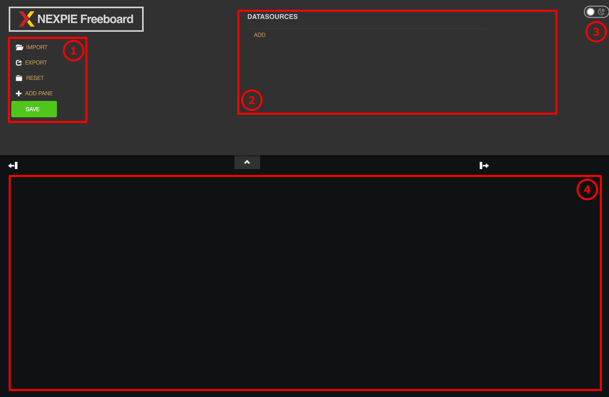
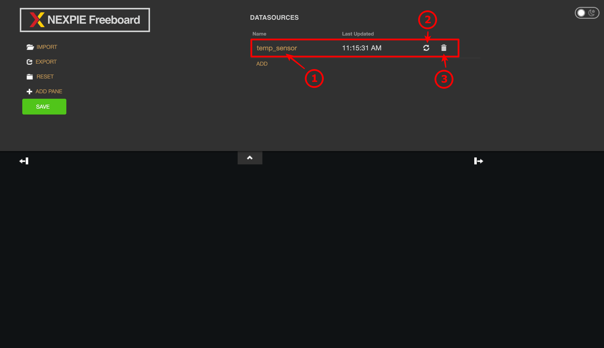
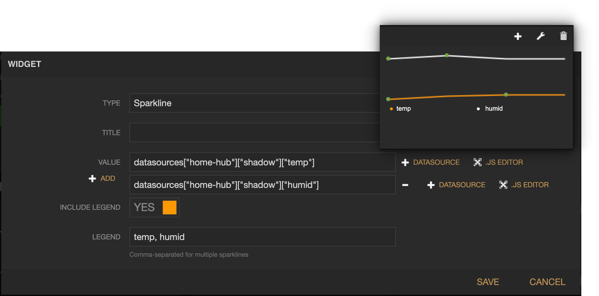
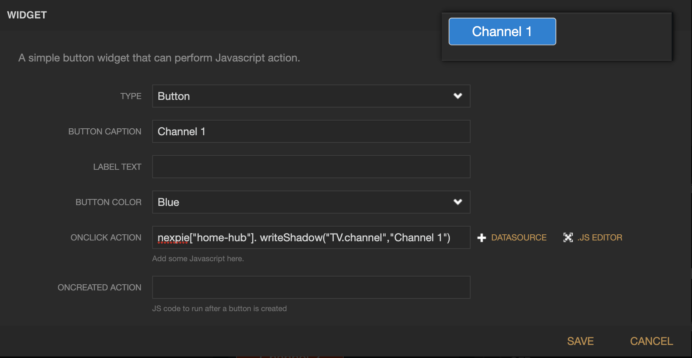
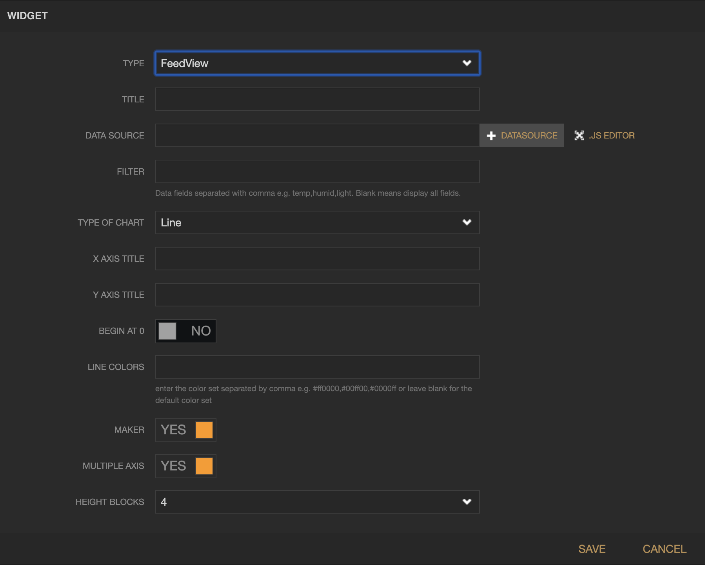
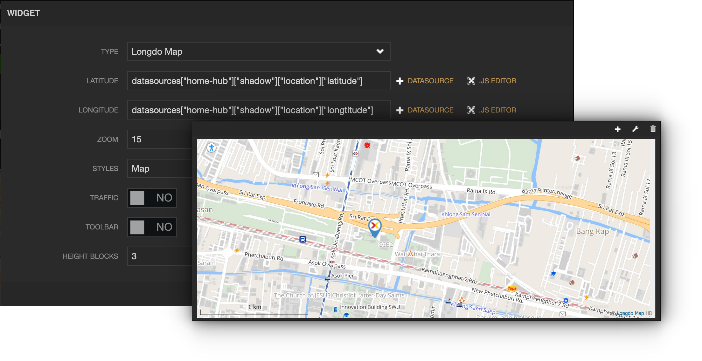

Dashboard
-----------------------

|

ใช้สำหรับนำข้อมูลที่เก็บอยู่ใน Platfrom มาแสดงผลในรูปแบบต่างๆ  เป็นเหมือนช่องทางให้ผู้ใช้สามารถติดตามหรือควบคุมการทำงานของ Deviec ของตัวเอง โดย Dashboard ที่มีให้ใช้งาน ณ ปัจจุบันมีเพียงประเภทเดียว คือ Freeboard ซึ่งสามารถเข้าใช้งานได้ด้วยการคลิกที่เมนู "Freeboard" ในแทบซ้ายมือ ก็จะปรากฏหน้าจอแสดงรายรายชื่อ Freeboard ทั้งหมดที่เคยสร้างไว้ภายใน Project นั้นๆ (ถ้ามี) ดังรูป

จากรูปด้านบน หลังรายชื่อ Freeboard แต่ละรายการ ถ้านำเม้าท์ไปวางไว้เหนือรายการใด จะปรากฏปุ่ม "Edit" และ "Delete" สำหรับทำการแก้ไขข้อมูลทั่วไปและลบ Freeboard นั้นๆ ตามลำดับ ถ้าต้องการสร้าง Freeboard ใหม่ให้คลิกที่ปุ่ม "Create" มุมบนขวามือของหน้าจอ ก็จะปรากฏหน้าจอสำหรับให้กรอกข้อมูลทั่วไปของ Freeboard ดังรูป

จากรูปด้านบนข้อมูล Dashboard ที่สามารถระบุได้มีดังนี้

:Dashboard Name: ชื่อ Dashboard ไม่อนุญาตให้มีช่องว่าง (White Space) อยู่ในชื่อ
:Dashboard Description: คำอธิบาย Dashboard

|

เมื่อกรอกข้อมูลเรียบร้อยแล้วให้คลิกที่ปุ่ม "Create" ก็จะปรากฏรายการ Freeboard ใหม่ที่พึ่งสร้างขึ้นมา ดังรูป

สำหรับการเข้าไปเซ็ต Configuration ของ Freeboard ให้คลิกที่รายการที่ต้องการเข้าไปดำเนินการ โดยหน้าจอสำหรับจัดการ Configuration ของ Freeboard มีรายละเอียดดังนี้

จากรูปด้านบน หน้าจอสำหหรับจัดการ Freeboard แบ่งเป็น 4 ส่วนใหญ่ๆ ดังนี้

1. เมนูสำหรับจัดการส่วนต่างๆ ของ Freeboard ได้แก่

- เมนู "*IMPORT*" ใช้สำหรับนำเข้า Configuration Code ซึ่งจะอยู่ในรูปแบบ JSON File ที่ส่งออกไปจาก Freeboard ที่เคยเซ็ต Configuration ไว้แล้ว เมื่อคลิกแล้วจะปรากฏ browse file ให้เลือกไฟล์ที่ต้องการนำเข้า

- เมนู "*EXPORT*" ใช้สำหรับส่งออก Configuration Code ที่เคยเซ็ตไว้แล้ว ซึ่งจะอยู่ในรูปแบบ JSON File เช่นกัน เพื่อนำเข้า (เมนู "IMPORT") สู่ Freeboard อื่น หรือเพื่อการสำรองข้อมูล (Backup)

- เมนู "*RESET*" ใช้สำหรับล้างค่า Configuration Code ที่เคยเซ็ตไว้แล้วทั้งหมด

- เมนู "*ADD PANE*" ใช้สำหรับสร้าง Block หรือ Panel ที่ใช้จัดกลุ่มการแสดงผลแต่ละ Widget ที่จะสร้างใน Freeboard

- ปุ่ม "*SAVE* (สีเขียว)" ใช้สำหรับบันทึกการเปลี่ยนแปลงทุกอย่างที่มีการดำเนินการไป คลิกปุ่มนี้ทุกครั้งก่อนออกหรือปิดหน้าจอเพื่อบันทึก Configuration ต่างๆ ที่ได้เปลี่ยนแปลงไป

2. ส่วนจัดการ "*DATASOURCES*" ใช้สำหรับสร้างการเชื่อมต่อเพื่อดึงข้อมูลจาก Device ต่างๆ ใน Platform มาแสดงที่ Freeboard รายละเอียดจะอธิบายเพิ่มเติมในหัวข้อถัดไป

3. *Theme* ใช้สำหรับเปลี่ยนธีมสีของ Freeboard มีให้เลือก 2 โทนสี คือ Dark Color (ค่า Default) และ Light Color

4. *ส่วนจัดการและแสดงผล Freeboard* ใช้สำหรับจัดการ Widget ต่างๆ ที่จะนำค่ามาแสดง และยังเป็นส่วนที่ใช้ดู Freeboard (View) ที่เซ็คค่าไว้แล้ว

|

การใช้งาน Freeboard
~~~~~~~~~~~~~~~~~~~

**1. สร้าง "DATASOURCES"** โดยเริ่มจากคลิกที่ "ADD" ในส่วนจัดการ DATASOURCE จะปรากฏฟอร์มให้กรอกข้อมูลเกี่ยวกับ DATASOURCE ที่สร้างดังรูป

จากรูปด้านบนข้อมูล DATASOURCE ที่สามารถระบุได้มีดังนี้

:Name: ชื่อ "DATASOURCES" ตั้งเป็นอะไรก็ได้ และจะเป็นส่วนที่ใช้ในการอ้างอิงตอนดึงข้อมูลมาแสดงผลในแต่ละ Widget
:Device ID: Client ID ของ Device
:Device Token: Token ของ Device
:Subscribed Topics: Topic ที่ต้องการรอรับข้อมูล (Subscribec) ถ้ามีหลาย Topic ให้คั่นแต่ละ Topic ด้วย comma (,)
:Feed: การเปิดใช้ข้อมูลจาก Timeseries Database ซึ่งจะใช้กับ Feed View Widget (YES เปิดใช้งาน, NO ปิดใช้งาน)
:Since: ช่วงเวลาย้อนหลังในการดึงข้อมูล Timeseries 
:Down Sampling: ความละเอียดของจุดข้อมูล เช่น เซ็ตไว้ที่ 1 นาที หมายความว่า จุดข้อมูลต่างๆ ที่เก็บในช่วงเวลา 1 นาที จะถูกนำมาแสดงเพียง 1 จุด (ถ้ามีข้อมูลมากกว่า 1 จุด จะใช้ค่าเฉลี่ย) หรือก็คือ GRANULARITY ของ Feed ใน NETPIE2015

จากรูปด้านบน เมื่อกรอกข้อมูลเรียบร้อยแล้วให้คลิกที่ปุ่ม "SAVE" จากในฟอร์ม ก็จะปรากฏรายการ DATASOURCE ใหม่ที่พึ่งสร้างขึ้นมา ดังรูป

จากรูปด้านบน ให้กดปุ่ม "SAVE (สีเขียว)" ที่อยู่ใต้เมนูอีกครั้งเพื่อเป็นการบันทึกข้อมูลและอัพเดทข้อมูลให้ Platform และ ถ้าการสร้าง DATASOURCE ถูกต้อง ข้อมูลจะถูกอัพเดทเข้ามายัง Freeboard ได้ ดูจากเวลาอัพเดทข้อล่าสุด "Last Updated" หลังชื่อ DATASOURCE ต้องมีเวลาขึ้น ซึ่งจากรูปดังกล่าวเวลาอัพเดทข้อล่าสุด คือ 11:15:31 AM 
การจัดการข้อมูล DATASOURCE สามารถทำได้ 3 อย่าง คือ แก้ไขให้คลิกที่ชื่อ DATASOURCE (หมายเลข 1) ก็จะปรากฏฟอร์มให้แก้ไขข้อมูลได้ , การซิงค์ข้อมูลจาก Platform (Synchronization) ให้คลิกที่ไอคอนหมายเลข 2 และการลบ DATASOURCE ให้คลิกที่ไอคอนหมายเลข 3

ข้อมูลที่ได้จาก DATASOURCE สามารถแยกได้เป็น 4 ประเภท คือ

- shadow สำหรับเข้าถึงข้อมูลต่าง ๆ ใน Shadow ของ Device นั้น ๆ
- status สำหรับดูสถานะของ Device ว่าเชื่อมต่อ Platform อยู่หรือไม่
- feed สำหรับเข้าถึงข้อมูล Timeseries ที่ Device นั้น ๆ ส่งมาเก็บเพื่อแสดงผลเป็นกราฟ
- msg สำหรับเข้าถึงข้อมูลที่ได้จากการ Subscribed ไว้

|

**2. สร้างส่วนแสดงผลหรือควบคุม** คือ การเลือก Widget ต่างๆ ของ Freeboard เพื่อใช้ในการแสดงข้อมูลหรือควบคุมการทำงานของ Device โดย Widget จะแยกเป็น 2 ประเภท ดังนี้ 

- *Data Display Widget* ใช้แสดงข้อมูล สังเกตได้จากในฟอร์มการตั้งค่าจะมีช่องให้กรอก DATASOURCE ที่ต้องการข้อมูลและมีชื่อฟิลด์ว่า "VALUE" โดย Widget ที่จัดอยู่ในประเภทนี้ได้แก่ Text, Gauge, Sparkline, Pointer, Picture, Indicator Light, Longdo Map, HTML และ FeedView ตัวอย่างฟอร์มการตั้งค่าดังรูปด้านล่าง

- *Control Widget* ใช้ควบคุมหรือสั่งการทำงานของ Device ได้แก่ Button, Toggle และ Slider ตัวอย่างฟอร์มการตั้งค่าดังรูปด้านล่าง

ทุก Widget ที่มีให้เลือกใน Freeboard จะมีช่องให้กรอก DATASOURCE ทั้งสิ้น ถึงแม้เป็น Control Widget ก็จำเป็นที่จะต้องนำค่าล่าสุดจาก Platform มาอัพเดทสถานะของ Widget เพื่อให้สถานะตรงกันทั้งสองฝั่ง กรณีที่พึ่งเปิด Freeboard นั้นๆ ขึ้นมา หรือสามารถควบคุมได้จากที่อื่น เป็นต้น การกรอก DATASOURCE ในแต่ละ Widget จะมีลักษณะที่คล้ายกัน เริ่มต้นให้ทำการคลิกที่ปุ่ม "DATASOURCE" ซึ่งแสดงอยู่หลังช่องที่จะกรอก หรือพิมพ์คำว่า *datasources["* ลงไปในช่อง หลังจากนั้น Auto Complete จะดึงข้อมูลจากใน DATASOURCE ที่ได้สร้างไว้แล้วมาให้เลือกได้ โดยการเลือกข้อมูลขึ้นอยู่กับประเภทข้อมูลที่ต้องการจาก DATASOURCE นั้นๆ ซึ่งมี 4 ประเภท ตามที่ได้กล่าวไปแล้วในหัวข้อก่อนหน้า รูปแบบการเลือกข้อมูลแต่ละประเภทเป็นดังนี้

|

``datasources["...DATASOURCE_NAME..."]["...ประเภทข้อมูล..."]["...ขึ้นอยู่กับประเภทข้อมูลที่เลือกก่อนหน้า..."]``

|

**กรณีที่ 1** : เลือกประเภทข้อมูล shadow

ส่วนที่เลือกต่อจากนี้จะเป็นตามโครงสร้าง Shadow JSON ที่ได้กำหนดไว้ใน Device ตัวอย่างเช่น Shadow JSON มีโครงสร้าง ดังนี้

.. code-block:: json

	{ 
		"bathroom": { 
			"light": "on", 
			"ventilator": { 
				"speed": 1
			}
		}
	}

|

ถ้าต้องการเข้าถึงข้อมูล ventilator speed ต้องกรอก DATASOURCE ดังนี้

``datasources["...DATASOURCE_NAME..."]["shadow"]["bathroom"]["ventilator"]["speed"]``

|

**กรณีที่ 2** : เลือกประเภทข้อมูล status

ถ้าเลือกประเภทข้อมูลเป็น status ไม่ต้องระบุส่วนที่ 3 เพราะเป็นการดึงข้อมูลสถานะการเชื่อมต่อ Platform ของ Device ค่าที่ได้จะเป็น 0 หมายถึง ไม่เชื่อมต่อ และ 1 หมายถึง เชื่อมต่อ ดังนั้น ถ้าต้องการข้อมูล status ต้องกรอก DATASOURCE ดังนี้

``datasources["...DATASOURCE_NAME..."]["status"]``

|

**กรณีที่ 3** : เลือกประเภทข้อมูล feed

ถ้าเลือกประเภทข้อมูลเป็น feed ไม่ต้องระบุส่วนที่ 3 เช่นกัน ส่วน Data Field ที่ต้องการจะไประบุเพิ่มเติมที่ FeedView Widget ดังนั้น ถ้าต้องการข้อมูล feed ต้องกรอก DATASOURCE ดังนี้

``datasources["...DATASOURCE_NAME..."]["feed"]``

|

**กรณีที่ 4** : เลือกประเภทข้อมูล msg

ส่วนที่เลือกต่อจากนี้จะเป็น Topic ที่ต้องการ Subscribe และต้องเป็น Topic ที่ DATASOURCE ที่อ้างอิง Subscribe ไว้ด้วย ตัวอย่างเช่น Publish Topic คือ @msg/home/kitchen ถ้าต้องการ Subscribed ที่ Topic ดังกล่าว ต้องกรอก DATASOURCE ดังนี้

``datasources["...DATASOURCE_NAME..."]["msg"]["home"]["kitchen"]``

|

สำหรับ Control Widget นอกจากจะช่องให้กรอก DATASOURCE แล้ว ยังมีช่องสำหรับตั้งค่าเกี่ยวกับการ Control โดยส่วนใหญ่ช่องดังกล่าวมักมีชื่อฟิลด์เป็น "...ON_EVENT... ACTION" ดังรูป

การเซ็คค่าในช่อง Control จะมีรูปแบบที่แตกต่างไปจากช่องกรอก DATASOURCE ลักษณะจะเป็นการเรียกใช้งาน Object Function มีรูปแบบดังนี้

|

**Control ด้วยการ Write Shadow**

``netpie["...DATASOURCE_NAME..."].writeShadow("...shadow field...", "...value...")``

|

**Control ด้วยการ Publish Message**

``netpie["...DATASOURCE_NAME..."].publish("...topic...", "...message...")``

|

การตั้งค่า Widget
~~~~~~~~~~~~~~~~~~~

|

**Widget : Text**

เป็น Data Display Widget ที่แสดงผลในรูปแบบข้อความลักษณะของ Plaint Text

จากรูปด้านบนข้อมูลที่สามารถระบุได้มีดังนี้

:TYPE: ชนิดของ widget
:TITLE: ตั้งชื่อ widget
:SIZE: กำหนดขนาดข้อความ
:VALUE: กำหนดค่าที่ต้องการแสดงผล (ช่องกรอก DATASOURCE)
:INCLUDE SPARKLINE: แสดงเส้นกราฟจากค่า value (ตัวเลข)
:ANIMATE VALUE CHANGES: แอนิเมชั่นเมื่อมีการเปลี่ยนแปลงค่าในช่อง VALUE
:UNITS: หน่วยข้อมูล

ตัวอย่างการกรอก DATASOURCE เมื่อต้องการแสดงสถานะการเชื่อมต่อ Platform ของ Device

``(datasources["...DATASOURCE_NAME..."]["status"]) ? "ON LINE" : "OFF LINE"``

การแสดงผลที่ได้เป็นดังรูป

|

**Widget : Gauge**

เป็น Data Display Widget ที่แสดงผลในรูปแบบการวัดค่า กำหนดค่าสูงสุด/ต่ำสุดได้

จากรูปด้านบนข้อมูลที่สามารถระบุได้มีดังนี้

:TYPE: ชนิดของ widget
:TITLE: ตั้งชื่อ widget
:VALUE: กำหนดค่าที่ต้องการแสดงผล (ช่องกรอก DATASOURCE)
:UNITS: หน่วยข้อมูล
:MINIMUM: ค่าต่ำสุด (ตัวเลข)
:MAXIMUM: ค่าสูงสุด (ตัวเลข)

ตัวอย่างการกรอก DATASOURCE เมื่อต้องการแสดงข้อมูลอุณหภูมิ

``datasources["...DATASOURCE_NAME..."]["shadow"]["temp"]``

การแสดงผลที่ได้เป็นดังรูป

|

**Widget : Spark Line**

เป็น Data Display Widget ที่แสดงผลในรูปแบบเส้นกราฟ และเส้นกราฟแสดงตามข้อมูลที่ระบุ

จากรูปด้านบนข้อมูลที่สามารถระบุได้มีดังนี้

:TYPE: ชนิดของ widget
:TITLE: ตั้งชื่อ widget
:VALUE: กำหนดค่าที่ต้องการแสดงผล สามารถ ADD เพิ่มได้มากกว่า 1 เส้นกราฟ (ช่องกรอก DATASOURCE)
:INCLUDE LEGEND: เปิด/ปิด การเพิ่มคำอธิบายหรือ TAG
:LEGEND: คำอธิบายหรือ TAG

ตัวอย่างการกรอก DATASOURCE เมื่อต้องการแสดงข้อมูลอุณหภูมิและความชื้น กด ADD เพิ่มช่อง VALUE ให้มี 2 ช่อง 

``datasources["...DATASOURCE_NAME..."]["shadow"]["temp"]``

``datasources["...DATASOURCE_NAME..."]["shadow"]["humid"]``

การแสดงผลที่ได้เป็นดังรูป

|

**Widget : Pointer**

เป็น Data Display Widget ที่แสดงผลในรูปแบบเข็มชี้ ซึ่งกำหนดตำแหน่งเข็มชี้ได้ตั้งแต่ 0-359 แต่ถ้าเกิน 360 ก็จะเริ่มต้นตำแหน่ง 0 ใหม่อีกครั้ง

( DIRECTION % 360 ) = ?

จากรูปด้านบนข้อมูลที่สามารถระบุได้มีดังนี้

:TYPE: ชนิดของ widget
:DIRECTION: ตำแหน่งของเข็มชี้ 360 องศา (0-359) (ช่องกรอก DATASOURCE)
:VALUE TEXT: กำหนดค่าที่ต้องการแสดงผล (ช่องกรอก DATASOURCE)
:UNITS: หน่วยข้อมูล

ตัวอย่างการกรอก DATASOURCE เมื่อต้องการแสดงข้อมูลแรงลมและทิศทาง

``datasources["home-hub"]["shadow"]["wind"]["direction"]``

``datasources["home-hub"]["shadow"]["wind"]["power"]``

การแสดงผลที่ได้เป็นดังรูป

|

**Widget : Indicator Light**

เป็น Data Display Widget ที่แสดงผลในรูปแบบสถานะ ON/OFF เพื่อระบุ STATE ของการทำงาน เช่น สถานะไฟ สถานะเครื่องจักรทำงาน เป็นต้น

จากรูปด้านบนข้อมูลที่สามารถระบุได้มีดังนี้

:TYPE: ชนิดของ widget
:VALUE: กำหนดค่าที่ต้องการแสดงผล (TRUE,FALSE,1,0) (ช่องกรอก DATASOURCE)
:ON TEXT: ข้อความที่ต้องการแสดงเมื่อค่าเป็นจริง (ดึงค่าจาก DATASOURCE หรือกรอกค่าลงไปโดยตรงก็ได้)
:OFF TEXT: ข้อความที่ต้องการแสดงเมื่อค่าเป็นเท็จ (ดึงค่าจาก DATASOURCE หรือกรอกค่าลงไปโดยตรงก็ได้)

ตัวอย่างการกรอก DATASOURCE เมื่อต้องการแสดงข้อมูลการเปิด/ปิดพัดลมดูดอากาศ

``datasources["home-hub"]["shadow"]["bathroom"]["ventilator"]["speed"]!=0``

การแสดงผลที่ได้เป็นดังรูป

|

**Widget : HTML**

เป็น Data Display Widget ที่แสดงผลในรูปแบบหน้าเว็บ HTML สามารถเขียนโค้ดเป็นภาษา HTML หรือ Javascript ได้

จากรูปด้านบนข้อมูลที่สามารถระบุได้มีดังนี้

:TYPE: ชนิดของ widget
:HTML: เขียนโค้ด HTML, Javascript ให้เป็นหน้าเว็บได้ (ช่องกรอก DATASOURCE)
:Height Blocks: ขนาดความสูงของบล็อคที่ใช้แสดงผล

ตัวอย่างในที่นี้จะใช้การใส่โค้ด HTML แสดงตัวอักษรหลายสีหลายขนาด

``
RED

BLUE

PINK
``

การแสดงผลที่ได้เป็นดังรูป

|

**Widget : Button**

เป็น Control Widget ที่แสดงผลในรูปแบบปุ่มกด กำหนด action ที่จะทำงานเมื่อกดปุ่มได้

จากรูปด้านบนข้อมูลที่สามารถระบุได้มีดังนี้

:TYPE: ชนิดของ widget
:BUTTON CAPTION: ข้อความบนปุ่มกด
:LABEL TEXT: ข้อความอธิบาย
:BUTTON COLOR: กำหนดกำหนดสีของปุ่มกด
:ONCLICK ACTION: เงื่อนไขการทำงานเมื่อมีการกดปุ่ม
:ONCREATED ACTION: เงื่อนไขการทำงานเมื่อสร้างปุ่มเสร็จ

ตัวอย่างในที่นี้จะใช้ปุ่มในการเปลี่ยนช่องทีวี เมิ่อคลิกปุ่มก็จะไปอัพเดทค่าที่เก็บช่องทีวีใน Shadow

``netpie["home-hub"].writeShadow("TV.channel","Channel 1")``

การแสดงผลที่ได้เป็นดังรูป

|

**Widget : Toggle**

เป็น Control Widget ที่แสดงผลในรูปแบบปุ่มกด 2 STATE กำหนด action ที่จะทำงานได้ทั้งเปิด/ปิด

จากรูปด้านบนข้อมูลที่สามารถระบุได้มีดังนี้

:TYPE: ชนิดของ widget
:TOGGLE CAPTION: ข้อความอธิบาย
:TOGGLE STATE: กำหนดค่าที่ต้องการแสดงผล (TRUE,FALSE,1,0)
:ON TEXT: ข้อความที่ต้องการแสดงเมื่อค่าเป็นจริง
:OFF TEXT: ข้อความที่ต้องการแสดงเมื่อค่าเป็นเท็จ
:ONTOGGLEON ACTION: เงื่อนไขการทำงานเมื่อต้องการเปลี่ยน STATE จาก OFF เป็น ON
:ONTOGGLEOFF ACTION: เงื่อนไขการทำงานเมื่อต้องการเปลี่ยน STATE จาก ON เป็น OFF
:ONCREATED ACTION: เงื่อนไขการทำงานเมื่อสร้าง toggle เสร็จ

ตัวอย่างในที่นี้จะใช้ในการ เปิด/ปิด ทีวี เมิ่อคลิก toggle ก็จะไปอัพเดทสถานะของทีวีใน Shadow

TOGGLE STATE ให้ดึงสถานะปัจจุบันจาก Shadow มาก่อน ``datasources["home-hub"]["shadow"]["TV"]["status"]=="on"``

ONTOGGLEON ACTION เซ็ตเป็น ``netpie["home-hub"].writeShadow("TV.status","on")``

ONTOGGLEOFF ACTION เซ็ตเป็น ``netpie["home-hub"].writeShadow("TV.status","off")``

การแสดงผลที่ได้เป็นดังรูป

|

**Widget : Slider**

เป็น Control Widget ที่แสดงผลในรูปแบบปุ่มกดแบบ slide กำหนดระดับค่าสำหรับการใช้งาน เช่น ความคุมความเร็วการทำงานรอบมอเตอร์ กำหนดระดับแสงสว่างของหลอดไฟ เป็นต้น

จากรูปด้านบนข้อมูลที่สามารถระบุได้มีดังนี้

:TYPE: ชนิดของ widget
:SLIDER CAPTION: ข้อความอธิบาย
:FILLED COLOR: สีที่แสดงบน slider
:DISPLAY VALUE: แสดงค่า slider ด้านบนมุมขวา
:MIN VALUE: ค่าต่ำสุด
:MAX VALUE: ค่าสูงสุด
:STEP: เลื่อน slider ทุกๆ n ครั้ง ตามตัวเลขที่กำหนด
:INITIAL VALUE: ค่าเริ่มต้น
:AUTO UPDATE VALUE: เมื่อมีค่าเปลี่ยนแปลง slider จะเปลี่ยนตามค่าที่ได้รับ
:ONSTART ACTION: เงื่อนไขการทำงานเมื่อคลิกที่ slider
:ONSLIDE ACTION: เงื่อนไขการทำงานเมื่อคลิกลากเปลี่ยนตำแหน่ง slider แต่ยังไม่ปล่อย
:ONSTOP ACTION: เงื่อนไขการทำงานเมื่อปล่อยคลิก slider เช่น
:ONCREATED ACTION: เงื่อนไขการทำงานเมื่อสร้าง toggle เสร็จ

ตัวอย่างในที่นี้จะใช้ในการควบคุมแรงลมของพัดลมดูดอากาศ

AUTO UPDATE VALUE ให้ดึงข้อมูลปัจจุบันจาก Shadow มาก่อน ``datasources["home-hub"]["shadow"]["bathroom"]["ventilator"]["speed"]``

ONSLIDE ACTION เซ็ตเป็น ``netpie["home-hub"].writeShadow("bathroom.ventilator.speed",value)``

การแสดงผลที่ได้เป็นดังรูป

|

**Widget : Feedview**

เป็น Data Display Widget ที่แสดงผลข้อมูล Timeseries ในรูปแบบกราฟ เลือกแสดงผลกราฟได้หลายเส้น ตามค่าที่เก็บใน Timeseries Database

จากรูปด้านบนข้อมูลที่สามารถระบุได้มีดังนี้

:TYPE: ชนิดของ widget
:TITLE: ตั้งชื่อ widget
:DATA SOURCE: ชุดข้อมูลกราฟเป็น json array
:FILTER: data field ที่จะเลือกแสดงข้อมูลบนกราฟ (หลาย data field ให้คั่นด้วยเครื่องหมาย ,)
:TYPE OF CHART: ประเภทการแสดงผลกราฟ มี 2 ตัวเลือก แสดงแบบ LINE กับ STEP
:X AXIS TITLE: ข้อความกำกับบนแกน X
:Y AXIS TITLE: ข้อความกำกับบนแกน Y
:BEGIN AT 0: YES ตั้งให้ค่าแกน Y เริ่มต้นที่ 0, NO ให้เฉลี่ยค่าเริ่มต้นแกน Y จากข้อมูลกราฟที่มีอยู่
:LINE COLORS: กำหนดสีให้เส้นกราฟ เช่น #ff0000,#00ff00,#0000ff
:MAKER: YES แสดงตำแหน่งจุดข้อมูลบนเส้นกราฟ, NO ไม่แสดงตำแหน่งจุดข้อมูลบนเส้นกราฟ
:MULTIPLE AXIS: YES แสดงแกน Y ตามจำนวนเส้นกราฟ, NO แสดงแกน Y เป็นแกนเดียวกันทุกเส้นกราฟ
:AUTO GAP: YES ถ้าข้อมูลเก็บด้วยเวลาต่างกันมากเกิน กราฟจะไม่มีการลากเส้นต่อกันให้, NO กราฟจะลากเส้นต่อกันให้

ตัวอย่างการกรอก DATASOURCE เมื่อต้องการแสดงข้อมูลอุณหภูมิเก็บเป็น Timeseries

DATA SOURCE เซ็ตเป็น ``datasources["home-hub"]["feed"]``

FILTER เซ็ตตามชื่อฟิลด์ใน Shadow temp

การแสดงผลที่ได้เป็นดังรูป

**Widget : Longdo Map**

เป็น Data Display Widget ที่แสดงผลในรูปแบบแผนที่ ใช้สำหรับระบุตำแหน่งที่ตั้งอุปกรณ์ หรือ car gps tracker

จากรูปด้านบนข้อมูลที่สามารถระบุได้มีดังนี้

:TYPE: ชนิดของ widget
:LATITUDE: ตำแหน่ง latitude บนแผนที่
:LONGTITUDE: ตำแหน่ง longtitude บนแผนที่
:ZOOM: การย่อ/ขยายสัดส่วนแผนที่
:STYLES: รูปแบบแผนที่ Map แผนที่ธรรมดา, Satellite แผนที่ดาวเทียม
:Traffic: แสดงข้อมูลการจราจรหรือไม่ YES แสดง, NO ไม่แสดง
:Toolbar: แสดงแถบเครื่องมือหรือไม่ YES แสดง, NO ไม่แสดง
:Height Blocks: ขนาดความสูงของบล็อคที่ใช้แสดงผล

ตัวอย่างการกรอก DATASOURCE เมื่อต้องการแสดงข้อมูลอุณหภูมิเก็บเป็น Timeseries

LATITUDE เซ็ตเป็น ``datasources["home-hub"]["shadow"]["location"]["latitude"]``

LATITUDE เซ็ตเป็น ``datasources["home-hub"]["shadow"]["location"]["longtitude"]``

การแสดงผลที่ได้เป็นดังรูป

