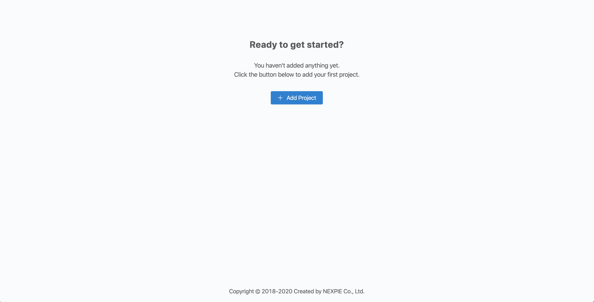
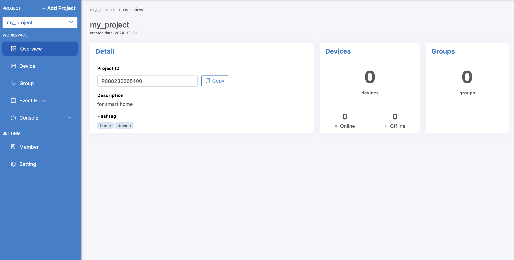
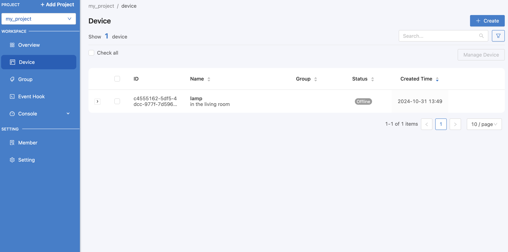
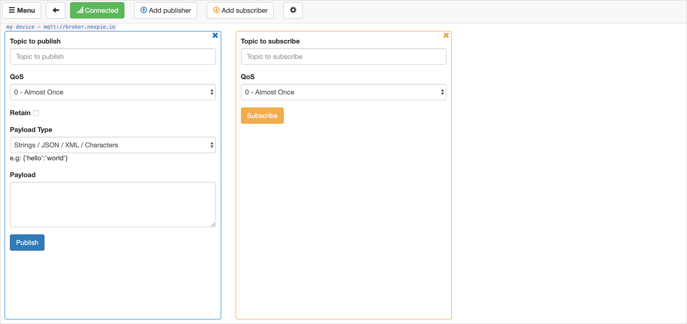
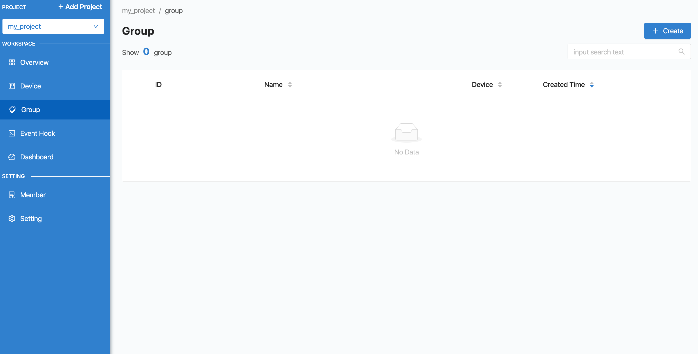
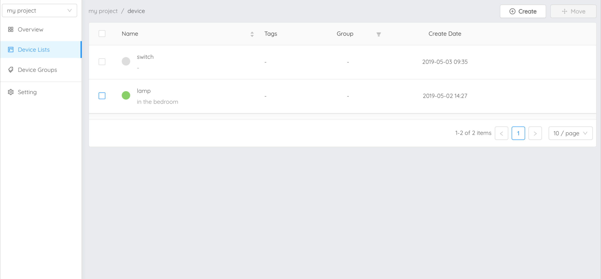

Getting started
===============

สร้าง Project
----------------

เมื่อ login เข้าสู่ |portal_url| เรียบร้อยแล้ว หน้าจอที่ปรากฏจะแสดงรายการ Project ทั้งหมดที่เคยสร้างไว้แล้ว :

ถ้ายังไม่มีให้ทำการสร้าง Project โดยคลิกที่เครื่องหมายบวกตามรูปด้านล่าง :

กรอกข้อมูล Project โดย field ที่มีเครื่องหมาย * กำกับอยู่ต้องกรอกข้อมูลให้ครบถ้วน จากนั้นคลิกที่ปุ่ม "Create" ระบบจะทำการสร้าง Project ให้ : 

คลิกที่ Project เพื่อดำเนินการขั้นต่อไป

สร้าง Device
----------------

เมื่อเข้ามาในแต่ละ Project แล้วจะปรากฏหน้าจอแสดงข้อมูลภาพรวมของ Project ดังต่อไปนี้ :

ให้ทำการสร้าง Device โดยคลิกที่เมนู "Device Lists" ทางด้านขวามือ :

.. image:: _static/device_list.png

หลังจากนั้นให้คลิกที่ปุ่ม "Create" เพื่อสร้าง Device ใหม่ :

กรอกข้อมูล Device โดย field ที่มีเครื่องหมาย * กำกับอยู่ต้องกรอกข้อมูลให้ครบถ้วน จากนั้นคลิกที่ปุ่ม "Create" ระบบจะทำการสร้าง Device ให้ : 

คลิกเข้าไปที่ Device แต่ละรายการจะปรากฏหน้าจอแสดงรายละเอียดข้อมูลต่าง ๆ ของ Device เหล่านั้น รวมถึง Key, Token และ Secret ที่จะนำไปใช้เพื่อให้ Device สามารถเชื่อมต่อเข้ามายัง Platform ได้ :

.. image:: _static/device_detail.png

.. _key-device-platform:

การนำ Key ไปใช้กับ Device เพื่อเชื่อมต่อ Platform
-------------------------------------------------

ส่วนสำคัญที่ใช้ในการเชื่อมต่อ Platform ของ Device คือ Key :

.. image:: _static/device_key.png

Key ใช้สำหรับการเชื่อมต่อของ Device มายัง Platform กรณีเชื่อมต่อผ่าน MQTT Protocol ให้เลือกใช้งาน MQTT Client Library ที่เหมาะสมหรือรองรับกับ Device ที่จะใช้ในการเชื่อมต่อ โดยการเชื่อมต่อของ MQTT จะต้องใช้ 4 Paramters คือ Host, Client id, Username และ Password โดยดูข้อมูลที่จะนำมาใช่ สามารถระบุค่าได้ดังนี้ :

.. list-table::
  :widths: 30 50
  
   * - **Host**
     - |broker_url|
   * - **Port**
     - 1883 (mqtt), 1884 (mqtts)
   * - **Client ID**
     - Client ID ของ Device ที่สร้างขึ้นใน |platform_name|
   * - **Username**
     - Token ของ Device ที่สร้างขึ้นใน |platform_name|
   * - **Password**
     - ยังไม่ต้องระบุ (ใช้สำหรับกรณีที่ต้องการตรวจสอบที่เพิ่มมากขึ้น)

ทดลองเชื่อมต่อ Platform ด้วย MQTT Box โดยดาวน์โหลดได้จาก http://workswithweb.com/mqttbox.html เมื่อดาวน์โหลดเรียบร้อยให้เปิดโปรแกรมขึ้นมาดังรูป :

.. image:: _static/mqttbox_create.png

หลังจากนั้นคลิกที่ปุ่ม "Create MQTT Client" เพื่อสร้างการเชื่อมต่อไปยัง MQTT Server (ในที่นี้คือ |platform_name| Platform) :

ระบุค่าการเชื่อมต่อให้ถูกต้อง จากนั้นคลิกปุ่ม "Save" แล้ว MQTT Box จะทำการเชื่อมต่อ Platform ให้อัตโนมัติ ถ้าเชื่อมต่อได้สำเร็จจะเป็นดังนี้ :

ทดสอบว่าสามารถเชื่อมต่อ Platform ได้จริงโดย Publish เข้าหาตัวเอง การเซ็ตค่า Topic ที่จะ Publish/Subcribe ให้ขึ้น Topic ด้วย ``@msg/`` (คลิกปุ่ม "Subcribe" ก่อนที่จะคลิกปุ่ม "Publish") :

การสื่อสารระหว่าง Devices
---------------------------

Device ที่จะสามารถสื่อสารกันได้ต้องอยู่ภายใต้ Device Group เดียวกัน โดยเริ่มจากไปที่เมนู "Device Groups" :

ให้ทำการสร้าง Group โดยคลิกที่ปุ่ม "Create" และกรอกข้อมูล :

.. image:: _static/group_create.png

เมื่อทำการสร้างเรียบร้อยแล้วจะปรากฏ Group ที่สร้างขึ้น :

กลับไปที่ "Device Lists" และทำการสร้าง Device ใหม่อีก 1 ตัวเพื่อใช้ในการสื่อสารระหว่าง Device กับ Device :

Device ที่สร้างใหม่ในที่นี้ คือ "switch" ทดลองเชื่อมต่อ Platform ด้วย HiveMQ โดยดาวน์โหลดได้จาก https://github.com/chavee/hivemq-mqtt-web-client เมื่อดาวน์โหลดเรียบร้อย ถ้าเป็น .zip ให้ทำการแตกไฟล์แล้วเปิดไฟล์ index.html กรอก Client ID ของ Device ที่ช่อง "ClientID" และ Token ของ Device ที่ช่อง "Username" :

จากนั้นคลิกปุ่ม "Connect" เพื่อทำการเชื่อมต่อ Platform : 

.. image:: _static/hivemq_connected.png

กลับไปที่หน้าเว็บ |portal_url| เมนู "Device Lists" จะพบว่า Device ทั้ง 2 ตัว เชื่อมต่อ Platform เรียบร้อยแล้ว :

ทดสอบสื่อสารระหว่าง 2 Devices คือ "lamp" และ "switch" โดย "lamp" เชื่อมต่อ Platform ผ่าน MQTT Box และ "switch" เชื่อมต่อ Platform ผ่าน HiveMQ :

ในที่นี้จะทดลองให้ "switch" ส่งข้อความไปหา "lamp" เพื่อให้ เปิด/ปิด ไฟ กำหนด Topic ที่ต้องการ Publish (ส่งข้อมูล) และ Subcribe (รอรับข้อมูล) ให้ตรงกัน โดย "switch" จะทำหน้าที่ Publish ส่วน "lamp" จะ Subcribe เซ็ต Topic เป็น ``@msg/set/status`` :

.. image:: _static/msg_pub_sub.png
