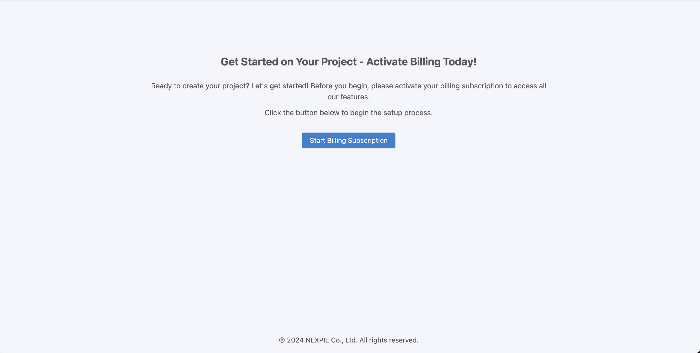
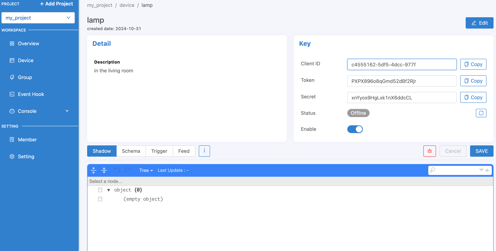
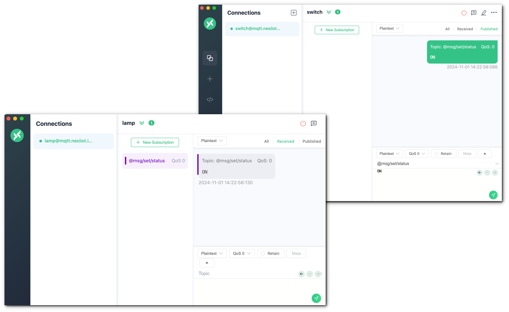

.. raw:: html

    
<b>TH</b> | <a href="https://docs.netpie.io/en/getting-started.html">EN</a>

Getting started
===============

สร้าง Project
----------------

เมื่อ login เข้าสู่ |portal_url| เรียบร้อยแล้ว หากเป็นการเข้าใช้งานระบบครั้งแรกและยังไม่มีการเปิดใช้งาน จะปรากฏหน้าจอดังรูปด้านล่าง ให้ทำการคลิกที่ปุ่ม "Start Billing Subscription" เพื่อให้ระบบทำการเริ่มต้นนับรอบการใช้งาน (ปกติ 1 รอบการใช้งาน คือ 1 เดือน) และเซ็ตโควต้าการใช้งานให้่ตามแพคเกจที่ได้รับจัดสรร โดยระบจะทำการรีเซ็ตโควต้าใช้งานให้ใหม่เมื่อขึ้นรอบการใช้งานถัดไป

เมื่อเปิดการใช้งานแล้วระบบจะแสดงหน้าจอจัดการ Project สำหรับการสร้างหรือรายการ Project ที่ถูกสร้างไว้แล้ว 

.. image:: _static/project_first.png

ถ้ายังไม่มีให้ทำการสร้าง Project โดยคลิกที่ "Add Project" จะปรากฏฟอร์มดังรูปด้านล่าง 

.. image:: _static/project_create.png

กรอกข้อมูล Project จากนั้นคลิกที่ปุ่ม "SAVE" ระบบจะทำการสร้าง Project และแสดงรายละเอียดต่างๆ ของ Project 

.. image:: _static/project_overview.png

|

สร้าง Device
----------------

คลิกที่เมนู "Device" ด้านซ้ายมือ จะปรากฏหน้าจอสำหรับจัดการข้อมูล Device ดังรูปต่อไปนี้ 

หลังจากนั้นให้คลิกที่ปุ่ม "Create" ที่มุมบนขวามือ เพื่อสร้าง Device ใหม่ จะปรากฏฟอร์มให้กรอกข้อมูลของ Device 

.. image:: _static/device_create.png

กรอกข้อมูล Device จากนั้นคลิกที่ปุ่ม "SAVE" ระบบจะทำการสร้าง Device ให้ 

.. image:: _static/device_first.png

คลิกเข้าไปที่ Device จะปรากฏหน้าจอแสดงรายละเอียดข้อมูลต่าง ๆ ของ Device เหล่านั้น รวมถึง Key, Token และ Secret ที่จะนำไปใช้เพื่อให้ Device สามารถเชื่อมต่อเข้ามายัง Platform ได้ 

|

การนำ Key ไปใช้กับ Device เพื่อเชื่อมต่อ Platform
-------------------------------------------------

ส่วนสำคัญที่ใช้ในการเชื่อมต่อ Platform ของ Device คือ Key 

Key ใช้สำหรับการเชื่อมต่อของ Device มายัง Platform กรณีเชื่อมต่อผ่าน MQTT Protocol ให้เลือกใช้งาน MQTT Client Library ที่เหมาะสมหรือรองรับกับ Device ที่จะใช้ในการเชื่อมต่อ โดยการเชื่อมต่อของ MQTT จะต้องใช้ 4 Paramters คือ Host, Client id, Username และ Password โดยดูข้อมูลที่จะนำมาใช่ สามารถระบุค่าได้ดังนี้ 

.. rst-class:: left-align-left-col

	.. list-table::
		:widths: 20 60
		  
		* - **Host**
		  - |broker_url|
		* - **Port**
		  - 1883 (mqtt), 1884 (mqtts)
		* - **Client ID**
		  - Client ID ของ Device ที่สร้างขึ้นใน |platform_name|
		* - **Username**
		  - Token ของ Device ที่สร้างขึ้นใน |platform_name|
		* - **Password**
		  - ยังไม่ต้องระบุ (ใช้สำหรับกรณีที่ต้องการตรวจสอบที่เพิ่มมากขึ้น)

ทดลองเชื่อมต่อ Platform ด้วย MQTTX ซึ่งสามารถดาวน์โหลดได้จาก https://mqttx.app/downloads เมื่อดาวน์โหลดเรียบร้อยให้เปิดโปรแกรมขึ้นมาดังรูป 

หลังจากนั้นคลิกที่ปุ่ม "New Connection" เพื่อสร้างการเชื่อมต่อไปยัง MQTT Server (ในที่นี้คือ |platform_name| Platform) 

ระบุค่าการเชื่อมต่อให้ถูกต้อง จากนั้นคลิก "Connect" เพื่อทำการเชื่อมต่อ Platform  หากเชื่อมต่อได้สำเร็จจะเป็นดังนี้ 

ทดสอบว่าสามารถเชื่อมต่อ Platform ได้จริงโดย Publish เข้าหาตัวเอง การเซ็ตค่า Topic ที่จะ Publish/Subscribe ให้ขึ้น Topic ด้วย ``@msg/`` (สร้าง "Subscribe" ก่อนที่จะทำการ "Publish") 

|

การสื่อสารระหว่าง Devices
---------------------------

Device ที่จะสามารถสื่อสารกันได้ต้องอยู่ภายใต้ Group เดียวกัน โดยการสร้าง Group ให้เข้าไปที่เมนู "Group" ด้านซ้ายมือ 

.. image:: _static/group_list.png

ให้ทำการสร้าง Group โดยคลิกที่ปุ่ม "Create" อยู่มุมบนด้านขวามือ จะปรากฏฟอร์มให้กรอกข้อมูลของ Group 

กรอกข้อมูล Group จากนั้นคลิกที่ปุ่ม "SAVE" ระบบจะทำการสร้าง Group ให้ 

.. image:: _static/group_first.png

จากนั้นคลิกที่ Group ที่สร้างไว้เพื่อจัดการ Device ภายใน Group นั้น ๆ ถ้ามี Device อยู่ใน Group ดังกล่าวก็จะแสดงรายการ Device ในหน้านี้ 

การจัดการ Device ภายใน Group ให้คลิกที่ปุ่ม "Manage Device" ที่มุมบนขวามือ เมื่อคลิกแล้วจะปรากฏหน้าจอสำหรับนำ Device เข้า/ออก จาก Group 

จากรูปด้านบน คลิกเลือกที่ Check Box หน้า Device ในกรอบด้านซ้ายมือที่ต้องการจัดเข้า Group นี้ จากนั้นคลิกที่ปุ่ม ">" เพื่อย้ายรายการ Device มายังกรอบด้านขวามือ ซึ่งก็คือการจัด Device เข้า Group 

จากรูปด้านบน เมื่อเลือก Device เรียบร้อยแล้วคลิกที่ปุ่ม "SAVE" เพื่อบันทึกข้อมูลก็จะมาปารกฏใน Group 

เมื่อจัด Device เข้า Group เรียบร้อยแล้ว ทำการเชื่อมต่อ Device ทั้ง 2 ตัวที่จัดเข้า Group เดียวกันเมื่อก่อนหน้านี้ผ่าน MQTTX ดังรูปต่อไปนี้

กลับไปที่หน้าเว็บ |portal_url| เข้าไปที่เมนู "Device" ด้านซ้ายมือ จะพบว่า Device ทั้ง 2 ตัว เชื่อมต่อ Platform เรียบร้อยแล้ว 

.. image:: _static/device_online_list.png

ทดสอบสื่อสารระหว่าง 2 Devices คือ "lamp" และ "switch" ในที่นี้จะทดลองให้ "switch" ส่งข้อความไปหา "lamp" เพื่อให้ เปิด/ปิด ไฟ กำหนด Topic ที่ต้องการ Publish (ส่งข้อมูล) และ Subcribe (รอรับข้อมูล) ให้ตรงกัน โดย "switch" จะทำหน้าที่ Publish ส่วน "lamp" จะ Subscribe เซ็ต Topic เป็น ``@msg/set/status`` (เปิด MQTTX แยก Device ละหน้าต่าง)

