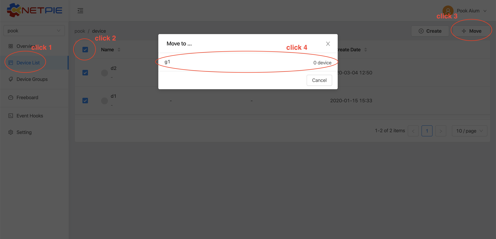
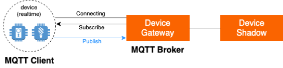

MQTT
======

|

การเชื่อมต่อ Platform ผ่าน MQTT (Message Queuing Telemetry Transport) ซึ่งเป็น Protocol ที่มีขนาดเล็กและได้รับความนิยมสำหรับการสื่อสารแบบ M2M ( Machine to Machine ) โดยสามารถใช้ MQTT Library ตัวใดก็ได้ที่รองรับกับ Device ที่ใช้งานอยู่ การเชื่อมต่อของ MQTT จะต้องใช้ 4 Parameters คือ Host, Client ID, Username และ Password โดยให้ระบุแต่ละค่าดังนี้

|

.. list-table::
   :widths: 30 50
  
   * - **Host**
     - |broker_url|
   * - **Port**
     - 1883 (mqtt), 1884 (mqtts)
   * - **Client ID**
     - Client ID ของ Device ที่สร้างขึ้นใน |platform_name|
   * - **Username**
     - Token ของ Device ที่สร้างขึ้นใน |platform_name|
   * - **Password**
     - ยังไม่ต้องระบุ (ใช้สำหรับกรณีที่ต้องการตรวจสอบที่เพิ่มมากขึ้น)

.. image:: _static/device_key.png

|

MQTT API จะมีลักษณะการใช้งานเป็นแบบ Publish / Subscribe โดย Publish จะเป็นการส่งข้อมูลไปยัง Topic ที่ต้องการ ส่วน Subscribe จะเป็นการรอรับข้อมูลใน Topic ที่ต้องการ การสั่ง Subscribe Topic ใดก็ตามทำเพียงครั้งเดียวก็จะได้รับข้อมูลใน Topic นั้นไปตลอดจนกว่าจะสั่ง Unsubscribe Topic นั้น หรือการเชื่อมต่อกับ Platform หยุดลง

|

.. caution:: 

	ควรสั่ง Subscribe Topic ก่อนที่จะมีการสั่ง Publish Topic เดียวกัน เพื่อให้ได้รับข้อมูลที่ถูกส่งมา ซึ่งข้อมูลที่ได้รับจะเป็นข้อมูลที่เกิดจากการ Publish หลังการ Subscribe เท่านั้น

|

องค์ประกอบสำคัญที่จำเป็นต้องทราบสำหรับการใช้งาน MQTT API คือ Topic เพราะ Publish / Subscribe จำเป็นต้องระบุ Topic ที่ต้องการ Topic จะหน้าที่เหมือน Endpoint บน MQTT Broker เพื่อให้ MQTT Client มาเชื่อมต่อและสื่อสารกัน โดยจะรองรับคุณสมบัติดังต่อไปนี้

- QoS (Quality of Service) 3 ระดับ คือ ข้อตกลงระหว่างผู้ส่ง (Publisher) และผู้รับ (MQTT Broker) ในการรับประกันการส่งข้อมูล

	**QoS Level 0** : การส่งข้อมูลที่มีการรับประกันผลในระดับต่ำสุด หรือเป็นข้อมูลที่ต้องการความรวดเร็วในการส่ง คือ ไม่ต้องการการตอบกลับว่าข้อมูลถึง MQTT Broker แล้ว

	**QoS Level 1** : การส่งข้อมูลที่มีการรับประกันผลในระดับที่ทุกครั้งของการส่งข้อมูล ต้องมีการตอบกลับเสมอเพื่อยืนยันว่าข้อมูลได้ส่งไปถึง MQTT Broker แล้ว ถ้าการตอบกลับสูญหาย ผู้ส่งจะทำการส่งข้อมูลไปใหม่จนกว่าจะได้รับการตอบกลับ นั่นหมายความว่า MQTT Broker จะได้รับข้อมูลอย่างน้อย 1 ครั้งแน่นอน แต่ข้อมูลเดียวกันอาจจะได้รับมากกว่า 1 ครั้งด้วยเช่นกัน

	**QoS Level 2** : การส่งข้อมูลที่มีการรับประกันผลระดับสูงสุด ข้อมูลมีความสำคัญมาก คือ ทุกครั้งของการส่งข้อมูลจะมีการยืนยันว่าถูกส่งไปถึง MQTT Broker อย่างแน่นอนและได้รับข้อมูลครั้งเดียว

- Shared Subscription คือ การส่งข้อมูลกระจายไปได้ทุกโหนดที่ Subscribe Topic เดียวกัน

- Transparent Virtual Host คือ การ Publish / Subscribe ไปที่ Topic เดียวกัน ถ้า Device อยู่ต่างกลุ่ม ก็จะเหมือนเป็นคนละ Topic กัน 

|

โครงสร้าง Topic ใน |platform_name| Platform สามารถแยกได้เป็น 3 ประเภท ดังนี้

|

Message API Topic
--------------------

|

เป็นการกำหนด Topic สำหรับ Publish / Subscribe ข้อมูลเพื่อสื่อสารระหว่าง Devices ที่อยู่ภายในใต้ Group เดียวกัน การจัด Device เข้า Group มีขั้นตอนตามรูปต่อไปนี้

โดยเมื่อนำ Device เข้า Group เรียบร้อยแล้ว รูปแบบการใช้งานให้ขึ้นต้น Topic ด้วย @msg ตามด้วยโครงสร้าง Topic ที่ต้องการ ดังนี้

|
	
.. list-table::
   :widths: 20 60
  
   * - **publish**
     - ``publish @msg/{any}/{topic}``
   * - **subscribe**
     - ``subscribe @msg/{any}/{topic}``
   * - **ตัวอย่าง Topic**
     - @msg/myhome/bedroom/lamp, @msg/sensor/temp, @msg/john

จะเห็นได้ว่า Topic สามารถระบุเป็นลำดับชั้นได้โดยการคั่นด้วย "/" นอกจากการระบุ Topic ที่เฉพาะเจาะจงแล้ว ยังรองรับการระบุ Topic แบบ Wildcard ด้วย มี 2 ลักษณะ คือ

	1.  **Wildcard แบบทั้งหมด** หมายถึง การระบุ Topic ตามลำดับชั้้นในส่วนหน้าแล้วปิดท้ายด้วยเครื่องหมาย '#' ตัวอย่างเช่น

	================================== ========================================
	Publish / Subscribe Topic          Publish / Subscribe Topic ที่จะได้รับข้อมูล
	================================== ========================================
	``@msg/#``                         @msg/{เป็นอะไรก็ได้ กี่ลำดับชั้นก็ได้ มีหรือไม่ก็ได้} เช่น ``@msg/myhome``, ``@msg/myhome/bedroom/lamp``, ``@msg/john``
	``@msg/rooms/#``                    @msg/room/{เป็นอะไรก็ได้ กี่ลำดับชั้นก็ได้ มีหรือไม่ก็ได้} เช่น ``@msg/rooms``, ``@msg/rooms/bathroom``, ``@msg/rooms/bedroom/lamp``
	================================== ========================================

	2. **Wildcard แบบเฉพาะชั้น** หมายถึง การระบุ Topic เฉพาะแต่ละลำดับชั้นให้เป็นอะไรก็ได้ โดยแทนด้วยเครื่องหมาย '+' ในลำดับชั้นที่ไม่ต้องการระบุเฉพาะเจาะจง ตัวอย่างเช่น

	================================== ========================================
	Publish / Subscribe Topic          Publish / Subscribe Topic ที่จะได้รับข้อมูล
	================================== ========================================
	``@msg/+``                         @msg/{เป็นอะไรก็ได้ 1 ลำดับชั้นและต้องมี} เช่น ``@msg/myhome``, ``@msg/temp``, ``@msg/room``
	``@msg/rooms/+``                   @msg/room/{เป็นอะไรก็ได้ 1 ลำดับชั้นและต้องมี} เช่น ``@msg/rooms/bathroom``, ``@msg/rooms/bedroom``, ``@msg/rooms/kitchen``
	``@msg/home/+/light``              @msg/home/{เป็นอะไรก็ได้ 1 ลำดับชั้นและต้องมี}/light เช่น ``@msg/home/bathroom/light``, ``@msg/home/livingroom/light``, ``@msg/home/garage/light``
	``@msg/home/+/+/door``             @msg/home/{เป็นอะไรก็ได้ 1 ลำดับชั้นและต้องมี}/{เป็นอะไรก็ได้ 1 ลำดับชั้นและต้องมี}/door เช่น ``@msg/home/john/bedroom/door``, ``@msg/home/upstairs/bathroom/door``
	================================== ========================================
|

.. note:: Wildcard Topic

	- เครื่องหมาย '#' ต้องถูกระบุอยู่ลำดับชั้นท้ายสุดของ Topic เท่านั้น ห้ามมีอะไรต่อท้ายอีก
	- เครื่องหมาย '#' จะมีการระบุข้อความ Topic จากตำแหน่งนั้นหรือไม่ก็ได้ แต่ เครื่องหมาย '+' บังคับว่าต้องมีการระบุในลำดับชั้นนั้น
	- เครื่องหมาย '#' และ '+' สามารถใช้ผสมกันได้ แต่ '#' ต้องอยู่ลำดับชั้นท้ายสุดของ Topic เท่านั้น เช่น ``@msg/home/+/bedroom/+/#``

|

Shadow API Topic
--------------------

|

|

MQTT Topic ที่เกี่ยวข้องกับการจัดการ Device Shadow สามารถแยกได้เป็น Publish และ Subscribe โดย Publish จะใช้กรณีที่ต้องการขอข้อมูลหรืออัพเดทข้อมูลใน Device Shadow ส่วน Subscribe จะเป็นการรอรับข้อมูลในกรณีที่มีการ Publish ไปขอข้อมูล หรือในกรณีที่มีการเปลี่ยนข้อมูล Device Shadow และได้ทำการ Subscribe ไว้ ซึ่งการใช้งานจะมีรายละเอียด ดังนี้

1. **Private Channel Topic** คือ ช่องทางพิเศษสำหรับรับการตอบกลับ (Response) หรือรอรับข้อมูลทุกอย่างที่เกิดขึ้นกับตัวเอง เช่น Device Shadow ตัวเองมีการเปลี่ยนแปลง เป็นต้น โดยรูปแบบการใช้งานให้ขึ้นต้น Topic ด้วย @private มีลักษณะตามนี้ ``@private/{response topic}`` จะมีเพียงการ Subscribe เท่านั้น Response Topic สำหรับ Subscribe @private มีดังนี

	==============================================================  ============================================================
	Subscribe Topic                                                 คำอธิบาย
	==============================================================  ============================================================
	``@private/#``                                                  การรอรับทุกข้อมูลที่ Publish มายัง Topic ที่ขึ้นต้นด้วย @private/ รวมถึงข่าสารต่างๆ ที่ Platform ต้องการแจ้งให้ทราบก็จะถูก Publish มายัง Topic นี้
	``@private/shadow/data/get/response``                           การรอรับ Device Shadow Data เมื่อมีการร้องขอข้อมูลไป
	``@private/shadow/batch/update/response``                        การรอรับข้อความตอบกลับ กรณีอัพเดท Shadow แบบเป็นชุดข้อมูล (Shadow Batch Update)
	==============================================================  ============================================================
		
2. **Shadow Topic** คือ Topic ที่ใช้สำหรับจัดการ Device Shadow ของตัวเอง Topic ที่เกี่ยวข้องมีดังนี้

	=========================================================  ==================================================
	Publish Topic                                              คำอธิบาย
	=========================================================  ==================================================
	``@shadow/data/get`` 		                               เป็นการร้องขอข้อมูล Shadow Data ของตัวเองแบบทั้งหมด โดยการรอรับข้อมูลให้ Subscribe Topic ``@private/#`` หรือ ``@private/shadow/data/get/response`` เพื่อรอรับข้อมูล (ใช้ในกรณีที่เป็น Shadow ตัวเองท่านั้น)
	``@shadow/data/update``            						   เป็นการอัพเดทค่าใน Shadow Data โดยส่ง Payload ดังนี้ { "data":{ "field name 1": value 1, "field name 2": value 2, ..., "field name n": value n }} ถ้าต้องการได้รับข้อมูลเมื่อค่าต่าง ๆ ใน Shadow Data ถูกอัพเดทให้ Subscribe Topic ``@shadow/data/updated`` รอไว้
	``@shadow/batch/update``                                   เป็นการอัพเดทค่าใน Shadow แบบเป็นชุดข้อมูล (Shadow Batch Update)
	=========================================================  ==================================================

.. note:: 

	Publish Topic คือ การส่งข้อความออกไปยัง Topic ตามที่ระบุ

	Subscribe Topic คือ การขอรับข้อความที่ถูกส่งเข้ามายัง Topic ตามที่ระบุ

	Shadow Batch Update อธิบายรายละเอียดและวิธีใช้งานในหัวข้อถัดไป

.. tip:: 

	Publish Topic ``@shadow/data/update`` ในกรณีที่เป็นฟิลด์ที่มีการตั้งค่าใน Device Schema ให้มีการบันทึกลง Timeseries Database ถ้าต้องการกำหนดเวลาของจุดข้อมูลที่บันทึกเอง ให้ใส่ timestamp เข้ามาใน Payload ด้วย ถ้าไม่กำหนดจะเป็นเวลาที่ Server รับข้อมูล ตัวอย่างเช่น 

	MQTT topic : @shadow/data/update
	
	MQTT payload : { "data" : { "temp" : 21.5 }, "timestamp": 1566450000000 }

	โดยมีเงื่อนไขว่า ถ้า timestamp ที่ใส่มานั้น เก่ากว่า timestamp ล่าสุดที่ระบุอยู่ใน Shadow Data ค่าใน Shadow Data จะไม่ถูกอัพเดต และถ้ามีการตั้งค่า Device Trigger ก็จะไม่มี Event Shadow Updated แจ้งออกไป แต่จะแค่ส่งข้อมูลไปเก็บลง Timeseries Database และทำให้เกิดจุดข้อมูลย้อนหลังในเวลาที่กำหนดมาเท่านั้น

|

.. _key-shadow-batch-mqtt:

Shadow Batch Update
--------------------

|

จะใช้ในกรณีที่ IoT Device ไม่สามารถส่งข้อมูลขึ้น Cloud Platform ได้ตามเวลาที่กำหนด เช่น อาจจะเกิดจากปัญหาการเชื่อมต่ออินเตอร์เน็ต เป็นต้น ทำให้ IoT Device จำเป็นต้องเก็บข้อมูลไว้ที่หน่วยความจำของ Device เองก่อน เช่น เก็บลง SD Card เป็นต้น และเมื่อสามารถเชื่อมต่อ Cloud Platform ได้ จึงทำการส่งข้อมูลที่เก็บไว้ทั้งหมดขึ้น Cloud Platform อีกที โดยสามารถส่งค่าขึ้น Platform ครั้งละหลาย ๆ จุดพร้อมกันได้

|

การเขียน Shadow แบบ Batch ทำได้ 3 ช่องทาง ได้แก่

1. MQTT คือ การเขียนข้อมูลเป็น Batch จะใช้ Topic และ Payload มีลักษณะดังตัวอย่างนี้

|

.. list-table::
   :widths: 10 50
  
   * - **Publish Topic**
     - @shadow/batch/update
   * - **Payload**
     - { "batch" : [ {"data":{"temp":25.9, "humid":9.6}, "ts":-90000}, {"data":{"temp":25.3, "humid":9.8}, "ts":-60000}, {"data":{"temp":24.5, "humid":9.1}, "ts":-30000}, {"data":{"temp":26.8, "humid":8.2}, "ts":0}], "merged": true }

|

โดยวิธีนี้จะไม่มีการตอบกลับ แต่หากต้องการให้มีการตอบกลับ เพื่อยืนยันว่าการดำเนินการสำเร็จ ต้องเพิ่มฟิลด์ ackid ซึ่งสามารถตั้งเป็นค่าอะไรก็ได้ เป็นได้ Number หรือ String โดยทุกการตอบกลับจะมีการทวนค่า ackid เดิม เพื่อให้ผู้ใช้สามารถจับคู่ระหว่าง Request และ Response ได้ ตัวอย่างดังนี้

|

.. list-table::
   :widths: 10 50
  
   * - **Publish Topic**
     - @shadow/batch/update
   * - **Payload**
     - { "ackid" : 1839, "batch" : [ {"data":{"temp":25.9, "humid":9.6}, "ts":-90000}, {"data":{"temp":25.3, "humid":9.8}, "ts":-60000}, {"data":{"temp":24.5, "humid":9.1}, "ts":-30000}, {"data":{"temp":26.8, "humid":8.2}, "ts":0}], "merged": true }

|

โดยการรอรับข้อความตอบกลับจะต้อง Subscribe ไปยัง Topic ที่กำหนด มีลักษณะดังนี้

|

.. list-table::
   :widths: 10 50
  
   * - **Subscribe Topic**
     - @private/shadow/batch/update/response
   * - **Payload**
     - { "ackid": 1839, "total": 4, "mints": 1618457252257, "maxts":1618457342257 }

|

ในส่วนของฟิลด์เวลาที่ระบุกำกับให้แต่ละจุดข้อมูลที่จะทำการเขียนลง Shadow มีหน่อยเป็น Millisecond สามารถใช้คำว่า ts หรือ timestamp เป็นชื่อฟิลด์ก็ได้ หากมีค่าต่ำกว่า 1000 * 2^23 = 8388608000 จะถือว่าเป็นค่า Relative Time กับเวลาปัจจุบัน ถ้ามีค่ามากกว่า จะถือเป็น timestamp แบบ Absolute Time สามารถใช้ค่าลบแทนเวลาในอดีตได้ ซึ่งจะเหมาะสำหรับการอัพเดตข้อมูลจุดย้อนหลัง ยกตัวอย่างเช่น ถ้ากำหนด ts หรือ timestamp เป็น -90000 และ timestamp ปัจจุบัน คือ 1619075885 เวลาที่เกิดจุดข้อมูลนั้นจะเป็น 1619075885 - 90000 = 1618985885 (เวลาย้อนหลังไปจากปัจจุบัน 90 วินาที)

.. note:: 

	ในส่วนของฟิลด์ ``merged`` ที่ระบุอยู่ใน Payload เพื่อส่งไปเขียนลง Shadow เป็นการกำหนดรูปแบบการเขียนข้อมูลว่าจะเขียนแบบผสาน (Merge) หรือแบบเขียนทับ (Overwrite) ถ้าเซ็ต ``merged : true`` จะเป็นการเขียนแบบผสาน (Merge) และถ้าเซ็ต ``merged : false`` จะเป็นการเขียนแบบเขียนทับ (Overwrite) แต่ถ้าไม่มีการระบุค่านี้ลงใน Payload ค่าโดย Default จะเป็น true คือ เป็นการเขียนแบบผสาน (Merge)
	
	|

	การทำงานของ Expression ที่กำหนดไว้ใน Schema และ Trigger กรณีเขียน Shadow แบบ Batch

	Expression ยังคงถูกคำนวณตามสูตรที่กำหนดไว้ทุกชุดข้อมูล เหมือนการ For Loop เขียน Shadow เอง แต่การเขียน Shadow แบบ Batch จะถูกหักโควต้า Shadow read/write เพยีง 1 Operation เท่านั้น แต่โควต้า Shadow Expression จะถูกหักตามจำนวนชุดข้อมูลเช่นเดิม ยกตัวอย่างเช่น ชุดข้อมูลที่ส่งค่ามาบันทึก 100 จุด และมีฟิลด์ข้อมูลที่เซ็ต Expression ไว้ 1 ฟิลด์ จำนวน Shadow Expression ที่ถูกหักจะเท่ากับ 1 x 100 = 100 Operations เป็นต้น

	สำหรับ Trigger จะทำงานเฉพาะชุดข้อมูลที่เป็นค่าล่าสุด (Timestamp มีค่าสูงสุด) เท่านั้น และจะถูกหักโควต้าการใช้งานเหมือนการเขียนข้อมูลแค่ชุดเดียว

|

2. REST API คือ การเขียนข้อมูลเป็น Batch โดยดำเนินการผ่าน REST API ซึ่งสามารถเขียนได้ทั้งแบบผสาน  (Merge) หรือเขียนทับ (Overwrite) ดูรายละเอียดได้ที่ :ref:`key-shadow-batch-rest`

|

3. CoAP API คือ การเขียนข้อมูลเป็น Batch โดยดำเนินการผ่าน CoAP Protocol ซึ่งสามารถเขียนได้ทั้งแบบผสาน  (Merge) หรือเขียนทับ (Overwrite) เช่นกัน ดูรายละเอียดได้ที่ :ref:`key-shadow-batch-coap`

|

.. caution::

	ข้อจำกัดของการเขียน Shadow แบบ Batch คือ จำนวนชุดข้อมูลที่ส่งไปเขียนได้ต่อครั้งต้องไม่เกิน 100 ชุดข้อมูล (JSON Array ของฟลิด์ ``batch``) เช่น กำหนด Payload ที่ส่งไปเขียนข้อมูลเป็น 

	{ "ackid" : 1839, "batch" : [ {"data":{"temp":25.9, "humid":9.6}, "ts":-90000}, {"data":{"temp":25.3, "humid":9.8}, "ts":-60000}, {"data":{"temp":24.5, "humid":9.1}, "ts":-30000}, {"data":{"temp":26.8, "humid":8.2}, "ts":0}], "merged": true } 

	แสดงว่ามีจำนวนชุดข้อมูลเท่ากับ 4 ชุดข้อมูล เป็นต้น หากมีส่งชุดข้อมูลไปเกินกว่าที่กำหนด ข้อมูลทั้งหมดจะไม่ถูกบันทึก และจะมีข้อความแจ้งเตือนกลับมาในรูปแบบ JSON ดังนี้ 

	{"ackid":140,"errcode":429,"message":"batch size exceeds 100","inputsize": 102} 

	หมายความว่า การเขียนข้อมูลแบบ Batch ที่ ackid เป็น 140 ส่งชุดข้อมูลไปเกิน 100 ชุด โดยส่งไป 102 ชุด เป็นต้น