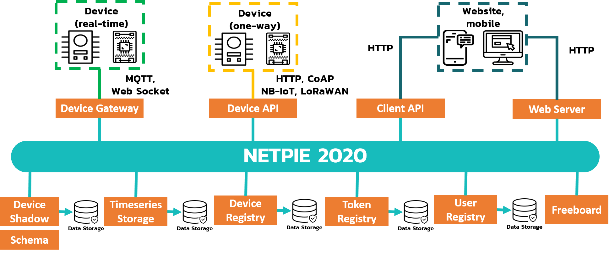

NETPIE Overview
===============

NEXPIE IoT คือแพลตฟอร์มที่ถูกพัฒนาขึ้นเพื่อตอบสนองผู้ใช้งานเชิงพาณิชย์ เช่น ผู้ผลิตอุปกรณ์ IoT, อุตสาหกรรม, โรงงาน และองค์กรที่พัฒนาสู่ยุค Digital Transformation 4.0 ซึ่งจะช่วยธุรกิจให้มีประสิทธิภาพยิ่งขึ้น ด้วยเทคโนโลยีการเชื่อมต่อทุกสรรพสิ่ง หรือ Internet of Things (IoT)

โดยแพลตฟอร์มจะช่วยให้อุปกรณ์ต่างๆ สามารถสื่อสารกันได้ เกิดการรับ-ส่งข้อมูลระหว่างอุปกรณ์แบบ real-time ทำให้ผู้ใช้งานทราบถึงข้อมูลของอุปกรณ์ ณ เวลานั้นๆ ไม่ว่าผู้ใช้งานจะอยู่ที่ไหนเวลาใดก็ตาม ทั้งยังรองรับการเชื่อมต่อกับอุปกรณ์ IoT ได้จำนวนมหาศาล ทำให้ตอบโจทย์กลุ่มผู้ใช้งานเชิงพาณิชย์ที่มีอุปกรณ์ IoT จำนวนมากอย่างแน่นอน

**คุณสมบัติหลักๆของ NEXPIE IoT Platfrom ประกอบไปด้วย**

	1. การแสดงค่าข้อมูลจากเซ็นเซอร์หรืออุปกรณ์แบบ Real-time (Monitoring)

	2. การควบคุมการทำงานของอุปกรณ์ต่างๆ ผ่าน Cloud Platform (Controlling)
	
	3. การเก็บค่าข้อมูลที่ได้จากเซ็นเซอร์หรืออุปกรณ์ (Data Storage)
	
	4. การแจ้งเตือนความผิดปกติของเซ็นเซอร์หรืออุปกรณ์จากที่ได้กำหนดไว้ (Notification)
  

