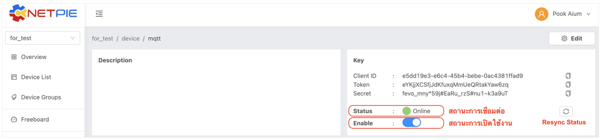
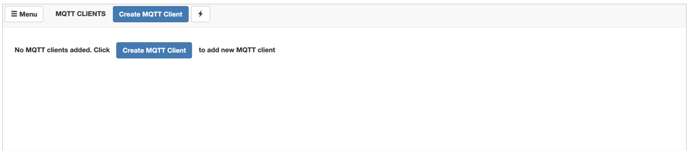
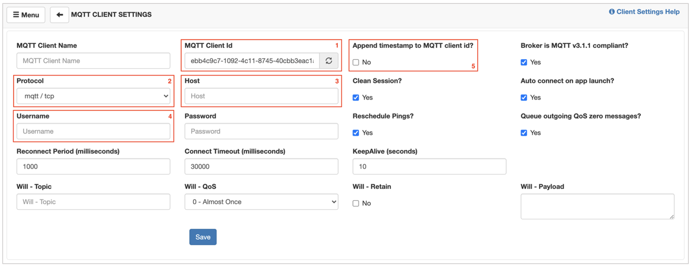
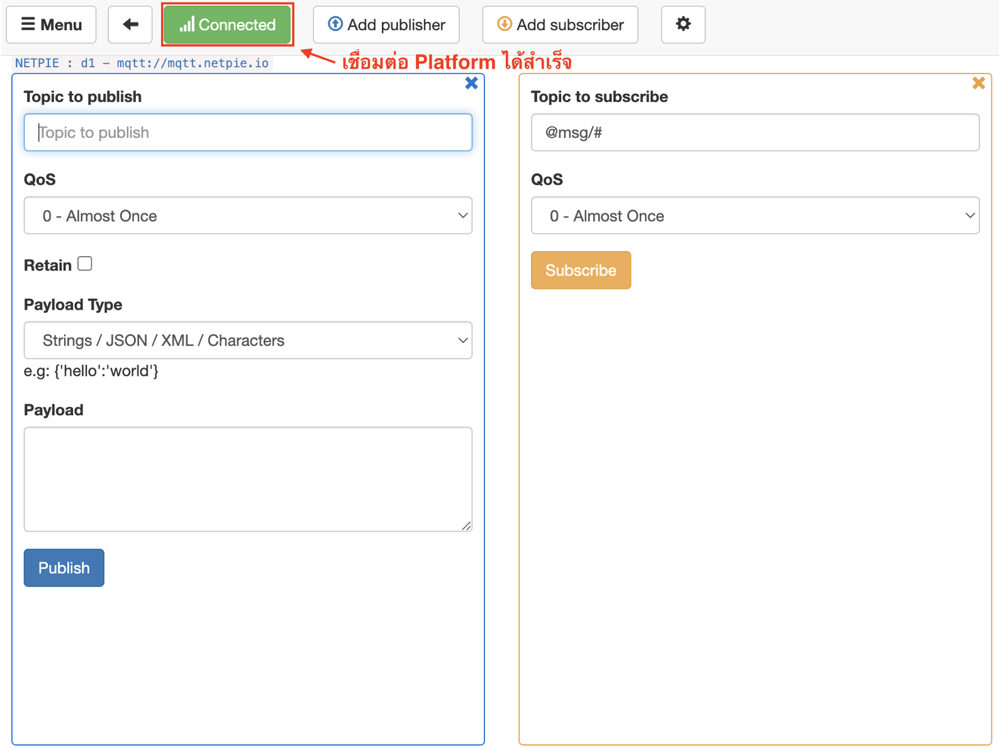
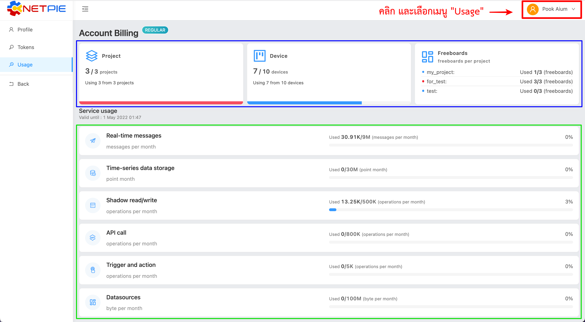
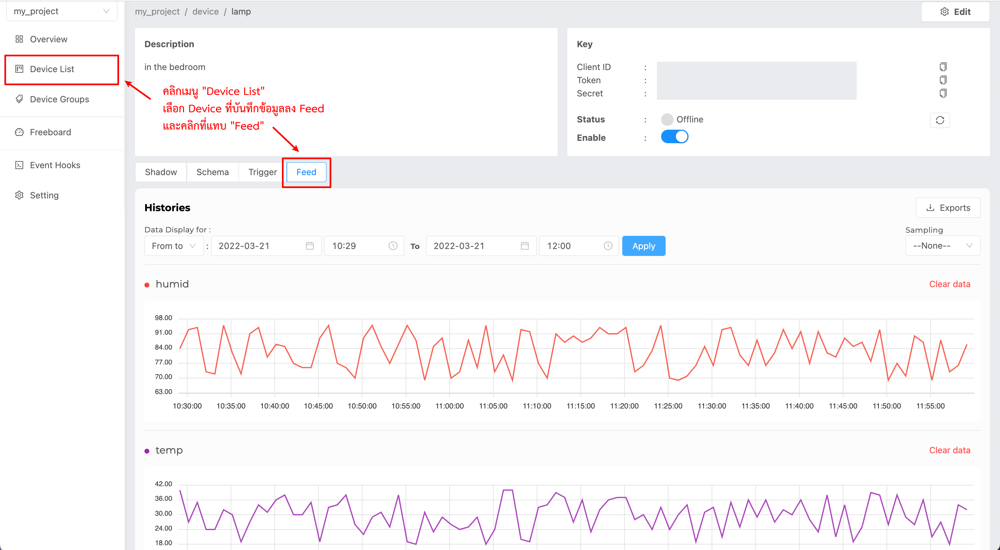
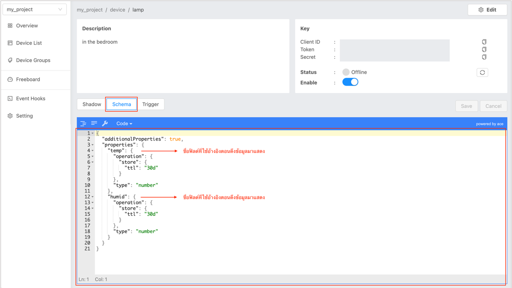
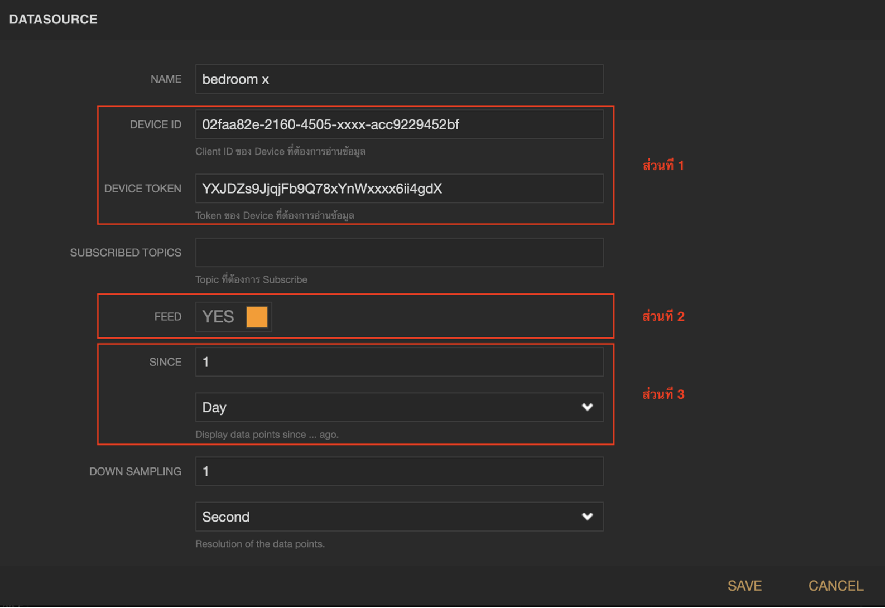
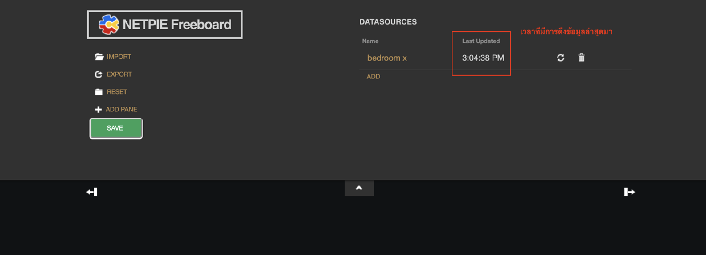
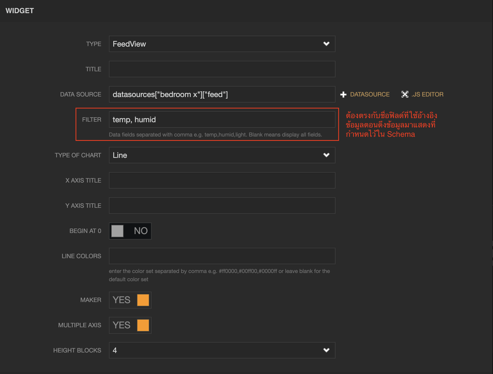

ตรวจสอบเบื้องต้นเมื่อมีปัญหาการใช้งาน
==================================

|

เมื่อพบปัญหาในการใช้งาน Platform อาจเกิดได้จากหลายสาเหตุ หนึ่งในนั้นคือการใช้งานไม่ตรงตามเงื่อนไขหรือข้อจำกัดของ Platform ที่กำหนดไว้ ทำให้ใช้งานไม่ได้หรือถูกระงับการใช้ ซึ่งถ้าเกิดจากกรณีนี้ ผู้ใช้สามารถตรวจสอบได้ด้วยตัวเองเบื้องต้น ดังนี้

|

ปัญหาที่ 1 : Device ไม่สามารถเชื่อมต่อ Platform ได้
-----------------------------------------------

|

สาเหตุที่ทำให้เกิดปัญหาดังกล่าว ผู้ใช้สามารถทำการตรวจสอบด้วยตนเองเบื้อต้นตามขั้นตอนต่อไปนี้

1. ตรวจสอบ Key (Client ID, Token) ที่ใช้ในการเชื่อมต่อว่าถูกต้องหรือไม่

2. ตรวจสอบสถานะของ Device ว่า Key ที่นำมาใช้ไม่ได้ถูกใช้เชื่อมต่อซ้ำซ้อน โดย Key 1 ชุด สามารถเชื่อมต่อได้เพียง 1 การเชื่อมต่อเท่านั้นในเวลาเดียวกัน การตรวจสอบดูได้จากหน้า Portal ในกรอบที่แสดง Key ของ Device ที่ฟิลด์ Status ถ้าเป็น Online แสดงว่าถูกเชื่อมต่อไปแล้ว (เพื่ออัพเดทสถานะของ Device ให้เป็นปัจจุบัน ให้คลิกที่ปุ่ม Resync Status ที่อยู่ด้านหลังก่อน) ดังรูปที่ 1.1

|

.. raw:: html

	
รูปที่ 1.1

|

3. ตรวจสอบสถานะการเปิดใช้งาน Device ว่าเปิดอยู่หรือไม่ (แสดงแทบสีฟ้า คือ เปิดใช้งานปกติ) โดยตรวจสอบได้จากหน้า Portal ในกรอบที่แสดง Key ของ Device ที่ฟิลด์ Enable ดังรูปที่ 1.1

4. ทดลองนำ Key ของ Device เชื่อมต่อผ่าน MQTTBox เพื่อทดสอบว่า Key และ Platform ไม่ได้มีปัญหา ขั้นตอนการเชื่อมต่อด้วย MQTT Box ซึ่งเป็นแอปที่สามารถดาวน์โหลดได้จาก Chrome เว็บสโตร์ โดยโลโก้ของแอปจะเป็นรูปลูกเต๋า เมื่อดาวน์โหลดเรียบร้อยให้เปิดโปรแกรมขึ้นมาดังรูป 1.2 คลิกปุ่ม “Create MQTT Client” จะปรากฏหน้าหน้าจอให้ตั้งค่าการเชื่อมต่อ MQTT ดังรูปที่ 1.3 โดยมีทั้ง 5 ค่า คือ

- ค่าที่ 1 MQTT Client id => Client ID ตามรูปที่ 1.1
- ค่าที่ 2 Protocol => mqtt / tcp
- ค่าที่ 3 Host => mqtt.netpie.io
- ค่าที่ 4 Username => Token ตามรูปที่ 1.1
- ค่าที่ 5 Append timestamp to MQTT client id? => No

จากนั้นคลิกปุ่ม Save ถ้าเชื่อมต่อ Platform จะปรากฏปุ่มสีเขียวเขียนว่า Connected ดังรูปที่ 1.4

|

.. raw:: html

	
รูปที่ 1.2

|

|

.. raw:: html

	
รูปที่ 1.3

|

|

.. raw:: html

	
รูปที่ 1.4

|

ปัญหาที่ 2 : บาง Services ของ Platform ไม่ทำงาน
----------------------------------------------

|

ในบางครั้งผู้ใช้ใช้งาน Services ต่าง ๆ ภายใน Platform แล้วเหมือนไม่เกิดการเปลี่ยนแปลงใด ๆ คล้ายกับว่า Services เหล่านั้นไม่ทำงาน เช่น สั่งเขียน Shadow แล้วแต่ไม่มีการเปลี่ยนแปลงเหมือนเขียนไม่เข้า  หรือข้อมูลไม่ถูกเก็บลงใน Time-series data storage (Feed) เป็นต้น โดยอันดับแรกที่ควรตรวจสอบ คือ โควต้าการใช้งานที่ได้รับจัดสรรสำหรับแต่ละ Service ในแต่ละเดือนยังเหลือหรือไม่ ซึ่งสามารถตรวจสอบได้ตามรูปที่ 2.1

|

.. raw:: html

	
รูปที่ 2.1

|

จากรูปที 2.1 โควต้าการใช้งานจะถูกแยกเป็น 2 ประเภท คือ

|

`แบบจำกัดจำนวนการใช้งาน` (ในกรอบสีน้ำเงิน) ประกอบด้วย

- Project : จำกัดจำนวน Project ที่สามารถสร้างได้ทั้งหมดในแต่ละ Account
- Device : จำกัดจำนวน Project ที่สามารถสร้างได้ทั้งหมดในแต่ละ Account
- Freeboard : จำกัดจำนวน Freeboard ที่สามารถสร้างได้ทั้งหมดในแต่ละ Project

|

`แบบใช้แล้วหมดไป แต่จะมีการรีเซ็ตโควต้าให้ทุกเดือน` (กรอบสีเขียว) 

- Real-time messages : ถ้า Service นี้หมด การดำเนินการผ่าน MQTT Protocol ทั้งหมดจะไม่ทำงาน ดูรายละเอียดได้ที่ :ref:`mqtt-quota`
- Time-series data storage : ถ้า Service นี้หมด จะไม่สามารถบันทึกข้อมูลเพื่อดูประวัติย้อนหลังได้ (Feed จะไม่ปรากฏจุดข้อมูลใหม่)
- Shadow read/write : ถ้า Service นี้หมด จะไม่สามารถ Read/Write Shadow นอกจากนี้ยังส่งผลกระทบไปถึง Service อื่นที่ดำเนินการผ่าน Shadow ด้วย เช่น การบันทึกข้อมูลลง Time-series data storage ผ่านการ Write Shadow จะไม่สามารถบันทึกได้ เป็นต้น
- API call : ถ้า Service นี้หมด การดำเนินการผ่าน REST API ทั้งหมดจะไม่ทำงาน ดูรายละเอียดได้ที่ :ref:`api-quota`
- Trigger and action : ถ้า Service นี้หมด Notifiication ต่าง ๆ ตั้งค่าไว้จะไม่ทำงาน
- Datasources : Service นี้คือ จำนวนขนาดข้อมูลสะสม (หน่วยเป็น Byte) ที่เกิดจากการ Request/Response ผ่าน REST API ถ้า Service นี้หมด จะส่งผลให้ API call ใช้ไม่ได้ด้วย

|

.. note::

	Datasources ที่จำเป็นต้องมีการควบคุมโควต้า เพื่อป้องการจู่โจมระบบ (Attack)

|

ปัญหาที่ 3 : Feed View ใน Freeboard ไม่แสดงเส้นกราฟ
-------------------------------------------------

|

การที่เส้นกราฟไม่แสดงใน Feed View ของ Freeboard เกิดได้จากหลายสาเหตุ ซึ่งผู้ใช้สามารถตรวจสอบด้วยตนเองเบื้องต้นก่อนได้ตามขั้นตอนต่อไปนี้

1. ตรวจว่ามีการบันทึกข้อมูลลงใน Time-series data storage (Feed) ได้จริงในช่วงเวลาที่เลือกมาแสดงข้อมูล โดยตรวจสอบได้ตามรูปที่ 3.1

|

.. raw:: html

	
รูปที่ 3.1

|

2. ถ้าไม่มีการบันทึกข้อมูลตามข้อ 1 ให้ทำการตรวจสอบว่าโควต้าการใช้งานในส่วนของ Time-series data storage และ Datasources (จากปัญหาที่ 2) ยังไม่หมด และ Schema มีการตั้งค่าให้เก็บข้อมูลลง Time-series data storage ถูกต้องหรือไม่ โดยเข้าไปที่เมนู Device List เลือก Device ที่ต้องการตรวจสอบ จากนั้นเลือกแทบ Schema ดังรูที่ 3.2

|

.. raw:: html

	
รูปที่ 3.2

|

3. ตรวจสอบการตั้งค่าใน Datasource ที่ Freeboard ว่าถูกต้องหรือไม่ โดยแยกเป็นส่วนๆ ตามรูปที่ 3.3

- ส่วนที่ 1 Key ของ Device ตรวจสอบว่าใส่ค่าถูกต้องหรือไม่
- ส่วนที่ 2 FEED เซ็ตเป็น YES เพื่อให้มีการดึงข้อมูล Feed มาเตรียมแสดงผล
- ส่วนที่ 3 SINCE คือ ช่วงเวลาที่จะดึงข้อมูลย้อนหลัง เซ็ตอยู่ในช่วงที่มีข้อมูลจริงหรือไม่

|

.. raw:: html

	
รูปที่ 3.3

|

ถ้า Datasource ตั้งค่าถูกต้อง ที่หน้าจอ Freeboard ในส่วนที่แสดงรายการ Datasource ทั้งหมดที่สร้างไว้ ในคอลัมน์ Last Updated จะต้องปรากฏเวลาที่มีการดึงข้อมูลล่าสุดมา ดังรูปที่ 3.4

|

.. raw:: html

	
รูปที่ 3.4

|

4. ตรวจสอบชื่อฟิลด์ที่ใช้อ้างอิงตอนดึงข้อมูลมาแสดงตามรูปที่ 3.2 ว่าตรงกับที่ตั้งค่าไว้ใน Feed View Widget หรือไม่ดังรูปที่ 3.5

|

.. raw:: html

	
รูปที่ 3.5

|

จากทุกปัญหาที่กล่าวไปข้างต้น ถ้าดำเนินการตรวจสอบเบื้องต้นด้วยตนเองทั้งหมดแล้ว ยังไม่สามารถแก้ปัญหาได้ ให้ติดต่อมายัง **email : contact@nexpie.com** พร้อมทั้งแจ้งว่าเป็นปัญหาที่เท่าไหร่, Client ID ของ Device, ชื่อ Service ที่ใช้งานไม่ได้(ถ้าเป็นปัญหาที่ 2), ชื่อ Freeboard(ถ้าเป็นปัญหาที่ 3) และ Account ที่ลงทะเบียนในระบบ